.. _Development:

Custom analysis
===============

Summary:
--------

* `How Exakat runs an analysis`_
* `Quick startup`_
* `Analysis structure`_
* `Internal database`_
    * `Atoms`_
    * `Atom properties`_
    * `Links`_
    * `Navigating`_
    * `Dictionaries`_
* `Testing your analysis`_
* `Tooling`_
* `Publishing your analysis`_

How Exakat runs an analysis
---------------------------

An analysis is the smallest unit of work on the Exakat engine. 

An analysis is constituted of several elements : 

* A name, including a prefix called 'folder'. 
* A class, that extends `Exakat\Analyzer\Analyzer`. 
* A documentation
* Unit tests

The exakat command `analyze` runs an analysis, either alone, or as a member of one category. An analysis may be part of multiple categories. Categories gathers several analysis together, to be used by a report. 

::

    # run one analysis alone
    php exakat analyze -p test -P Structures/AddZero 

    # run an analysis as apart of of a category : Structures/AddZero belongs to Analyze
    php exakat analyze -p test -T Analyze

An analysis can only be run after loading the code in the central database, with the 'load' command. It is then 'dump'-ed before being reported as an audit. 

The prefix is used for internal identification and storage. It is unique. 

Quick startup
-------------

To create a new analysis, you must work with the Exakat source code. Start by cloning the repository : 

``git clone exakat https://github.com/exakat/exakat.git``

Then move to the cloned directory. Here, call the following script to create an analysis : 

``php scripts/createAnalyzer Custom/FirstTest``

This script creates the following files : 

* library/Exakat/Analyze/Custom/FirstTest.php
* human/en/Custom/FirstTest.ini
* tests/analyzer/Test/Custom/FirstTest.php
* tests/analyzer/source/Custom/FirstTest.01.php
* tests/analyzer/exp/Custom/FirstTest.01.php
* It also updates a file called `data/analyzers.sqlite`

Open `library/Exakat/Analyze/Custom/FirstTest.php` in your favorite IDE. The code looks like the following : 

::

    <?php
    /*
     * Copyright 2012-2018 Damien Seguy – Exakat Ltd <contact(at)exakat.io>
     * This file is part of Exakat.
     *
     * Exakat is free software: you can redistribute it and/or modify
     * it under the terms of the GNU Affero General Public License as published by
     * the Free Software Foundation, either version 3 of the License, or
     * (at your option) any later version.
     *
     * Exakat is distributed in the hope that it will be useful,
     * but WITHOUT ANY WARRANTY; without even the implied warranty of
     * MERCHANTABILITY or FITNESS FOR A PARTICULAR PURPOSE.  See the
     * GNU Affero General Public License for more details.
     *
     * You should have received a copy of the GNU Affero General Public License
     * along with Exakat.  If not, see <http://www.gnu.org/licenses/>.
     *
     * The latest code can be found at <http://exakat.io/>.
     *
    */
    
    namespace Exakat\Analyzer\Custom;
    
    use Exakat\Analyzer\Analyzer;
    
    class FirstTest extends Analyzer {
        /* Remove this if useless
        public function dependsOn() {
            return array('MethodDefinition');
        }
        */
        
        public function analyze() {
            $this->atomIs('Identifier')
                 ->back('first');
            $this->printQuery();
            $this->prepareQuery();
        }
    }
    
    ?>

The main part of the analysis is the `analyze` method, so we'll focus on it. It has a very simple example code, and runs a debugging tool. Let start by removing the line `$this->printQuery();`.

For this example, we're going to look for useless additions : something like `$a + 0`. For that, we need to detect additions, check that the operator is `+` and find if one of the operand is 0. For that, we're going to replace the first call to `$this` by the following code : 

::

    $this->atomIs('Addition')
         ->codeIs('+')
         ->outIs('RIGHT')
         ->atomIs('Integer')
         ->codeIs('0');
    $this->prepareQuery();

The query may be read as the following : find all atoms that are 'Addition', check if the code is '+', then go to the 'RIGHT' expression, check if the atom is an 'Integer', then check if the value is '0'. If all of those steps are valid, the resulting element is now a result for our analysis.

The next call to 'prepareQuery' means that this query is complete. 

At that point, our analysis is build with one query. It is executed by the exakat engine.

Now, we need to start testing our analysis and check if all works as expected. The simplest is to rely on the unit tests to validate the analysis. 

Open the file `tests/analyzer/source/Custom/MyFirst.01.php`. Inside, you'll find an empty PHP script. 

:: 

    <?php
    
    ?>

Let's complete this script with code that we intend to analyse. For that, we simply PHP code that hold the pattern we are looking for. For example : 

::

    <?php
    
    $a + 0;
    0 + $a;
    
    1 + $a;
    $a + 1;
    ?>

As you can see, we added patterns of code that we would like to find, like `$a + 0` and `0 + $a`. We also added patterns of code we don't want to find, like `$a + 1` and `1 + $a`. It is important to tell the tests what we expect, and what we want to avoid.

Save that file, and open the next one : `tests/analyzer/exp/Custom/MyFirst.01.php`.

::

    <?php
    
    $expected     = array('',
                          '',
                         );
    
    $expected_not = array('',
                          '',
                         );
    
    ?>

This file holds the expected values and the values we want to avoid. The expected values are `$a + 0` and `0 + $a`, so added them in the `$expected` array. The unwanted values are `$a + 1` and `1 + $a`, so added them in the `$expected_not` array. 

::

    <?php
    
    $expected     = array('$a + 0',
                          '0 + $a',
                         );
    
    $expected_not = array('$a + 1',
                          '1 + $a',
                         );
    
    ?>

Save the file too. We are now ready to run this test with PHPunit. Check that PHPunit is installed, then run the test.

::

    cd tests/analyzer/
    phpunit Test/Custom/MyFirst.php

You should have a result like this : 

::

    PHPUnit 7.3.5 by Sebastian Bergmann and contributors.
    
    .                                                                   1 / 1 (100%)
    
    Time: 2.01 seconds, Memory: 10.00MB
    
    There was 1 failure:
    
    1) Test\Custom_MyFirst::testCustom_MyFirst01
    1 values were found and are unprocessed : 0 + $a
    
    source/Custom/MyFirst.02.php
    exp/Custom/MyFirst.02.php
    phpunit --filter=01 Test/Custom/MyFirst.php
    
    
    Failed asserting that 1 matches expected 0.
    
    FAILURES!
    Tests: 2, Assertions: 5, Failures: 1.

In the first analysis, we have build a query to look for `$a + 0` but not for `0 + $a`. It is a good thing that we added tests for them, so we need to add more query to the analysis.

Open again the 'library/Exakat/Analyze/Custom/MyFirst.php', and, inside the `analyze()` method, below the first `prepareQuery()`, add the following code to search for `0 + $a` : 

::

    $this->atomIs('Addition')
         ->codeIs('+')
         ->outIs('LEFT')
         ->atomIs('Integer')
         ->codeIs('0');
    $this->prepareQuery();

An analysis may run several queries. In this case, we have searched for '$a + 0', but we should also check for '0 + $a'. Addition is associative, so 0 may be useless on the right or on the left. 

::

    PHPUnit 7.3.5 by Sebastian Bergmann and contributors.
    
    .                                                                   1 / 1 (100%)
    
    Time: 2.82 seconds, Memory: 10.00MB

This means that the Unit Test found the values we expected, and it also didn't find the values we didn't want. 

Congratulations! This is your first analysis, and it is time to celebrate! Welcome to the great family of static analyzers.

Analysis structure
------------------

An analysis class is build with 4 elements. 

* analyze() method
* dependsOn() method
* $phpVersion property
* Analyzer extends

The analyze() method
####################

The analyze method is the most important. It is the method that does the actual analysis. 

The method doesn't return anything. 

The dependsOn() method
######################

This method returns the list of other analysis on which the current analysis depends on. For example, an analysis may target PHP functions : it relies on another analysis that detects the PHP functions, then, add it own layer of review. The other analysis must be processed first, and the Exakat engine run the dependencies before it runs the current analysis.

The list of dependency is a array of strings, with the usual analysis format : for example, `array('Functions/IsExtFunction')`. Multiple analysis may be returned by that method. If the current analysis is autonomous, the method may be omitted, or it may return an empty array. 

$phpVersion property
####################

The protected `$phpVersion` property configure the analysis to run with specific versions of PHP. For example, `Structures/Break0` is an analysis that can only run until PHP 5.4 : after that version, PHP doesn't compile code that uses `break 0;`. Thus, there is no need to run the current analysis on newer PHP versions.

If the analysis works on every PHP version, this can be omitted.

Patch level version are never taken into consideration : PHP 7.0.0 or PHP 7.0.30 are all covered by '7.0'.

`$phpVersion` accepts several values : 

* '7.0' : the analysis only runs for PHP 7.0 version.
* '7.1-' : the analysis only runs until PHP 7.1 version. PHP 7.1 is excluded.
* '7.2+' : the analysis only runs after PHP 7.2 version. PHP 7.2 is included.

Generally speaking, PHP version are the official middle versions : 5.2, 5.3, 5.4, 5.5, 5.6, 7.0, 7.1, 7.2, 7.3, 7.4. This changes with the publication of PHP versions.

Analyzer extends
################

By default, an analysis extends the Exakat\Analyzer\Analyzer class. Some frequent analysis that can be configurer, are available in the `Common/*` folder. More on that later.

Internal database
-----------------

Presentation
############

Every important structure of PHP code is stored in the database as a node, called atom. Nodes are connected to each other with links. Each atom has a list of defining properties, that are not represented in the code. For example, where is a simple assignation : 

The 'Assignation' atom is holding the '+=' code, which is its characteristics. Then, it has two members : 'LEFT' and 'RIGHT'. Each of the target atoms are different : one is a variable, and the other is a integer. Altogether, they build the assignation, which is summed up in the 'fullcode' property of the assignation.

.. image:: images/database.introduction.png

To define a pattern in the code, we use a combinaison of filters on atom, links or their property. Any succession of steps that yield a result means that an issue has been found in the code.  

Atoms
#####

Here is the list of the 117 available atoms : 

* Addition : An addition or a substraction
* Analysis : An analysis, as processed by Exakat.
* Array : Represents array access : `$a[4]`, `$this['a']['f']` and `foo()[1]['g']`
* Arrayappend : Represents `$a[]` or `$this->b[]`
* Arrayliteral : Represents an array definition : `[4,5 => 3,6]` and `array(1,2,3)`
* As : The as keyword, when aliasing an imported class
* Assignation : Any assignation and short assignation : `$a = 1`, `$b .= 3`
* Bitshift : A bit shift operation on integers, with << or >>
* Block : Represents a sequence between curly braces. For example, `{ $c += $b; }`.
* Boolean : Represents `true` or `false`.
* Break : A break, with or without the level indication. `break 1`;
* Cast : A case expression in a switch() statement. `case 1: `
* Cast : A cast operation, like ``(array)`` or ``(unset)``
* Catch : A catch clause in a try/catch command. For example : `catch (Exception $e)` or `catch{A|B|C $d}`
* Class : A named class.
* Classalias : A call to the `class_alias` function. 
* Classanonymous : A unnamed class, created with `new class {};`
* Clone : A clone expression
* Closure : A closure definition. For example, `function () { return 3; }`.
* Coalesce : An expression with the coalesce operator, `?:`. For example, `$x = $y ?: 'ef';` 
* Comparison : A comparison, with any kind of comparison operator : `==`, `===`, `>`, ...
* Concatenation : A concatenation : a sequence of values, linked by the dot operator `.`
* Const : A constant definition, for classes or global. `const X = 1;` or `class x { const Y = 2; }`
* Constant : A constant definition, part of a `Const` atom.
* Continue : A continue operator, with or without its level indicator
* Declare : A declare expression.
* Declaredefinition : One configuration expression inside a `declare` definition. For example, in `declare(strict_types=1);`, `strict_types=1`
* Default : A default case, in a switch statement.
* Defineconstant : A call to the `define()` function.
* Dowhile : A do...while() loop. 
* Echo : A call to `echo`
* Empty : A call to `empty`
* Eval : A call to `Eval`
* Exit : A call to `Exit`
* File : A file, containing the PHP source code.
* Finally : A finally clause in a try/catch command.
* For : A for loop. For example : `for($i = 0; $i < 10; ++$i) { }`
* Foreach : A foreach loop.
* Function : A function definition
* Functioncall : A call to a function.
* Global : An expression with the global keyword. For example, `global $x, $y`.
* Globaldefinition : A definition of a global variable, inside a global expression. For example, in `global $x = 1, $y`, `$x = 1` and `$y` are Globaldefinition.
* Goto : The goto expression.
* Gotolabel : A target destination for a goto expression.
* Halt : The `__halt_compiler` command.
* Heredoc : A Heredoc or Nowdoc string
* Identifier : A name for a constant or a class. For example : `$x instanceof Y`, 'echo PHP_INT_MAX`, `new Y`
* Ifthen : A if/then/else structure.
* Include : A inclusion, with `require` or `include`, with `_once` or not.
* Inlinehtml : Raw text, in the middle of a PHP script. For example : ``++$a; ?>RAW TEXT<?php ++$b; ``
* Instanceof : A `instanceof` expression
* Insteadof : A `insteadof` expression
* Integer : An Integer literal, positive or negative.
* Interface : An interface definition
* Isset : A call to `isset`
* Keyvalue : An expression with the `=>` operator : for arrays or foreach() instructions.
* List : The list() or [] call when on the right of an assignation.
* Logical : A logical expression. This covers also bitwise operations. For example : `$a | $b`, `$a && $b`, `$a xor $b`.
* Magicconstant : A PHP magic constant. For example : __FILE__ or __class__.
* Magicmethod : A special PHP method in a class. For example, `__clone()`, `__construct()`, `__get()`, ...
* Member : A reference to a member of an object. For example, `$object->member`. 
* Method : A method definition in a class.
* Methodcall : A non-static call to a method. For example, `$a->method();`
* Methodcallname : The name of the method in a methodcall
* Multiplication : A multiplication `*`, division `/` or modulo `%` operation.
* Name : The name of a structure : name of a class, method, interface, trait, interface.
* Namespace : A namespace declaration
* New : An instantiation expression, with `new ClassName()`.
* Newcall : The functioncall in a New expression. For example, in ``new foo()`, `foo()` is the Newcall.
* Not : A call to `!` or `~`. 
* Nsname : A fully qualified name, including `\`. For example, `\strtolower`, `A\B\C`, ...w
* Null : The `Null` value
* Parameter : A parameter definition, in a function or method definition. When called, it becomes an argument.
* Parametername : A Parametername
* Parent : The parent keyword, when it is used to refer to the parent class.
* Parenthesis : A Parenthesis expression. This is not a syntactic parenthesis, like in a switch or functioncall.
* Php : A PHP script, inside its tags. This exclude the following and previous raw text in a PHP file. 
* Phpvariable : A PHP reserved variable, such as `$_GET`, `$_POST`, `$GLOBALS`, etc. 
* Postplusplus : $i++` expression
* Power : The power operator, `**`. 
* Ppp : A properties declaration, in a class or a trait. For example : `private $x, $y = 2;`
* Preplusplus : ++ or -- when it is before the variable.
* Print : A call to the function print.
* Project : The project node : the root above all File.
* Propertydefinition : A property definition. For example : `class x { private $property = 1; var $x; }
* Real : A float number
* Return : The return expression.
* Self : The `self` keyword, as used inside a class.
* Sequence : A virtual atom, that represents the sequence of expression, in a block.
* Shell : A shell, made with ticks `\``
* Sign : A Sign structure : when a `-`or `+` has been added before another expression. For example `- ($a + $b)`.
* Static : The static keyword, when it is used to refer to the current class.
* Staticclass : A call to `::class`, with the syntax of a static constant. For example, `X::class`.
* Staticconstant : A staticconstant : `TheClass::TheConstant`
* Staticdefinition : A static variable definition, in a method or function. This is not a static property. For example ; `function foo() { static $s; }`.
* Staticmethod : A staticmethod name, when using trait and renaming a method. For example, `trait t { use t2 { C::D as E; }}`. `C::D` is a static method.
* Staticmethodcall : A static methodcall
* Staticproperty : A static property syntax. For example, `A::$b` or `self::$d`.
* Staticpropertyname : The name of a static property : not a variable.
* String : A string literal, with or without interpolation. For example, `'$x'`, `"a{$y}"`, `"a"`. 
* Switch : A switch structure.
* Ternary : The ternary operator : `$a ? $b : 'c'`.
* This : The special variable `$this`.
* Throw : A throw expression
* Trait : A trait. For example : `trait t { function foo() {} }`
* Try : The Try part in a try/catch/finally expression.
* Unset : A call to `unset`
* Usenamespace : Use expression within a namespace, and not in a class or trait.
* Usetrait : A `use` expression, when used to import a trait. For exapmle, `class x { use t; }`
* Variable : A Variable, as a standalone container. For example : `$a = 1` or `$b += 3`. Variables in arrays are `Variablearray`, while variables in objects are `Variableobject`. 
* Variablearray : A variable, when used to build an array syntax. For example, the `$x` in `$x[0]` or `$x[]`.
* Variabledefinition : A placeholder to federate local variable definition in a method. 
* Variableobject : A variable when used with the `->` operator.
* Void : A Void operation. It represents the absence of data. For example : `foo();;` : there is a Void as argument, and one between the semicolons.
* While : A While structure, different from a Dowhile structure. For example : `while($a < 10) { $a++;}`
* Yield : A `yield` expression
* Yieldfrom : A `yield from` expression

Addition
___________________________

An addition or a substraction

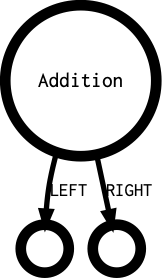

List of available properties : 

* boolean
* code
* constant
* ctype1
* ctype1_size
* fullcode
* intval
* lccode
* line
* noDelimiter
* rank

List of possible tokens : 

* T_MINUS
* T_PLUS

List of outgoing links : 

* LEFT
* RIGHT

List of incoming links : 

* ANALYZED
* ARGUMENT
* CODE
* CONCAT
* CONDITION
* DEFAULT
* ELSE
* EXPRESSION
* INDEX
* LEFT
* RETURN
* RIGHT
* SOURCE
* THEN
* VALUE

Analysis
___________________________

An analysis, as processed by Exakat.

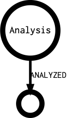

List of available properties : 

* Atom
* analyzer
* atom

List of possible tokens : 

* 

List of outgoing links : 

* ANALYZED

List of incoming links : 

* 

Array
___________________________

Represents array access : `$a[4]`, `$this['a']['f']` and `foo()[1]['g']`

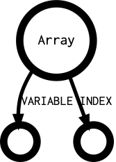

List of available properties : 

* code
* ctype1
* ctype1_size
* enclosing
* fullcode
* globalvar
* lccode
* line
* noDelimiter
* noscream
* rank
* reference
* variadic

List of possible tokens : 

* T_CLOSE_BRACKET
* T_CLOSE_CURLY
* T_CLOSE_PARENTHESIS
* T_CONSTANT_ENCAPSED_STRING
* T_CURLY_OPEN
* T_QUOTE
* T_START_HEREDOC
* T_STRING
* T_STRING_VARNAME
* T_VARIABLE

List of outgoing links : 

* INDEX
* VARIABLE

List of incoming links : 

* ANALYZED
* APPEND
* ARGUMENT
* CASE
* CAST
* CLASS
* CLONE
* CODE
* CONCAT
* CONDITION
* DEFAULT
* ELSE
* EXPRESSION
* INDEX
* LEFT
* NAME
* NEW
* NOT
* OBJECT
* POSTPLUSPLUS
* PREPLUSPLUS
* RETURN
* RIGHT
* SIGN
* SOURCE
* THEN
* THROW
* VALUE
* VARIABLE

Arrayappend
___________________________

Represents `$a[]` or `$this->b[]`

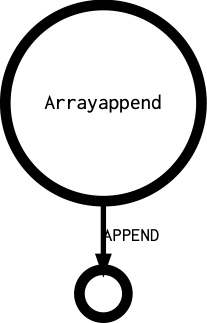

List of available properties : 

* code
* ctype1
* ctype1_size
* fullcode
* lccode
* line
* rank
* reference

List of possible tokens : 

* T_CLOSE_BRACKET
* T_CLOSE_CURLY
* T_CLOSE_PARENTHESIS
* T_STRING
* T_VARIABLE

List of outgoing links : 

* APPEND

List of incoming links : 

* APPEND
* ARGUMENT
* LEFT
* OBJECT
* POSTPLUSPLUS
* PREPLUSPLUS
* RETURN
* RIGHT
* VALUE
* VARIABLE
* YIELD

Arrayliteral
___________________________

Represents an array definition : `[4,5 => 3,6]` and `array(1,2,3)`

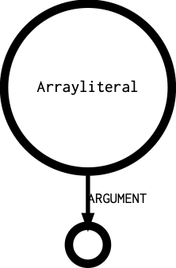

List of available properties : 

* args_max
* args_min
* boolean
* cbClass
* cbMethod
* cbObject
* code
* constant
* count
* ctype1
* ctype1_size
* fullcode
* intval
* lccode
* line
* noDelimiter
* noscream
* rank
* variadic

List of possible tokens : 

* T_ARRAY
* T_OPEN_BRACKET

List of outgoing links : 

* ARGUMENT

List of incoming links : 

* ANALYZED
* ARGUMENT
* CASE
* CAST
* CLONE
* CODE
* DEFAULT
* DEFINITION
* ELSE
* EXPRESSION
* INDEX
* LEFT
* NAME
* OBJECT
* RETURN
* RIGHT
* SOURCE
* THEN
* VALUE
* VARIABLE
* YIELD

As
___________________________

The as keyword, when aliasing an imported class

.. image:: images/As.png
                            :alt: As's outgoing diagramm

List of available properties : 

* alias
* code
* ctype1_size
* fullcode
* fullnspath
* lccode
* line
* rank
* visibility

List of possible tokens : 

* T_AS

List of outgoing links : 

* AS
* DEFINITION
* NAME

List of incoming links : 

* ANALYZED
* DEFINITION
* EXPRESSION
* USE

Assignation
___________________________

Any assignation and short assignation : `$a = 1`, `$b .= 3`

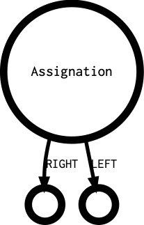

List of available properties : 

* code
* ctype1
* ctype1_size
* fullcode
* lccode
* line
* rank

List of possible tokens : 

* T_AND_EQUAL
* T_CONCAT_EQUAL
* T_DIV_EQUAL
* T_EQUAL
* T_MINUS_EQUAL
* T_MOD_EQUAL
* T_MUL_EQUAL
* T_OR_EQUAL
* T_PLUS_EQUAL
* T_POW_EQUAL
* T_SL_EQUAL
* T_SR_EQUAL
* T_XOR_EQUAL

List of outgoing links : 

* LEFT
* RIGHT

List of incoming links : 

* ANALYZED
* ARGUMENT
* CODE
* CONDITION
* ELSE
* EXPRESSION
* INDEX
* LEFT
* NAME
* RETURN
* RIGHT
* SOURCE
* THEN
* THROW
* VALUE

Bitshift
___________________________

A bit shift operation on integers, with << or >>

List of available properties : 

* boolean
* code
* constant
* ctype1
* ctype1_size
* fullcode
* intval
* lccode
* line
* noDelimiter
* rank

List of possible tokens : 

* T_SL
* T_SR

List of outgoing links : 

* LEFT
* RIGHT

List of incoming links : 

* ANALYZED
* ARGUMENT
* CODE
* CONDITION
* DEFAULT
* LEFT
* RETURN
* RIGHT
* VALUE

Block
___________________________

Represents a sequence between curly braces. For example, `{ $c += $b; }`.

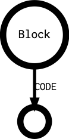

List of available properties : 

* code
* ctype1_size
* fullcode
* lccode
* line

List of possible tokens : 

* T_CLOSE_BRACKET
* T_CLOSE_CURLY
* T_CLOSE_PARENTHESIS
* T_CONSTANT_ENCAPSED_STRING
* T_LNUMBER
* T_QUOTE
* T_STRING
* T_VARIABLE

List of outgoing links : 

* CODE

List of incoming links : 

* MEMBER
* NAME

Boolean
___________________________

Represents `true` or `false`.

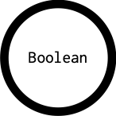

List of available properties : 

* boolean
* code
* constant
* ctype1
* ctype1_size
* fullcode
* fullnspath
* intval
* lccode
* line
* noDelimiter
* rank

List of possible tokens : 

* T_STRING

List of outgoing links : 

* 

List of incoming links : 

* ANALYZED
* ARGUMENT
* CASE
* CODE
* CONCAT
* CONDITION
* DEFAULT
* ELSE
* EXPRESSION
* INDEX
* LEFT
* RETURN
* RIGHT
* THEN
* VALUE

Break
___________________________

A break, with or without the level indication. `break 1`;

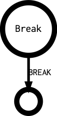

List of available properties : 

* code
* ctype1
* ctype1_size
* fullcode
* lccode
* line
* rank

List of possible tokens : 

* T_BREAK

List of outgoing links : 

* BREAK

List of incoming links : 

* EXPRESSION

Cast
___________________________

A case expression in a switch() statement. `case 1: `

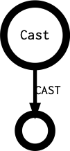

List of available properties : 

* code
* ctype1
* ctype1_size
* fullcode
* lccode
* line
* rank

List of possible tokens : 

* T_CASE

List of outgoing links : 

* CASE
* CODE

List of incoming links : 

* ANALYZED
* EXPRESSION

Cast
___________________________

A cast operation, like ``(array)`` or ``(unset)``

List of available properties : 

* binaryString
* code
* ctype1
* ctype1_size
* fullcode
* lccode
* line
* rank

List of possible tokens : 

* T_ARRAY_CAST
* T_BOOL_CAST
* T_DOUBLE_CAST
* T_INT_CAST
* T_OBJECT_CAST
* T_STRING_CAST

List of outgoing links : 

* CAST

List of incoming links : 

* ANALYZED
* ARGUMENT
* CAST
* CODE
* CONCAT
* CONDITION
* ELSE
* EXPRESSION
* INDEX
* LEFT
* NAME
* POSTPLUSPLUS
* RETURN
* RIGHT
* SIGN
* SOURCE
* THEN
* VALUE
* YIELD

Catch
___________________________

A catch clause in a try/catch command. For example : `catch (Exception $e)` or `catch{A|B|C $d}`

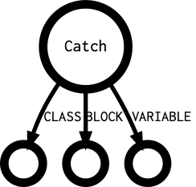

List of available properties : 

* code
* count
* ctype1
* ctype1_size
* fullcode
* lccode
* line
* rank

List of possible tokens : 

* T_TRY
* 1

List of outgoing links : 

* BLOCK
* CLASS
* VARIABLE

List of incoming links : 

* ANALYZED
* CATCH

Class
___________________________

A named class.

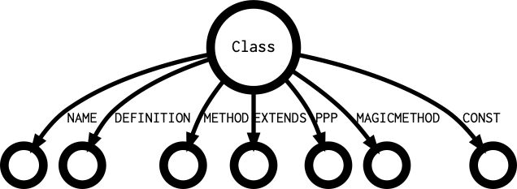

List of available properties : 

* abstract
* aliased
* code
* ctype1_size
* final
* fullcode
* fullnspath
* lccode
* line
* rank

List of possible tokens : 

* T_CLASS
* 1

List of outgoing links : 

* CONST
* DEFINITION
* EXTENDS
* IMPLEMENTS
* MAGICMETHOD
* METHOD
* NAME
* PPP
* USE

List of incoming links : 

* ANALYZED
* EXPRESSION

Classalias
___________________________

A call to the `class_alias` function. 

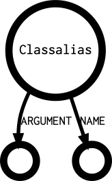

List of available properties : 

* args_max
* args_min
* code
* constant
* count
* ctype1
* ctype1_size
* fullcode
* fullnspath
* lccode
* line
* rank

List of possible tokens : 

* T_STRING

List of outgoing links : 

* ARGUMENT
* NAME

List of incoming links : 

* ANALYZED
* EXPRESSION
* RIGHT

Classanonymous
___________________________

A unnamed class, created with `new class {};`

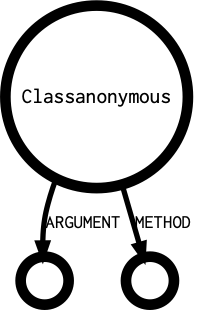

List of available properties : 

* args_max
* args_min
* code
* count
* ctype1
* ctype1_size
* fullcode
* fullnspath
* lccode
* line

List of possible tokens : 

* T_CLASS

List of outgoing links : 

* ARGUMENT
* DEFINITION
* EXTENDS
* IMPLEMENTS
* MAGICMETHOD
* METHOD
* PPP
* USE

List of incoming links : 

* ANALYZED
* NEW

Clone
___________________________

A clone expression

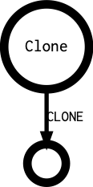

List of available properties : 

* code
* ctype1
* ctype1_size
* fullcode
* lccode
* line
* noscream
* rank

List of possible tokens : 

* T_CLONE

List of outgoing links : 

* CLONE

List of incoming links : 

* ANALYZED
* ARGUMENT
* CLONE
* CODE
* ELSE
* EXPRESSION
* LEFT
* RETURN
* RIGHT
* SOURCE
* THEN

Closure
___________________________

A closure definition. For example, `function () { return 3; }`.

.. image:: images/Closure.png
                            :alt: Closure's outgoing diagramm

List of available properties : 

* args_max
* args_min
* boolean
* code
* constant
* count
* ctype1
* ctype1_size
* fullcode
* fullnspath
* lccode
* line
* noscream
* nullable
* rank
* reference
* static

List of possible tokens : 

* T_FUNCTION

List of outgoing links : 

* ARGUMENT
* BLOCK
* DEFINITION
* RETURNED
* RETURNTYPE
* USE

List of incoming links : 

* ANALYZED
* ARGUMENT
* CAST
* CODE
* ELSE
* INDEX
* RETURN
* RIGHT
* SOURCE
* THEN
* VALUE
* VARIABLE

Coalesce
___________________________

An expression with the coalesce operator, `?:`. For example, `$x = $y ?: 'ef';` 

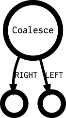

List of available properties : 

* code
* ctype1
* ctype1_size
* fullcode
* intval
* isNull
* lccode
* line
* noDelimiter
* rank

List of possible tokens : 

* T_COALESCE

List of outgoing links : 

* LEFT
* RIGHT

List of incoming links : 

* ARGUMENT
* CODE
* CONDITION
* DEFAULT
* RETURN
* RIGHT
* SOURCE
* THEN
* VALUE

Comparison
___________________________

A comparison, with any kind of comparison operator : `==`, `===`, `>`, ...

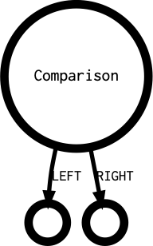

List of available properties : 

* boolean
* code
* constant
* ctype1
* ctype1_size
* fullcode
* intval
* lccode
* line
* noDelimiter
* rank

List of possible tokens : 

* T_GREATER
* T_IS_EQUAL
* T_IS_GREATER_OR_EQUAL
* T_IS_IDENTICAL
* T_IS_NOT_EQUAL
* T_IS_NOT_IDENTICAL
* T_IS_SMALLER_OR_EQUAL
* T_SMALLER
* T_SPACESHIP

List of outgoing links : 

* LEFT
* RIGHT

List of incoming links : 

* ANALYZED
* ARGUMENT
* CASE
* CODE
* CONDITION
* ELSE
* EXPRESSION
* INDEX
* LEFT
* RETURN
* RIGHT
* THEN
* VALUE

Concatenation
___________________________

A concatenation : a sequence of values, linked by the dot operator `.`

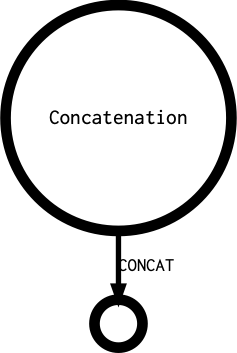

List of available properties : 

* boolean
* code
* constant
* count
* ctype1
* ctype1_size
* fullcode
* fullnspath
* intval
* lccode
* line
* noDelimiter
* rank

List of possible tokens : 

* T_DOT

List of outgoing links : 

* CONCAT

List of incoming links : 

* ANALYZED
* ARGUMENT
* CASE
* CODE
* CONDITION
* DEFAULT
* ELSE
* EXPRESSION
* INDEX
* LEFT
* NAME
* RETURN
* RIGHT
* THEN
* THROW
* VALUE

Const
___________________________

A constant definition, for classes or global. `const X = 1;` or `class x { const Y = 2; }`

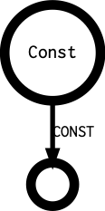

List of available properties : 

* code
* count
* ctype1_size
* fullcode
* lccode
* line
* rank
* visibility

List of possible tokens : 

* T_CONST
* 1

List of outgoing links : 

* CONST

List of incoming links : 

* ANALYZED
* CONST
* EXPRESSION

Constant
___________________________

A constant definition, part of a `Const` atom.

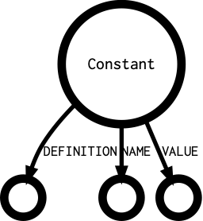

List of available properties : 

* boolean
* code
* ctype1
* ctype1_size
* fullcode
* intval
* isNull
* lccode
* line
* rank

List of possible tokens : 

* T_COMMA
* T_CONST
* 1

List of outgoing links : 

* DEFINITION
* NAME
* OVERWRITE
* VALUE

List of incoming links : 

* ANALYZED
* CONST
* OVERWRITE

Continue
___________________________

A continue operator, with or without its level indicator

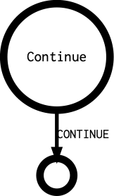

List of available properties : 

* code
* ctype1
* ctype1_size
* fullcode
* lccode
* line
* rank

List of possible tokens : 

* T_CONTINUE

List of outgoing links : 

* CONTINUE

List of incoming links : 

* ANALYZED
* EXPRESSION

Declare
___________________________

A declare expression.

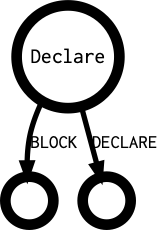

List of available properties : 

* code
* ctype1_size
* fullcode
* lccode
* line
* rank

List of possible tokens : 

* T_DECLARE

List of outgoing links : 

* BLOCK
* DECLARE

List of incoming links : 

* ANALYZED
* EXPRESSION

Declaredefinition
___________________________

One configuration expression inside a `declare` definition. For example, in `declare(strict_types=1);`, `strict_types=1`

.. image:: images/Declaredefinition.png
                            :alt: Declaredefinition's outgoing diagramm

List of available properties : 

* code
* ctype1_size
* fullcode
* lccode
* line

List of possible tokens : 

* 

List of outgoing links : 

* NAME
* VALUE

List of incoming links : 

* DECLARE

Default
___________________________

A default case, in a switch statement.

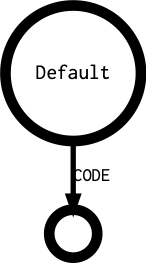

List of available properties : 

* code
* ctype1
* ctype1_size
* fullcode
* lccode
* line
* rank

List of possible tokens : 

* T_DEFAULT

List of outgoing links : 

* CODE

List of incoming links : 

* EXPRESSION

Defineconstant
___________________________

A call to the `define()` function.

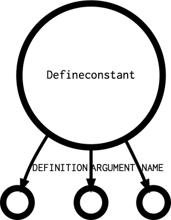

List of available properties : 

* args_max
* args_min
* code
* count
* ctype1
* ctype1_size
* fullcode
* fullnspath
* lccode
* line
* rank

List of possible tokens : 

* T_STRING

List of outgoing links : 

* ARGUMENT
* DEFINITION
* NAME

List of incoming links : 

* ANALYZED
* ARGUMENT
* EXPRESSION
* RIGHT

Dowhile
___________________________

A do...while() loop. 

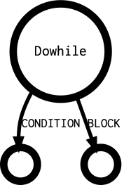

List of available properties : 

* code
* ctype1
* ctype1_size
* fullcode
* lccode
* line
* rank

List of possible tokens : 

* T_DO

List of outgoing links : 

* BLOCK
* CONDITION

List of incoming links : 

* ANALYZED
* EXPRESSION

Echo
___________________________

A call to `echo`

List of available properties : 

* args_max
* args_min
* code
* count
* ctype1
* ctype1_size
* fullcode
* fullnspath
* lccode
* line
* rank

List of possible tokens : 

* T_ECHO
* T_OPEN_TAG_WITH_ECHO
* 1

List of outgoing links : 

* ARGUMENT
* NAME

List of incoming links : 

* ANALYZED
* EXPRESSION

Empty
___________________________

A call to `empty`

List of available properties : 

* args_max
* args_min
* code
* count
* ctype1
* ctype1_size
* fullcode
* fullnspath
* lccode
* line
* rank

List of possible tokens : 

* T_EMPTY

List of outgoing links : 

* ARGUMENT

List of incoming links : 

* ANALYZED
* ARGUMENT
* CODE
* CONDITION
* LEFT
* NOT
* RETURN
* RIGHT
* VALUE

Eval
___________________________

A call to `Eval`

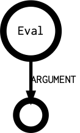

List of available properties : 

* args_max
* args_min
* code
* count
* ctype1
* ctype1_size
* fullcode
* fullnspath
* lccode
* line
* noscream
* rank

List of possible tokens : 

* T_EVAL

List of outgoing links : 

* ARGUMENT

List of incoming links : 

* ANALYZED
* ARGUMENT
* CODE
* EXPRESSION
* NOT
* RETURN
* RIGHT

Exit
___________________________

A call to `Exit`

List of available properties : 

* args_max
* args_min
* code
* count
* ctype1
* ctype1_size
* fullcode
* fullnspath
* lccode
* line
* rank

List of possible tokens : 

* T_COMMA
* T_EXIT
* T_OPEN_PARENTHESIS

List of outgoing links : 

* ARGUMENT

List of incoming links : 

* ANALYZED
* EXPRESSION
* RIGHT

File
___________________________

A file, containing the PHP source code.

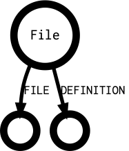

List of available properties : 

* code
* ctype1_size
* fullcode
* lccode
* line

List of possible tokens : 

* T_FILENAME

List of outgoing links : 

* DEFINITION
* FILE

List of incoming links : 

* ANALYZED
* PROJECT

Finally
___________________________

A finally clause in a try/catch command.

.. image:: images/Finally.png
                            :alt: Finally's outgoing diagramm

List of available properties : 

* code
* ctype1
* ctype1_size
* fullcode
* lccode
* line

List of possible tokens : 

* T_TRY

List of outgoing links : 

* BLOCK

List of incoming links : 

* FINALLY

For
___________________________

A for loop. For example : `for($i = 0; $i < 10; ++$i) { }`

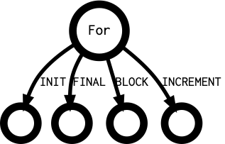

List of available properties : 

* alternative
* code
* ctype1
* ctype1_size
* fullcode
* lccode
* line
* rank

List of possible tokens : 

* T_CLOSE_CURLY
* T_OPEN_TAG
* T_SEMICOLON
* 1

List of outgoing links : 

* BLOCK
* FINAL
* INCREMENT
* INIT

List of incoming links : 

* ANALYZED
* EXPRESSION

Foreach
___________________________

A foreach loop.

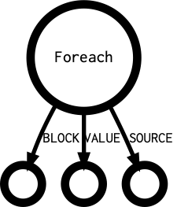

List of available properties : 

* alternative
* code
* ctype1
* ctype1_size
* fullcode
* lccode
* line
* rank

List of possible tokens : 

* T_FOREACH

List of outgoing links : 

* BLOCK
* SOURCE
* VALUE

List of incoming links : 

* ANALYZED
* EXPRESSION

Function
___________________________

A function definition

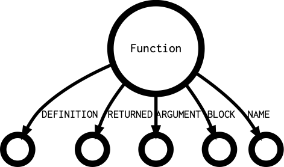

List of available properties : 

* args_max
* args_min
* code
* count
* ctype1
* ctype1_size
* fullcode
* fullnspath
* lccode
* line
* nullable
* rank
* reference

List of possible tokens : 

* T_FUNCTION

List of outgoing links : 

* ARGUMENT
* BLOCK
* DEFINITION
* NAME
* RETURNED
* RETURNTYPE

List of incoming links : 

* ANALYZED
* EXPRESSION

Functioncall
___________________________

A call to a function.

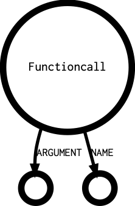

List of available properties : 

* aliased
* args_max
* args_min
* code
* constant
* count
* ctype1
* ctype1_size
* enclosing
* fullcode
* fullnspath
* lccode
* line
* noDelimiter
* noscream
* rank
* reference
* variadic

List of possible tokens : 

* T_CLOSE_BRACKET
* T_CLOSE_PARENTHESIS
* T_CONSTANT_ENCAPSED_STRING
* T_CURLY_OPEN
* T_DOLLAR
* T_DOUBLE_COLON
* T_NS_SEPARATOR
* T_OBJECT_OPERATOR
* T_OPEN_BRACKET
* T_OPEN_PARENTHESIS
* T_STRING
* T_VARIABLE

List of outgoing links : 

* ARGUMENT
* NAME

List of incoming links : 

* ANALYZED
* APPEND
* ARGUMENT
* CASE
* CAST
* CODE
* CONCAT
* CONDITION
* DEFINITION
* ELSE
* EXPRESSION
* INDEX
* LEFT
* NAME
* NEW
* NOT
* OBJECT
* RETURN
* RIGHT
* SIGN
* SOURCE
* THEN
* THROW
* VALUE
* VARIABLE
* YIELD

Global
___________________________

An expression with the global keyword. For example, `global $x, $y`.

List of available properties : 

* code
* count
* ctype1
* ctype1_size
* fullcode
* lccode
* line
* rank

List of possible tokens : 

* T_GLOBAL

List of outgoing links : 

* GLOBAL

List of incoming links : 

* ANALYZED
* EXPRESSION

Globaldefinition
___________________________

A definition of a global variable, inside a global expression. For example, in `global $x = 1, $y`, `$x = 1` and `$y` are Globaldefinition.

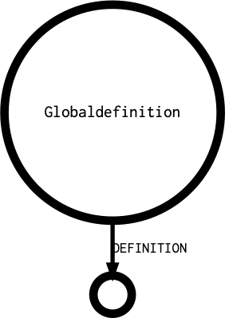

List of available properties : 

* code
* ctype1
* ctype1_size
* fullcode
* lccode
* line
* rank

List of possible tokens : 

* T_VARIABLE

List of outgoing links : 

* DEFINITION

List of incoming links : 

* ANALYZED
* DEFINITION
* GLOBAL

Goto
___________________________

The goto expression.

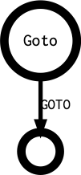

List of available properties : 

* code
* ctype1
* ctype1_size
* fullcode
* lccode
* line
* rank

List of possible tokens : 

* T_GOTO

List of outgoing links : 

* GOTO

List of incoming links : 

* DEFINITION
* EXPRESSION

Gotolabel
___________________________

A target destination for a goto expression.

.. image:: images/Gotolabel.png
                            :alt: Gotolabel's outgoing diagramm

List of available properties : 

* code
* ctype1_size
* fullcode
* lccode
* line
* rank

List of possible tokens : 

* T_COLON

List of outgoing links : 

* DEFINITION
* GOTOLABEL

List of incoming links : 

* EXPRESSION

Halt
___________________________

The `__halt_compiler` command.

.. image:: images/Halt.png
                            :alt: Halt's outgoing diagramm

List of available properties : 

* code
* ctype1_size
* fullcode
* lccode
* line
* rank

List of possible tokens : 

* T_HALT_COMPILER

List of outgoing links : 

* 

List of incoming links : 

* EXPRESSION

Heredoc
___________________________

A Heredoc or Nowdoc string

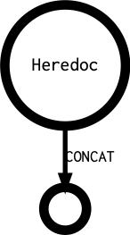

List of available properties : 

* binaryString
* boolean
* code
* count
* ctype1
* ctype1_size
* delimiter
* fullcode
* heredoc
* intval
* lccode
* line
* noDelimiter
* rank

List of possible tokens : 

* T_START_HEREDOC

List of outgoing links : 

* CONCAT

List of incoming links : 

* ANALYZED
* ARGUMENT
* CONCAT
* DEFAULT
* RETURN
* RIGHT
* VALUE

Identifier
___________________________

A name for a constant or a class. For example : `$x instanceof Y`, 'echo PHP_INT_MAX`, `new Y`

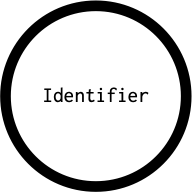

List of available properties : 

* aliased
* boolean
* code
* constant
* ctype1
* ctype1_size
* fullcode
* fullnspath
* intval
* isNull
* lccode
* line
* noDelimiter
* noscream
* rank
* reference

List of possible tokens : 

* T_ARRAY
* T_CALLABLE
* T_CONST
* T_FUNCTION
* T_STRING

List of outgoing links : 

* DEFINITION

List of incoming links : 

* ANALYZED
* ARGUMENT
* AS
* CASE
* CAST
* CLASS
* CODE
* CONCAT
* CONDITION
* CONST
* DEFAULT
* DEFINITION
* ELSE
* EXPRESSION
* FUNCTION
* INDEX
* INSTEADOF
* LEFT
* MEMBER
* NAME
* NEW
* NOT
* RETURN
* RIGHT
* SIGN
* THEN
* TYPEHINT
* VALUE
* VARIABLE

Ifthen
___________________________

A if/then/else structure.

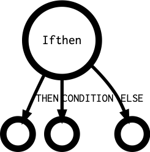

List of available properties : 

* alternative
* code
* ctype1
* ctype1_size
* fullcode
* lccode
* line
* rank

List of possible tokens : 

* T_ELSEIF
* T_IF

List of outgoing links : 

* CONDITION
* ELSE
* THEN

List of incoming links : 

* ANALYZED
* ELSE
* EXPRESSION

Include
___________________________

A inclusion, with `require` or `include`, with `_once` or not.

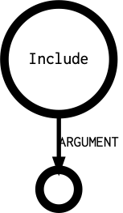

List of available properties : 

* code
* count
* ctype1
* ctype1_size
* fullcode
* fullnspath
* lccode
* line
* noscream
* rank

List of possible tokens : 

* T_INCLUDE
* T_INCLUDE_ONCE
* T_REQUIRE
* T_REQUIRE_ONCE

List of outgoing links : 

* ARGUMENT

List of incoming links : 

* ANALYZED
* ARGUMENT
* CODE
* CONDITION
* EXPRESSION
* NOT
* RETURN
* RIGHT
* THEN

Inlinehtml
___________________________

Raw text, in the middle of a PHP script. For example : ``++$a; ?>RAW TEXT<?php ++$b; ``

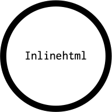

List of available properties : 

* code
* ctype1_size
* fullcode
* lccode
* line
* rank

List of possible tokens : 

* T_INLINE_HTML
* 1

List of outgoing links : 

* 

List of incoming links : 

* ANALYZED
* EXPRESSION

Instanceof
___________________________

A `instanceof` expression

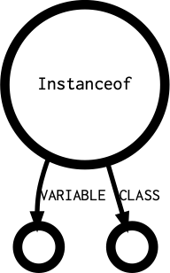

List of available properties : 

* code
* ctype1
* ctype1_size
* fullcode
* lccode
* line
* rank

List of possible tokens : 

* T_INSTANCEOF

List of outgoing links : 

* CLASS
* VARIABLE

List of incoming links : 

* ANALYZED
* ARGUMENT
* CASE
* CODE
* CONDITION
* INDEX
* LEFT
* NOT
* RETURN
* RIGHT

Insteadof
___________________________

A `insteadof` expression

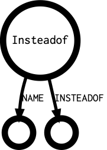

List of available properties : 

* code
* ctype1
* ctype1_size
* fullcode
* lccode
* line
* rank

List of possible tokens : 

* T_INSTEADOF

List of outgoing links : 

* INSTEADOF
* NAME

List of incoming links : 

* EXPRESSION

Integer
___________________________

An Integer literal, positive or negative.

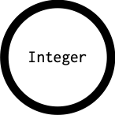

List of available properties : 

* boolean
* code
* constant
* ctype1
* ctype1_size
* fullcode
* fullnspath
* intval
* lccode
* line
* noDelimiter
* rank
* variadic

List of possible tokens : 

* T_LNUMBER
* T_NUM_STRING

List of outgoing links : 

* 

List of incoming links : 

* ANALYZED
* ARGUMENT
* BREAK
* CASE
* CAST
* CLONE
* CODE
* CONCAT
* CONDITION
* CONTINUE
* DEFAULT
* ELSE
* INDEX
* LEFT
* NAME
* NOT
* RETURN
* RIGHT
* THEN
* THROW
* VALUE
* YIELD

Interface
___________________________

An interface definition

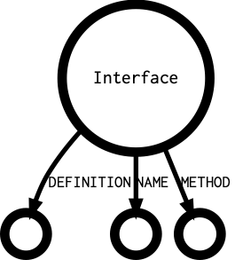

List of available properties : 

* code
* ctype1_size
* fullcode
* fullnspath
* lccode
* line
* rank

List of possible tokens : 

* T_INTERFACE

List of outgoing links : 

* CONST
* DEFINITION
* EXTENDS
* MAGICMETHOD
* METHOD
* NAME

List of incoming links : 

* ANALYZED
* EXPRESSION

Isset
___________________________

A call to `isset`

List of available properties : 

* args_max
* args_min
* code
* count
* ctype1
* ctype1_size
* fullcode
* fullnspath
* lccode
* line
* rank

List of possible tokens : 

* T_ISSET

List of outgoing links : 

* ARGUMENT

List of incoming links : 

* ANALYZED
* ARGUMENT
* CASE
* CODE
* CONDITION
* EXPRESSION
* LEFT
* NOT
* RETURN
* RIGHT

Keyvalue
___________________________

An expression with the `=>` operator : for arrays or foreach() instructions.

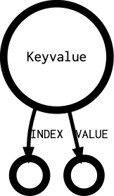

List of available properties : 

* boolean
* code
* constant
* ctype1
* ctype1_size
* fullcode
* lccode
* line
* rank

List of possible tokens : 

* T_DOUBLE_ARROW

List of outgoing links : 

* INDEX
* VALUE

List of incoming links : 

* ARGUMENT
* VALUE
* YIELD

List
___________________________

The list() or [] call when on the right of an assignation.

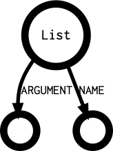

List of available properties : 

* args_max
* args_min
* code
* count
* ctype1
* ctype1_size
* fullcode
* fullnspath
* lccode
* line
* noscream
* rank

List of possible tokens : 

* T_LIST
* T_OPEN_BRACKET

List of outgoing links : 

* ARGUMENT
* NAME

List of incoming links : 

* ANALYZED
* ARGUMENT
* LEFT
* VALUE

Logical
___________________________

A logical expression. This covers also bitwise operations. For example : `$a | $b`, `$a && $b`, `$a xor $b`.

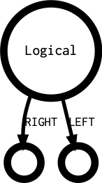

List of available properties : 

* boolean
* code
* constant
* ctype1
* ctype1_size
* fullcode
* intval
* lccode
* line
* noDelimiter
* rank

List of possible tokens : 

* T_AND
* T_BOOLEAN_AND
* T_BOOLEAN_OR
* T_LOGICAL_AND
* T_LOGICAL_OR
* T_LOGICAL_XOR
* T_OR
* T_XOR

List of outgoing links : 

* LEFT
* RIGHT

List of incoming links : 

* ANALYZED
* ARGUMENT
* CASE
* CODE
* CONDITION
* DEFAULT
* ELSE
* EXPRESSION
* INDEX
* LEFT
* RETURN
* RIGHT
* THEN
* VALUE

Magicconstant
___________________________

A PHP magic constant. For example : __FILE__ or __class__.

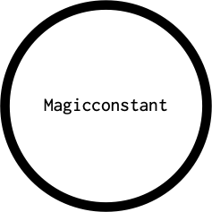

List of available properties : 

* boolean
* code
* ctype1
* ctype1_size
* fullcode
* intval
* lccode
* line
* noDelimiter
* rank

List of possible tokens : 

* T_CLASS_C
* T_DIR
* T_FILE
* T_FUNC_C
* T_LINE
* T_METHOD_C
* T_NS_C
* T_TRAIT_C
* 1

List of outgoing links : 

* 

List of incoming links : 

* ANALYZED
* ARGUMENT
* CODE
* CONCAT
* DEFAULT
* ELSE
* INDEX
* LEFT
* RETURN
* RIGHT
* THEN
* VALUE

Magicmethod
___________________________

A special PHP method in a class. For example, `__clone()`, `__construct()`, `__get()`, ...

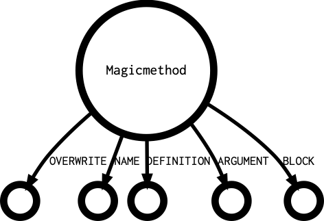

List of available properties : 

* abstract
* args_max
* args_min
* code
* count
* ctype1
* ctype1_size
* final
* fullcode
* fullnspath
* lccode
* line
* rank
* static
* visibility

List of possible tokens : 

* T_FUNCTION
* 1

List of outgoing links : 

* ARGUMENT
* BLOCK
* DEFINITION
* NAME
* OVERWRITE
* RETURNED
* RETURNTYPE

List of incoming links : 

* ANALYZED
* MAGICMETHOD
* OVERWRITE

Member
___________________________

A reference to a member of an object. For example, `$object->member`. 

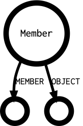

List of available properties : 

* code
* ctype1
* ctype1_size
* enclosing
* fullcode
* lccode
* line
* noDelimiter
* rank

List of possible tokens : 

* T_CURLY_OPEN
* T_OBJECT_OPERATOR
* T_QUOTE
* T_START_HEREDOC

List of outgoing links : 

* MEMBER
* OBJECT

List of incoming links : 

* ANALYZED
* APPEND
* ARGUMENT
* CAST
* CLASS
* CLONE
* CODE
* CONCAT
* CONDITION
* DEFINITION
* ELSE
* EXPRESSION
* INDEX
* LEFT
* NAME
* NEW
* NOT
* OBJECT
* POSTPLUSPLUS
* PREPLUSPLUS
* RETURN
* RIGHT
* SIGN
* SOURCE
* THEN
* THROW
* VALUE
* VARIABLE
* YIELD

Method
___________________________

A method definition in a class.

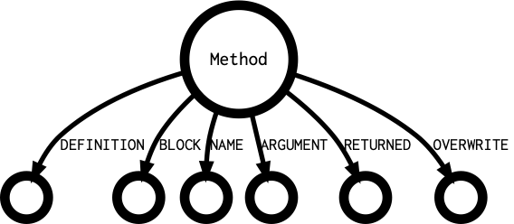

List of available properties : 

* abstract
* args_max
* args_min
* code
* count
* ctype1
* ctype1_size
* final
* fullcode
* fullnspath
* lccode
* line
* nullable
* rank
* reference
* static
* visibility

List of possible tokens : 

* T_FUNCTION
* 1

List of outgoing links : 

* ARGUMENT
* BLOCK
* DEFINITION
* NAME
* OVERWRITE
* RETURNED
* RETURNTYPE

List of incoming links : 

* ANALYZED
* METHOD
* OVERWRITE

Methodcall
___________________________

A non-static call to a method. For example, `$a->method();`

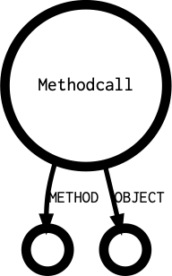

List of available properties : 

* code
* ctype1
* ctype1_size
* enclosing
* fullcode
* lccode
* line
* noDelimiter
* rank
* variadic

List of possible tokens : 

* T_CURLY_OPEN
* T_OBJECT_OPERATOR

List of outgoing links : 

* METHOD
* OBJECT

List of incoming links : 

* ANALYZED
* APPEND
* ARGUMENT
* CASE
* CAST
* CLONE
* CODE
* CONCAT
* CONDITION
* DEFINITION
* ELSE
* EXPRESSION
* INDEX
* LEFT
* NAME
* NEW
* NOT
* OBJECT
* RETURN
* RIGHT
* SIGN
* SOURCE
* THEN
* THROW
* VALUE
* VARIABLE
* YIELD

Methodcallname
___________________________

The name of the method in a methodcall

List of available properties : 

* args_max
* args_min
* code
* count
* ctype1
* ctype1_size
* fullcode
* lccode
* line

List of possible tokens : 

* T_CLOSE_BRACKET
* T_CONSTANT_ENCAPSED_STRING
* T_DOLLAR
* T_NEW
* T_STRING
* T_VARIABLE

List of outgoing links : 

* ARGUMENT
* NAME

List of incoming links : 

* ANALYZED
* METHOD

Multiplication
___________________________

A multiplication `*`, division `/` or modulo `%` operation.

List of available properties : 

* boolean
* code
* constant
* ctype1
* ctype1_size
* fullcode
* intval
* lccode
* line
* noDelimiter
* rank

List of possible tokens : 

* T_PERCENTAGE
* T_SLASH
* T_STAR

List of outgoing links : 

* LEFT
* RIGHT

List of incoming links : 

* ANALYZED
* ARGUMENT
* CODE
* CONCAT
* CONDITION
* DEFAULT
* ELSE
* EXPRESSION
* INDEX
* LEFT
* RETURN
* RIGHT
* SIGN
* THEN
* VALUE

Name
___________________________

The name of a structure : name of a class, method, interface, trait, interface.

.. image:: images/Name.png
                            :alt: Name's outgoing diagramm

List of available properties : 

* aliased
* code
* ctype1
* ctype1_size
* fullcode
* fullnspath
* lccode
* line

List of possible tokens : 

* T_ABSTRACT
* T_CLASS
* T_INSTANCEOF
* T_LIST
* T_NEW
* T_OPEN_TAG_WITH_ECHO
* T_PRINT
* T_PRIVATE
* T_PUBLIC
* T_STRING
* T_THROW

List of outgoing links : 

* DEFINITION

List of incoming links : 

* ANALYZED
* CONSTANT
* DEFINITION
* GOTO
* GOTOLABEL
* MEMBER
* METHOD
* NAME

Namespace
___________________________

A namespace declaration

List of available properties : 

* code
* ctype1_size
* fullcode
* fullnspath
* lccode
* line
* rank

List of possible tokens : 

* T_NAMESPACE

List of outgoing links : 

* BLOCK
* NAME

List of incoming links : 

* ANALYZED
* EXPRESSION

New
___________________________

An instantiation expression, with `new ClassName()`.

List of available properties : 

* code
* ctype1
* ctype1_size
* fullcode
* lccode
* line
* noscream
* rank
* variadic

List of possible tokens : 

* T_NEW

List of outgoing links : 

* NEW

List of incoming links : 

* ANALYZED
* ARGUMENT
* CAST
* CLONE
* CODE
* CONCAT
* CONDITION
* DEFINITION
* ELSE
* EXPRESSION
* INDEX
* LEFT
* RETURN
* RIGHT
* SOURCE
* THEN
* THROW
* VALUE
* VARIABLE
* YIELD

Newcall
___________________________

The functioncall in a New expression. For example, in ``new foo()`, `foo()` is the Newcall.

List of available properties : 

* absolute
* aliased
* args_max
* args_min
* code
* count
* ctype1
* ctype1_size
* fullcode
* fullnspath
* lccode
* line
* noscream
* rank

List of possible tokens : 

* T_DOLLAR
* T_LIST
* T_NS_SEPARATOR
* T_STATIC
* T_STRING
* T_VARIABLE

List of outgoing links : 

* ARGUMENT
* DEFINITION
* NAME

List of incoming links : 

* ANALYZED
* ARGUMENT
* CAST
* CLASS
* CODE
* CONCAT
* CONDITION
* DEFINITION
* ELSE
* EXPRESSION
* INDEX
* LEFT
* NAME
* NEW
* NOT
* OBJECT
* RETURN
* RIGHT
* SIGN
* THEN
* TYPEHINT
* VALUE
* VARIABLE

Not
___________________________

A call to `!` or `~`. 

List of available properties : 

* boolean
* code
* constant
* ctype1
* ctype1_size
* fullcode
* intval
* lccode
* line
* noDelimiter
* noscream
* rank

List of possible tokens : 

* T_BANG
* T_TILDE

List of outgoing links : 

* NOT

List of incoming links : 

* ANALYZED
* ARGUMENT
* CASE
* CAST
* CODE
* CONDITION
* ELSE
* EXPRESSION
* LEFT
* NOT
* RETURN
* RIGHT
* THEN
* VALUE

Nsname
___________________________

A fully qualified name, including `\`. For example, `\strtolower`, `A\B\C`, ...w

List of available properties : 

* absolute
* alias
* boolean
* code
* constant
* ctype1
* ctype1_size
* fullcode
* fullnspath
* intval
* isNull
* lccode
* line
* noDelimiter
* origin
* rank
* reference

List of possible tokens : 

* T_ARRAY
* T_CALLABLE
* T_NS_SEPARATOR
* T_STRING
* 1

List of outgoing links : 

* DEFINITION

List of incoming links : 

* ANALYZED
* ARGUMENT
* CLASS
* CONCAT
* DEFAULT
* DEFINITION
* EXTENDS
* IMPLEMENTS
* INDEX
* LEFT
* NAME
* NEW
* RETURNTYPE
* RIGHT
* TYPEHINT
* USE
* VALUE

Null
___________________________

The `Null` value

.. image:: images/Null.png
                            :alt: Null's outgoing diagramm

List of available properties : 

* boolean
* code
* constant
* ctype1
* ctype1_size
* fullcode
* fullnspath
* intval
* isNull
* lccode
* line
* noDelimiter
* rank
* variadic

List of possible tokens : 

* T_STRING

List of outgoing links : 

* 

List of incoming links : 

* ANALYZED
* ARGUMENT
* CASE
* CAST
* CODE
* CONDITION
* DEFAULT
* ELSE
* INDEX
* LEFT
* RETURN
* RIGHT
* THEN
* VALUE

Parameter
___________________________

A parameter definition, in a function or method definition. When called, it becomes an argument.

List of available properties : 

* code
* ctype1_size
* fullcode
* lccode
* line
* nullable
* rank
* reference
* variadic

List of possible tokens : 

* T_VARIABLE

List of outgoing links : 

* DEFAULT
* DEFINITION
* NAME
* TYPEHINT

List of incoming links : 

* ANALYZED
* ARGUMENT
* DEFINITION
* USE

Parametername
___________________________

A Parametername

.. image:: images/Parametername.png
                            :alt: Parametername's outgoing diagramm

List of available properties : 

* code
* ctype1
* ctype1_size
* fullcode
* lccode
* line
* rank

List of possible tokens : 

* T_VARIABLE

List of outgoing links : 

* DEFINITION

List of incoming links : 

* ANALYZED
* GLOBAL
* NAME

Parent
___________________________

The parent keyword, when it is used to refer to the parent class.

.. image:: images/Parent.png
                            :alt: Parent's outgoing diagramm

List of available properties : 

* boolean
* code
* ctype1
* ctype1_size
* fullcode
* fullnspath
* intval
* lccode
* line
* noscream

List of possible tokens : 

* T_STRING
* 1

List of outgoing links : 

* 

List of incoming links : 

* ANALYZED
* CLASS
* DEFINITION
* NEW
* RETURNTYPE
* TYPEHINT

Parenthesis
___________________________

A Parenthesis expression. This is not a syntactic parenthesis, like in a switch or functioncall.

List of available properties : 

* boolean
* code
* constant
* ctype1
* ctype1_size
* fullcode
* intval
* isNull
* lccode
* line
* noDelimiter
* noscream
* rank

List of possible tokens : 

* T_OPEN_PARENTHESIS

List of outgoing links : 

* CODE

List of incoming links : 

* ANALYZED
* ARGUMENT
* CASE
* CAST
* CLONE
* CODE
* CONCAT
* CONDITION
* ELSE
* EXPRESSION
* INDEX
* LEFT
* NAME
* NOT
* OBJECT
* RETURN
* RIGHT
* SIGN
* SOURCE
* THEN
* THROW
* VALUE
* VARIABLE

Php
___________________________

A PHP script, inside its tags. This exclude the following and previous raw text in a PHP file. 

List of available properties : 

* close_tag
* code
* ctype1_size
* fullcode
* lccode
* line
* rank

List of possible tokens : 

* T_OPEN_TAG

List of outgoing links : 

* CODE

List of incoming links : 

* EXPRESSION

Phpvariable
___________________________

A PHP reserved variable, such as `$_GET`, `$_POST`, `$GLOBALS`, etc. 

List of available properties : 

* code
* ctype1
* ctype1_size
* fullcode
* lccode
* line
* noDelimiter
* rank
* reference
* variadic

List of possible tokens : 

* T_VARIABLE

List of outgoing links : 

* 

List of incoming links : 

* ANALYZED
* APPEND
* ARGUMENT
* CONCAT
* CONDITION
* DEFINITION
* ELSE
* LEFT
* RIGHT
* SOURCE
* THEN
* VALUE
* VARIABLE

Postplusplus
___________________________

$i++` expression

List of available properties : 

* code
* ctype1
* ctype1_size
* fullcode
* lccode
* line
* rank

List of possible tokens : 

* T_DEC
* T_INC

List of outgoing links : 

* POSTPLUSPLUS

List of incoming links : 

* ANALYZED
* ARGUMENT
* CODE
* CONCAT
* CONDITION
* ELSE
* EXPRESSION
* INDEX
* LEFT
* NOT
* RETURN
* RIGHT
* THEN

Power
___________________________

The power operator, `**`. 

.. image:: images/Power.png
                            :alt: Power's outgoing diagramm

List of available properties : 

* boolean
* code
* ctype1
* ctype1_size
* fullcode
* intval
* lccode
* line
* noDelimiter
* rank

List of possible tokens : 

* T_POW

List of outgoing links : 

* LEFT
* RIGHT

List of incoming links : 

* ARGUMENT
* CODE
* VALUE

Ppp
___________________________

A properties declaration, in a class or a trait. For example : `private $x, $y = 2;`

List of available properties : 

* code
* count
* ctype1
* ctype1_size
* fullcode
* lccode
* line
* rank
* static
* visibility

List of possible tokens : 

* T_PRIVATE
* T_PROTECTED
* T_PUBLIC
* T_STATIC
* T_VAR
* 1

List of outgoing links : 

* PPP

List of incoming links : 

* ANALYZED
* PPP

Preplusplus
___________________________

++ or -- when it is before the variable.

List of available properties : 

* code
* ctype1
* ctype1_size
* fullcode
* lccode
* line
* rank

List of possible tokens : 

* T_DEC
* T_INC

List of outgoing links : 

* PREPLUSPLUS

List of incoming links : 

* ANALYZED
* ARGUMENT
* CODE
* CONCAT
* CONDITION
* ELSE
* EXPRESSION
* INDEX
* LEFT
* NOT
* RETURN
* RIGHT
* VALUE
* YIELD

Print
___________________________

A call to the function print.

List of available properties : 

* code
* count
* ctype1
* ctype1_size
* fullcode
* fullnspath
* lccode
* line
* rank

List of possible tokens : 

* T_PRINT

List of outgoing links : 

* ARGUMENT

List of incoming links : 

* ANALYZED
* ELSE
* EXPRESSION
* RIGHT
* THEN

Project
___________________________

The project node : the root above all File.

List of available properties : 

* code
* ctype1_size
* fullcode
* lccode
* line

List of possible tokens : 

* T_WHOLE

List of outgoing links : 

* PROJECT

List of incoming links : 

* 

Propertydefinition
___________________________

A property definition. For example : `class x { private $property = 1; var $x; }

List of available properties : 

* code
* ctype1
* ctype1_size
* fullcode
* lccode
* line
* propertyname
* rank

List of possible tokens : 

* T_VARIABLE
* 1

List of outgoing links : 

* DEFAULT
* DEFINITION
* OVERWRITE

List of incoming links : 

* ANALYZED
* OVERWRITE
* PPP

Real
___________________________

A float number

List of available properties : 

* boolean
* code
* constant
* ctype1
* ctype1_size
* fullcode
* intval
* lccode
* line
* noDelimiter
* rank
* variadic

List of possible tokens : 

* T_DNUMBER

List of outgoing links : 

* 

List of incoming links : 

* ARGUMENT
* CAST
* CODE
* CONCAT
* DEFAULT
* ELSE
* INDEX
* LEFT
* RETURN
* RIGHT
* THEN
* VALUE

Return
___________________________

The return expression.

List of available properties : 

* code
* constant
* ctype1
* ctype1_size
* fullcode
* lccode
* line
* rank

List of possible tokens : 

* T_RETURN

List of outgoing links : 

* RETURN

List of incoming links : 

* ANALYZED
* EXPRESSION

Self
___________________________

The `self` keyword, as used inside a class.

List of available properties : 

* boolean
* code
* ctype1
* ctype1_size
* fullcode
* fullnspath
* intval
* lccode
* line
* noscream
* reference

List of possible tokens : 

* T_STRING
* 1

List of outgoing links : 

* 

List of incoming links : 

* ANALYZED
* CLASS
* DEFINITION
* NAME
* NEW
* RETURNTYPE
* TYPEHINT

Sequence
___________________________

A virtual atom, that represents the sequence of expression, in a block.

List of available properties : 

* boolean
* bracket
* code
* constant
* count
* ctype1
* ctype1_size
* fullcode
* lccode
* line
* rank
* root

List of possible tokens : 

* T_CLOSE_CURLY
* T_CLOSE_PARENTHESIS
* T_COLON
* T_CONSTANT_ENCAPSED_STRING
* T_INLINE_HTML
* T_OPEN_CURLY
* T_OPEN_TAG
* T_SEMICOLON
* T_SWITCH

List of outgoing links : 

* EXPRESSION

List of incoming links : 

* ANALYZED
* BLOCK
* CASES
* CODE
* ELSE
* EXPRESSION
* FILE
* FINAL
* INCREMENT
* INIT
* THEN

Shell
___________________________

A shell, made with ticks `\``

List of available properties : 

* code
* count
* ctype1
* ctype1_size
* fullcode
* lccode
* line
* noDelimiter
* rank

List of possible tokens : 

* T_SHELL_QUOTE

List of outgoing links : 

* CONCAT

List of incoming links : 

* ARGUMENT
* EXPRESSION
* RIGHT

Sign
___________________________

A Sign structure : when a `-`or `+` has been added before another expression. For example `- ($a + $b)`.

List of available properties : 

* code
* ctype1
* ctype1_size
* fullcode
* lccode
* line
* rank

List of possible tokens : 

* T_CLOSE_BRACKET
* T_CLOSE_PARENTHESIS
* T_CONSTANT_ENCAPSED_STRING
* T_LNUMBER
* T_STRING
* T_VARIABLE
* 1

List of outgoing links : 

* SIGN

List of incoming links : 

* ARGUMENT
* CAST
* CODE
* ELSE
* LEFT
* RETURN
* RIGHT
* THEN
* VALUE

Static
___________________________

The static keyword, when it is used to refer to the current class.

List of available properties : 

* code
* count
* ctype1
* ctype1_size
* fullcode
* fullnspath
* lccode
* line
* rank

List of possible tokens : 

* T_STATIC

List of outgoing links : 

* STATIC

List of incoming links : 

* CLASS
* DEFINITION
* EXPRESSION
* NAME

Staticclass
___________________________

A call to `::class`, with the syntax of a static constant. For example, `X::class`.

List of available properties : 

* boolean
* code
* constant
* ctype1
* ctype1_size
* fullcode
* intval
* lccode
* line
* noDelimiter
* rank

List of possible tokens : 

* T_DOUBLE_COLON

List of outgoing links : 

* CLASS

List of incoming links : 

* ANALYZED
* ARGUMENT
* CASE
* CODE
* CONCAT
* DEFAULT
* ELSE
* INDEX
* LEFT
* RETURN
* RIGHT
* THEN
* VALUE
* YIELD

Staticconstant
___________________________

A staticconstant : `TheClass::TheConstant`

List of available properties : 

* boolean
* code
* constant
* ctype1
* ctype1_size
* fullcode
* intval
* lccode
* line
* noDelimiter
* rank

List of possible tokens : 

* T_DOUBLE_COLON
* 1

List of outgoing links : 

* CLASS
* CONSTANT

List of incoming links : 

* ANALYZED
* ARGUMENT
* CASE
* CODE
* CONCAT
* CONDITION
* DEFAULT
* DEFINITION
* ELSE
* EXPRESSION
* INDEX
* LEFT
* NOT
* RETURN
* RIGHT
* THEN
* VALUE
* VARIABLE

Staticdefinition
___________________________

A static variable definition, in a method or function. This is not a static property. For example ; `function foo() { static $s; }`.

List of available properties : 

* code
* ctype1
* ctype1_size
* fullcode
* lccode
* line
* rank

List of possible tokens : 

* T_VARIABLE

List of outgoing links : 

* DEFAULT
* DEFINITION

List of incoming links : 

* ANALYZED
* DEFINITION
* GLOBAL
* STATIC

Staticmethod
___________________________

A staticmethod name, when using trait and renaming a method. For example, `trait t { use t2 { C::D as E; }}`. `C::D` is a static method.

.. image:: images/Staticmethod.png
                            :alt: Staticmethod's outgoing diagramm

List of available properties : 

* code
* ctype1
* ctype1_size
* fullcode
* fullnspath
* lccode
* line

List of possible tokens : 

* T_DOUBLE_COLON
* T_STRING

List of outgoing links : 

* CLASS
* METHOD

List of incoming links : 

* ANALYZED
* DEFINITION
* NAME
* NEW
* SOURCE

Staticmethodcall
___________________________

A static methodcall

.. image:: images/Staticmethodcall.png
                            :alt: Staticmethodcall's outgoing diagramm

List of available properties : 

* code
* ctype1
* ctype1_size
* fullcode
* lccode
* line
* rank

List of possible tokens : 

* T_DOUBLE_COLON

List of outgoing links : 

* CLASS
* METHOD

List of incoming links : 

* ANALYZED
* APPEND
* ARGUMENT
* CAST
* CODE
* CONCAT
* CONDITION
* DEFINITION
* ELSE
* EXPRESSION
* INDEX
* LEFT
* NAME
* NEW
* NOT
* OBJECT
* RETURN
* RIGHT
* SIGN
* SOURCE
* THEN
* THROW
* VALUE
* VARIABLE

Staticproperty
___________________________

A static property syntax. For example, `A::$b` or `self::$d`.

List of available properties : 

* code
* ctype1
* ctype1_size
* fullcode
* lccode
* line
* rank

List of possible tokens : 

* T_DOUBLE_COLON
* 1

List of outgoing links : 

* CLASS
* MEMBER

List of incoming links : 

* ANALYZED
* APPEND
* ARGUMENT
* CASE
* CODE
* CONCAT
* CONDITION
* DEFINITION
* ELSE
* EXPRESSION
* INDEX
* LEFT
* NOT
* OBJECT
* POSTPLUSPLUS
* PREPLUSPLUS
* RETURN
* RIGHT
* SOURCE
* THEN
* VALUE
* VARIABLE

Staticpropertyname
___________________________

The name of a static property : not a variable.

List of available properties : 

* code
* ctype1_size
* fullcode
* lccode
* line

List of possible tokens : 

* T_VARIABLE
* 1

List of outgoing links : 

* 

List of incoming links : 

* ANALYZED
* DEFINITION
* MEMBER
* NAME

String
___________________________

A string literal, with or without interpolation. For example, `'$x'`, `"a{$y}"`, `"a"`. 

List of available properties : 

* binaryString
* block
* boolean
* cbMethod
* code
* constant
* count
* ctype1
* ctype1_size
* delimiter
* encoding
* fullcode
* fullnspath
* intval
* lccode
* line
* noDelimiter
* noscream
* rank
* variadic

List of possible tokens : 

* T_CONSTANT_ENCAPSED_STRING
* T_ENCAPSED_AND_WHITESPACE
* T_QUOTE
* T_STRING

List of outgoing links : 

* CONCAT

List of incoming links : 

* ANALYZED
* ARGUMENT
* CASE
* CAST
* CODE
* CONCAT
* DEFAULT
* DEFINITION
* ELSE
* EXPRESSION
* INDEX
* LEFT
* NAME
* OBJECT
* RETURN
* RIGHT
* THEN
* VALUE
* VARIABLE
* YIELD

Switch
___________________________

A switch structure.

List of available properties : 

* code
* ctype1
* ctype1_size
* fullcode
* lccode
* line
* rank

List of possible tokens : 

* T_SWITCH
* 1

List of outgoing links : 

* CASES
* CONDITION

List of incoming links : 

* ANALYZED
* EXPRESSION

Ternary
___________________________

The ternary operator : `$a ? $b : 'c'`.

List of available properties : 

* boolean
* code
* constant
* ctype1
* ctype1_size
* fullcode
* intval
* isNull
* lccode
* line
* noDelimiter
* rank

List of possible tokens : 

* T_QUESTION

List of outgoing links : 

* CONDITION
* ELSE
* THEN

List of incoming links : 

* ANALYZED
* ARGUMENT
* CODE
* CONDITION
* DEFAULT
* ELSE
* EXPRESSION
* INDEX
* NAME
* RETURN
* RIGHT
* SOURCE
* THEN
* THROW
* VALUE

This
___________________________

The special variable `$this`.

List of available properties : 

* code
* ctype1
* ctype1_size
* fullcode
* fullnspath
* lccode
* line
* noscream
* rank
* reference

List of possible tokens : 

* T_VARIABLE
* 1

List of outgoing links : 

* 

List of incoming links : 

* ANALYZED
* ARGUMENT
* CAST
* CLASS
* CLONE
* DEFINITION
* ELSE
* EXPRESSION
* LEFT
* NEW
* OBJECT
* RETURN
* RIGHT
* SOURCE
* THEN
* VALUE
* VARIABLE
* YIELD

Throw
___________________________

A throw expression

List of available properties : 

* code
* ctype1
* ctype1_size
* fullcode
* lccode
* line
* rank

List of possible tokens : 

* T_THROW
* 1

List of outgoing links : 

* THROW

List of incoming links : 

* ANALYZED
* EXPRESSION

Trait
___________________________

A trait. For example : `trait t { function foo() {} }`

List of available properties : 

* code
* ctype1_size
* fullcode
* fullnspath
* lccode
* line
* rank

List of possible tokens : 

* T_TRAIT

List of outgoing links : 

* DEFINITION
* MAGICMETHOD
* METHOD
* NAME
* PPP
* USE

List of incoming links : 

* ANALYZED
* EXPRESSION

Try
___________________________

The Try part in a try/catch/finally expression.

List of available properties : 

* code
* count
* ctype1
* ctype1_size
* fullcode
* lccode
* line
* rank

List of possible tokens : 

* T_TRY
* 1

List of outgoing links : 

* BLOCK
* CATCH
* FINALLY

List of incoming links : 

* ANALYZED
* EXPRESSION

Unset
___________________________

A call to `unset`

List of available properties : 

* args_max
* args_min
* code
* count
* ctype1
* ctype1_size
* fullcode
* fullnspath
* lccode
* line
* rank

List of possible tokens : 

* T_UNSET
* 1

List of outgoing links : 

* ARGUMENT

List of incoming links : 

* ANALYZED
* EXPRESSION

Usenamespace
___________________________

Use expression within a namespace, and not in a class or trait.

List of available properties : 

* code
* ctype1_size
* fullcode
* lccode
* line
* rank

List of possible tokens : 

* T_USE
* 1

List of outgoing links : 

* CONST
* FUNCTION
* USE

List of incoming links : 

* ANALYZED
* EXPRESSION

Usetrait
___________________________

A `use` expression, when used to import a trait. For exapmle, `class x { use t; }`

List of available properties : 

* code
* ctype1_size
* fullcode
* lccode
* line
* rank

List of possible tokens : 

* T_USE

List of outgoing links : 

* BLOCK
* USE

List of incoming links : 

* ANALYZED
* USE

Variable
___________________________

A Variable, as a standalone container. For example : `$a = 1` or `$b += 3`. Variables in arrays are `Variablearray`, while variables in objects are `Variableobject`. 

List of available properties : 

* code
* ctype1
* ctype1_size
* enclosing
* fullcode
* fullnspath
* lccode
* line
* noDelimiter
* noscream
* rank
* reference
* variadic

List of possible tokens : 

* T_CURLY_OPEN
* T_DOLLAR
* T_DOLLAR_OPEN_CURLY_BRACES
* T_STRING_VARNAME
* T_VARIABLE

List of outgoing links : 

* NAME

List of incoming links : 

* ANALYZED
* APPEND
* ARGUMENT
* CASE
* CAST
* CLASS
* CLONE
* CODE
* CONCAT
* CONDITION
* DEFINITION
* ELSE
* EXPRESSION
* GLOBAL
* INDEX
* LEFT
* MEMBER
* NAME
* NEW
* NOT
* OBJECT
* POSTPLUSPLUS
* PREPLUSPLUS
* RETURN
* RETURNED
* RIGHT
* SIGN
* SOURCE
* THEN
* THROW
* VALUE
* VARIABLE
* YIELD

Variablearray
___________________________

A variable, when used to build an array syntax. For example, the `$x` in `$x[0]` or `$x[]`.

List of available properties : 

* code
* ctype1
* ctype1_size
* fullcode
* lccode
* line

List of possible tokens : 

* T_STRING_VARNAME
* T_VARIABLE

List of outgoing links : 

* 

List of incoming links : 

* ANALYZED
* APPEND
* DEFINITION
* RETURNED
* VARIABLE

Variabledefinition
___________________________

A placeholder to federate local variable definition in a method. 

List of available properties : 

* code
* ctype1
* ctype1_size
* fullcode
* lccode
* line
* rank

List of possible tokens : 

* 

List of outgoing links : 

* DEFAULT
* DEFINITION

List of incoming links : 

* DEFINITION
* GLOBAL
* STATIC

Variableobject
___________________________

A variable when used with the `->` operator.

List of available properties : 

* code
* ctype1
* ctype1_size
* fullcode
* lccode
* line
* noscream
* reference

List of possible tokens : 

* T_VARIABLE

List of outgoing links : 

* 

List of incoming links : 

* ANALYZED
* DEFINITION
* NAME
* OBJECT
* RETURNED

Void
___________________________

A Void operation. It represents the absence of data. For example : `foo();;` : there is a Void as argument, and one between the semicolons.

List of available properties : 

* boolean
* code
* constant
* ctype1
* ctype1_size
* fullcode
* intval
* isNull
* lccode
* line
* noDelimiter
* rank

List of possible tokens : 

* v

List of outgoing links : 

* 

List of incoming links : 

* ANALYZED
* ARGUMENT
* BLOCK
* BREAK
* CAST
* CODE
* CONTINUE
* EXPRESSION
* NAME
* RETURN
* THEN
* YIELD

While
___________________________

A While structure, different from a Dowhile structure. For example : `while($a < 10) { $a++;}`

List of available properties : 

* alternative
* code
* ctype1
* ctype1_size
* fullcode
* lccode
* line
* rank

List of possible tokens : 

* T_WHILE

List of outgoing links : 

* BLOCK
* CONDITION

List of incoming links : 

* ANALYZED
* EXPRESSION

Yield
___________________________

A `yield` expression

List of available properties : 

* code
* constant
* ctype1
* ctype1_size
* fullcode
* lccode
* line
* rank

List of possible tokens : 

* T_YIELD

List of outgoing links : 

* YIELD

List of incoming links : 

* ANALYZED
* ARGUMENT
* CONCAT
* CONDITION
* EXPRESSION
* LEFT
* RIGHT
* YIELD

Yieldfrom
___________________________

A `yield from` expression

.. image:: images/Yieldfrom.png
                            :alt: Yieldfrom's outgoing diagramm

List of available properties : 

* code
* ctype1
* ctype1_size
* fullcode
* lccode
* line
* rank

List of possible tokens : 

* T_YIELD_FROM

List of outgoing links : 

* YIELD

List of incoming links : 

* ANALYZED
* ARGUMENT
* EXPRESSION
* LEFT

Atom properties
###############

Each atom in the database has a list of properties. They hold information about the current atom, that are not available through the network.

To check those properties, there are some specific method calls.

* label : this is the type of atom.
* code : the value of the PHP token. For a variable, it is `$name`, while for a function, it is the function name `foo` instead of `foo(1,2,3)`
* token : the name of the current PHP token. They use the same names as inside PHP, plus a couple of special values. They are strings, and not integers
* fullcode : this is a normalized representation of the code. It include the current atom, and its important dependencies
* rank : the position of the current atom in a list of similar element, like arguments in a functioncall. rank starts at 0. 
* reference : is this atom is a reference, marked with '&'
* variadic : is this atom is a variadic, marked with '...'
* noscream : is this atom is a variadic, marked with '@'
* block : is this atom enclosed in curly braces (only available for Sequence)
* heredoc : is this a Heredoc (true), or a Nowdoc (false) (only available for Heredoc)
* delimiter : delimiter used for string : ', " or nothing
* noDelimiter : the actual value of the string, without the delimiters
* count : count of elements. For example, count in a functioncall represents the number of arguments.
* fullnspath : the Full Qualified Name, as it was resolved at compile time.
* absolute : is this name absolute or not (only available for Nsname)
* alias : the alias name (only available for Usenamespace)
* origin : the origin for the use expression (only available for Usenamespace)
* encoding : Unicode block for the current string
* intval : the value of the atom, when cast as integer
* strval :  the value of the atom, when cast as string
* boolean :  the value of the atom, when cast as boolean
* args_max : maximum number of arguments (only available for Function, Method, Closure, Magicmethod)
* args_min : minimum number of arguments (only available for Function, Method, Closure, Magicmethod)
* enclosing : is the atom inside curly braces (only available for Variable inside a string)
* bracket : is the current array a short syntax or a traditional syntax (only available for Arrayliteral)
* flexible : is the Heredoc using the flexible syntax
* close_tag : has the Php atom the closing tag or not
* aliased : is the current tag aliased with a use expression, or not
* constant : is the current atom a constant value. atom are constant if they are build with constant values, like other constants or literals.
* root : is this the root node
* globalvar : the simple name of the variable, in the global syntax. For example, $GLOBALS['x'] is actually $x in the global space
* binaryString : the equivalent of strval, but after replacing the PHP escape sequence with their actual value. For example, "\064" is turned into "4". This is valid for PHP sequences, unicode codepoint, etc.
* visibility : the visibility for the property, constant or method. (only available for Const, Method, Magicmethod, Propertydefinition)
* final : is the current class or method final (only available for Class, Method and Magicmethod) 
* abstract : is the current class or method abstract (only available for Class, Method and Magicmethod) 
* static : is the current class, property or method static (only available for Class, Method, Property and Magicmethod) 

Links
#####

Links are the relation established between the atoms. You can move from one to the other by using links. 

Links are defined only with their label. A link between a 'Not' atom, and its operand is called 'NOT'. 

There may be several links from an atom : for example, Addition has two outgoing links : 'LEFT' and 'RIGHT'. 

Some links are always available, like 'CONDITION' and 'THEN' for Ifthen. 'ELSE' is not always available, depending on the code. 

Some links may be repeated as often as necessary. For example, 'CONCAT' is the building block for 'Concatenation' : there may be from 2 'CONCAT' link to a lot more. 

Links are oriented : they always start from the mentioned atom, and go to the next. Leaving the current atom is the 'OUT' direction, while going back to the originating atom is 'IN'. 

The destination atom type is rarely defined. PHP always provides a lot of freedom, and various expressions may be used at the same place. Consider calling a function : `foo()`, `\foo()`, '$foo()`, `foo()()`, `$foo[1]()`. So, the target for 'NAME' from a 'Functioncall' atom, may be a 'Name', 'Nsname', 'Variable', 'Functioncall', 'Array'. Usually, it is important to always check the landing atom, before accessing properties.

Navigating 
##########

The script is turned into a structure network of atoms, connected by links. To create an analysis, exakat will navigate those atoms and links. The navigation is based on a specific API. 

It starts with a call to atomIs() or analyzerIs() from $this, inside the analysis. Then, different steps are taken, and, in the end, if a final token is found, the query has found a result. 

Initial steps
_____________

There are three special steps that must be used as first call : atomIs(), atomFunctionIs() or analyzerIs(). Those two steps are optimized as first step, to take advantage of indexes in the databases. They also represents the classic starting point of any static analysis. 

Those two steps may also be used anywhere else in the query. 

* atomIs($atomType) : checks that the current atom is of the type $atomType
* analyzerIs($analyzerName) : checks that the current atom is also the result of the analysis called $analyzerName.
* atomFunctionIs($functionName) : checks that the current atom is a 'Functioncall', with the name $functionName. This step can't be used anywhere in the query but as the first step

Here is an example of two queries with the initial step. The first one searches for an Exit command, described above as a call to `exit` or `die`. Then, it checks that the call has no argument, which only allows 'exit' to be selected.

:: 

    $this->atomIs('Exit')
         ->hasNoOut('ARGUMENT');
    $this->prepareQuery();

    $this->analyzerIs('Functions/IsExtFunction')
         ->outIs('ARGUMENT')
         ->atomIs('Void');
    $this->prepareQuery();

The second is based on the 'Functions/IsExtFunction', which mark functioncalls made to PHP extensions : as such, the function won't have a definition in the PHP code, but in the binary. Then, the query follows the available 'ARGUMENT' links, and check if the argument is 'Void' or not. Here, the second call to atomIs() is not an initial step. 

All steps
_________

Here is the list of the 190 available steps : 

* AddEFrom : adds a link between the current atom from the atom called  (see _As())

* AddETo : adds a link between the current atom to the atom called  (see _As())

* AnalyzerInsideMoreThan : Docs for AnalyzerInsideMoreThan

* AnalyzerIs : checks that the current atom satisfy the analyzer 

* AnalyzerIsNot : checks that the current atom doesn't satisfy the analyzer 

* AtomFunctionIs : checks that the current atom is a Functioncall with the name 

* AtomInside : searches for all atom  inside the current one, by searching every outgoing links

* AtomInsideExpression : Docs for AtomInsideExpression

* AtomInsideMoreThan : Docs for AtomInsideMoreThan

* AtomInsideNoAnonymous : searches for all atom  inside the current one, by searching every outgoing links, but skips anonymous code like Closure and Classanonymous

* AtomInsideNoBlock : searches for all atom  inside the current one, by searching every outgoing links, but skips blocks

* AtomInsideNoDefinition : searches for all atom  inside the current one, by searching every outgoing links, but skips any definition, closure, class, interface, function, etc.

* AtomIs : checks that an atom has a specified name

* AtomIsNot : checks that an atom is not a specified name

* Back : moves the query to the atom called () (see _As()

* ClassDefinition : moves the query to the classDefinition, if it exists

* CodeIs : checks that the 'code' property has a given value

* CodeIsNot : checks that the 'code' property has a value different from the given one

* CodeIsPositiveInteger : Docs for CodeIsPositiveInteger

* CodeLength : report the length of the string that represents the code

* CollectContainers : Docs for CollectContainers

* CollectExtends : Docs for CollectExtends

* CollectImplements : Docs for CollectImplements

* CollectVariables : Docs for CollectVariables

* Command : Docs for Command

* Count : Docs for Count

* CountBy : Docs for CountBy

* DSLFactory : Docs for DSLFactory

* Dedup : Docs for Dedup

* Extending : Docs for Extending

* FetchContext : Docs for FetchContext

* Filter : Docs for Filter

* FollowExpression : Docs for FollowExpression

* FullcodeInside : Docs for FullcodeInside

* FullcodeIs : Docs for FullcodeIs

* FullcodeLength : Docs for FullcodeLength

* FullcodeVariableIs : Docs for FullcodeVariableIs

* FullnspathIs : Docs for FullnspathIs

* FullnspathIsNot : Docs for FullnspathIsNot

* FunctionDefinition : Docs for FunctionDefinition

* FunctionInside : Docs for FunctionInside

* FunctioncallIs : Docs for FunctioncallIs

* FunctioncallIsNot : Docs for FunctioncallIsNot

* GetNameInFNP : Docs for GetNameInFNP

* GetStringLength : Docs for GetStringLength

* GoToAllChildren : Docs for GoToAllChildren

* GoToAllElse : Docs for GoToAllElse

* GoToAllImplements : Docs for GoToAllImplements

* GoToAllParents : Docs for GoToAllParents

* GoToAllParentsTraits : Docs for GoToAllParentsTraits

* GoToAllTraits : Docs for GoToAllTraits

* GoToArray : Docs for GoToArray

* GoToClass : Docs for GoToClass

* GoToCurrentScope : Docs for GoToCurrentScope

* GoToExpression : Docs for GoToExpression

* GoToExtends : Docs for GoToExtends

* GoToFirstExpression : Docs for GoToFirstExpression

* GoToFunction : Docs for GoToFunction

* GoToImplements : Docs for GoToImplements

* GoToInstruction : Docs for GoToInstruction

* GoToInterface : Docs for GoToInterface

* GoToLiteralValue : Docs for GoToLiteralValue

* GoToNamespace : Docs for GoToNamespace

* GoToParent : Docs for GoToParent

* GoToTrait : Docs for GoToTrait

* GoToTraits : Docs for GoToTraits

* GroupCount : Docs for GroupCount

* GroupFilter : Docs for GroupFilter

* Has : checks if a property  is available for the current atom 

* HasAtomInside : Docs for HasAtomInside

* HasChildWithRank : Docs for HasChildWithRank

* HasChildren : Docs for HasChildren

* HasClassDefinition : Docs for HasClassDefinition

* HasClassInterface : Docs for HasClassInterface

* HasClassTrait : Docs for HasClassTrait

* HasConstantDefinition : Docs for HasConstantDefinition

* HasFunction : Docs for HasFunction

* HasFunctionDefinition : Docs for HasFunctionDefinition

* HasIn : checks if the current atom has an incoming link with a name

* HasInstruction : Docs for HasInstruction

* HasInterfaceDefinition : Docs for HasInterfaceDefinition

* HasNextSibling : Docs for HasNextSibling

* HasNo : Docs for HasNo

* HasNoChildren : Docs for HasNoChildren

* HasNoComparison : Docs for HasNoComparison

* HasNoConstantDefinition : Docs for HasNoConstantDefinition

* HasNoCountedInstruction : Docs for HasNoCountedInstruction

* HasNoDefinition : Docs for HasNoDefinition

* HasNoFunction : Docs for HasNoFunction

* HasNoFunctionDefinition : Docs for HasNoFunctionDefinition

* HasNoIn : checks if the current atom has no incoming link with a name

* HasNoInstruction : Docs for HasNoInstruction

* HasNoNamedInstruction : Docs for HasNoNamedInstruction

* HasNoNextSibling : Docs for HasNoNextSibling

* HasNoOut : checks if the current atom has no outgoing link with a name

* HasNoParent : Docs for HasNoParent

* HasNoUsage : Docs for HasNoUsage

* HasNoVariadicArgument : checks if any argument uses the variadic operator 

* HasOut : checks if the current atom has no outgoing link with a name

* HasParent : Docs for HasParent

* HasPropertyInside : Docs for HasPropertyInside

* HasTraitDefinition : Docs for HasTraitDefinition

* HasVariadicArgument : Docs for HasVariadicArgument

* Ignore : Docs for Ignore

* Implementing : Docs for Implementing

* InIs : follows the link to the parent atom

* InIsIE : follows a link if it is present, or stay put

* InIsNot : follows a link that is not the given value

* InitVariable : Docs for InitVariable

* InterfaceDefinition : Docs for InterfaceDefinition

* Is : checks that the property  has the value 

* IsArgument : checks if the current atom is an argument of a function or method call

* IsComplexExpression : Docs for IsComplexExpression

* IsEqual : Docs for IsEqual

* IsGlobalCode : Docs for IsGlobalCode

* IsHash : Docs for IsHash

* IsInCatchBlock : Docs for IsInCatchBlock

* IsLess : Docs for IsLess

* IsLiteral : checks if an atom is a literal value

* IsLocalClass : Docs for IsLocalClass

* IsLowercase : Docs for IsLowercase

* IsMore : Docs for IsMore

* IsNot : checks if a property is present, and if its value is different from the given value

* IsNotArgument : checks if an atom is not the argument of a functioncall

* IsNotEmptyArray : Docs for IsNotEmptyArray

* IsNotEmptyBody : Docs for IsNotEmptyBody

* IsNotExtendingComposer : Docs for IsNotExtendingComposer

* IsNotHash : Docs for IsNotHash

* IsNotInheritedMethod : Docs for IsNotInheritedMethod

* IsNotLiteral : Docs for IsNotLiteral

* IsNotLocalClass : Docs for IsNotLocalClass

* IsNotLowercase : Docs for IsNotLowercase

* IsNotMixedcase : Docs for IsNotMixedcase

* IsNotUppercase : Docs for IsNotUppercase

* IsReassigned : Docs for IsReassigned

* IsReferencedArgument : Docs for IsReferencedArgument

* IsUppercase : Docs for IsUppercase

* IsUsed : Docs for IsUsed

* MakeVariableName : Docs for MakeVariableName

* NextSibling : Docs for NextSibling

* NextSiblings : Docs for NextSiblings

* NoAnalyzerInside : Docs for NoAnalyzerInside

* NoAnalyzerInsideWithProperty : Docs for NoAnalyzerInsideWithProperty

* NoAtomInside : checks that the current atom has no  inside its links

* NoAtomPropertyInside : Docs for NoAtomPropertyInside

* NoAtomWithoutPropertyInside : Docs for NoAtomWithoutPropertyInside

* NoChildWithRank : checks that the current atom has no children, after following the link , and checking for the rank 

* NoClassDefinition : Docs for NoClassDefinition

* NoCodeInside : Docs for NoCodeInside

* NoDelimiterIs : checks that the 'noDelimiter' property has a given value 

* NoDelimiterIsNot : checks that the 'noDelimiter' property has not a given value 

* NoFullcodeInside : Docs for NoFullcodeInside

* NoFunctionInside : Docs for NoFunctionInside

* NoInterfaceDefinition : Docs for NoInterfaceDefinition

* NoTraitDefinition : Docs for NoTraitDefinition

* NoUseDefinition : Docs for NoUseDefinition

* Not : Docs for Not

* NotExtending : Docs for NotExtending

* NotImplementing : Docs for NotImplementing

* NotSamePropertyAs : Docs for NotSamePropertyAs

* OtherSiblings : Docs for OtherSiblings

* OutIs : follow an outgoing link

* OutIsIE : follow an outgoing link if it is present, and stay put otherwise

* OutIsNot : follow an outgoing link if it is not the given value

* OutWithRank : follow an outgoing link to the given rank

* OutWithoutLastRank : Docs for OutWithoutLastRank

* PreviousSibling : Docs for PreviousSibling

* PreviousSiblings : Docs for PreviousSiblings

* Property : Docs for Property

* PropertyIs : Docs for PropertyIs

* PropertyIsNot : Docs for PropertyIsNot

* Raw : Docs for Raw

* RegexIs : apply a regex on the property 

* RegexIsNot : apply a regex on the property , and checks that is fails

* ReturnCount : Docs for ReturnCount

* SamePropertyAs : Docs for SamePropertyAs

* SamePropertyAsArray : Docs for SamePropertyAsArray

* SaveMethodNameAs : Docs for SaveMethodNameAs

* SaveOutAs : Docs for SaveOutAs

* SavePropertyAs : Docs for SavePropertyAs

* SetProperty : Docs for SetProperty

* Side : Docs for Side

* TokenIs : checks that the current atom uses the token 

* TokenIsNot : checks that the current atom uses a different token than the token 

* Trim : Docs for Trim

* Unique : Docs for Unique

* Values : Docs for Values

* VariableIsAssigned : Docs for VariableIsAssigned

* VariableIsRead : Docs for VariableIsRead

* _As : gives a unique name to the current atom. The query may come back to it with Back()

Special values
______________

There are a few special values to be used when calling a method's query.

* Most of the arguments are expected as string. They often may also be replaced with an array of strings, and they will be used as a list of values for the same purpose. For example, `atomIs("String")` filters a "String", while `atomIs(array("String", "Integer"))` filters a "String" or an "Integer".
* With analyzerIs() and analyzerIsNot(), the special 'self' may be used to represents the current analysis.

Dictionaries
############

There are a collection of dictionaries available. Dictionaries hold list of definition, like PHP's constant and functions, extension's classes, or classes from unit test frameworks. 

Documentation
-------------

Documentation is used to build automatic documentation for audit report : every time an analysis is run, its documentation is provided in the audits. 

Every Exakat analysis <Folder/Name> has a documentation, stored in the 'human/en' folder, as a .ini file. 

Keep the .ini files compiled, as PHP will refuse to load them otherwise. Then, Exakat will stop the processing : no documentation, no analysis.

The documentation is in international English.Localisation will be handled in the future, as other folders inside 'human'.

Each analysis has a standard structure, with the following elements : 

* name : the title used for the analysis. Keep it as short as possible, as it is used for short references in reports.
* description: A complete description of the analysis. The description should include a short introduction, a detailled explanation of the targe situations, a piece of code with good recommended code as a first illustration, and various bad situations as second example. The description should also include limitations from the analysis, if any. It should also include external links, including PHP.net documentation and tutorials, to help the reader learn more about the problem. 
* exakatSince: This is the version where the analysis was created. For example : "1.4.0"
* modifications: This is an array of strings : each string is a short suggestions on what kind of refactoring may be done once the analysis has spotted the issue. Suggestions should be as precise as possible. Provide as many suggestions as possible, as the problem may often be solved from different angles.

Testing your analysis
---------------------

Every analysis has its own set of unit test. They check that the analysis finds every pattern it intend to find, and it doesn't find the other patterns. As such, it is important to test for expected and unwanted results.

Expected results are patterns that you expect to find. But sometimes, analysis are too broad, and collect a number extra situations that are false positives. To avoid collecting them, and to document that they should not be found, unit tests have to be written.

Analysis tests are located in the `tests/analyzer/` folder. In that folder, there is : 

* Test folder : it contains the PHPUnit classes, and is automatically generated. Don't open it.
* source : this  folder contains the PHP code source for the tests. 
* exp : this folder contains the expected results of an analysis on the corresponding `source` code.
* random.php : this is a PHPUnit test suite that runs a random selection of unit tests
* alltests.php : this is a PHPUnit test suite that runs all the unit tests. It also checks some of the test Structures
* create_test.php : use this tool to create and add a new test to Exakat unit test list. It will create all the necessary files

Unit are run with `PHPUnit <https://www.phpunit.de/>`_ version 7.0+. They were tested with PHPUnit 7.3.5 and are supposed to work with other minor versions. 

Writing test
------------

Tests must be written to match patterns and to not-match anti-patterns. 

For example, imagine that we are analyzing code to find useless additions. We want to match `$a + 0`, `$a - 0`, `0 + $a` but not `0 - $a`. The last one doesn't have the same effect than the others : here the `-` sign has an important value. As such,  `$a + 0`, `$a - 0`, `0 + $a`  must go in the `$expected` array, and `0 - $a` must go in the `$expected_not` array. 

The unit test framework also supports code source as folders. There are situations where PHP refuses to compile a piece of code if all the code is in a single script, but accepts the same code when split over two or several files. For that, use the `create_test.php` with `-d` option, so as to create the folder with the test. `source/Custom/MyFirst.0x.php` will be created as a folder (including with the '.php' extension). Otherwise, simply remove the `source/Custom/MyFirst.0x.php` file, and create a folder of the same name instead.

PHP source for tests only have to compile without warning. There is no need for the PHP test script to run, nor to make any sense : this code will be audited, but not run. 

Pieces of advice
################

* In the PHP source for the test, always try to give names that help understand where is the error being hunter, and what are clean situations. This may be done by giving explicit names to functions and variables. 
* Try to keep the PHP source in a single file. When it is not possible, rely on a directory, with little files.
* When building a test, remove any name that link it to an existing code. Often, simply changing the name '$EXPLICIT_GLOBAL' to '$X' is enough.

Tooling
-------

There are three scripts to simplify manipulations when managing an analyzer. 

They are located in the `scripts` folder. They must be called from Exakat's code root, and not from within the script folder. 

* createAnalyzer <Folder/Name>: this tool creates a new analyzer in the 'Folder' folder, with the name 'Name'. At the time of creation, it creates also the documentation in 'human/en/Folder/Name.ini' file, and a first set of tests in the 'tests/analyzer/'. Finally, it sets up the analyzer in the data/analyzers.sqlite folder. 
* renameAnalyzer <Folder1/Name1> <Folder2/Name2>: this tool moves the analyzer called <Folder1/Name1> to <Folder2/Name2>. It moves the code in 'library/Exakat/Analyzer/', in the tests, and in the 'human/en' folder. 
* removeAnalyzer <Folder/Name>: this tool removes the analyzer called <Folder/Name>. It removes the code in 'library/Exakat/Analyzer/', in the tests, and in the 'human/en' folder. 

The scripts are only available with the open source version. Exakat.phar doesn't have support for those scripts.

Publishing your analysis
------------------------

To be written.