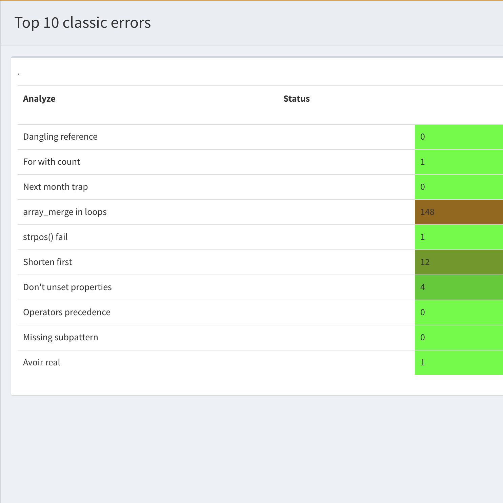

.. reports:

Reports
=======

There are several reports that may be extracted from Exakat : 

* `Ambassador`_
* `Clustergrammer`_
* `Code Flower`_
* `Code Sniffer`_
* `Composer`_
* `Dependency Wheel`_
* `Diplomat`_
* `Exakatyaml`_
* `History`_
* `Inventories`_
* `Json`_
* `Marmelab`_
* `None`_
* `Owasp`_
* `Perfile`_
* `PhpCompilation`_
* `PhpConfiguration`_
* `Phpcity`_
* `Phpcsfixer`_
* `PlantUml`_
* `RadwellCode`_
* `Sarb`_
* `SimpleTable`_
* `Stats`_
* `Text`_
* `Top10`_
* `Uml`_
* `Xml`_
* `Yaml`_

Configuring a report before the audit
-------------------------------------

By default, Exakat builds the 'Ambassador' report for any project. If you want another report, or want to ignore the build of Ambassador, configure it before running the audit. 

To do so, open the `projects/<project>/config.ini` file, and mention the list of report like that : 

::

    project_reports[] = 'Owasp';
    project_reports[] = 'Weekly';

By configuring the reports before the audit, Exakat processes only the needed analysis, and produces all the reports for each audit. 

Generating a report after the audit
-----------------------------------

If you have run an audit, but wants to extract another report for a piece of code, you can use the following command : 

   `php exakat.phar report -p <project> -format <format> -file <filename>`
   
Where <format> is one of the format listed in the following section, and <filename> is the target file. 

Note that some format requires some specific audits to be run : they will fail if those results are not available. Then, run the audit again, and mention the desired audit in the configuration. 

Common behavior
---------------

Default format is Text. Each report has a default filename, that may be configured with the -file option. Each report adds a file extension to the provided filename. 

A special value for -file is 'stdout'. Some formats may be output to stdout, such as Text or Json. Not all format are accepting that value : some format, like Ambassador or Sqlite, may only be written to directories. 

Each report is stored in its <project> folder, under the requested name.

Reports may be generated at any time, during execution of the analysis (partial results) or later, even if another audit is running. 

Ambassador
----------

Ambassador is the most complete Exakat report. It used to be the default report, until Exakat 1.7.0

Ambassador includes : 

+ Full configuration for the audit
+ Full documentation of the analysis
+ All results, searchable and browsable by file and analysis
+ Extra reports for 
    + Minor versions compatibility
    + PHP Directive usage
    + PHP compilation recommendations
    + Error messages list
    + List of processed files

.. image:: images/report.ambassador.png
    :alt: Example of a Ambassador report (0)

Ambassador includes the report from 3 other reports : PhpCompilation, PhpConfiguration, Stats.

Ambassador is a HTML report format.

Ambassador depends on the following  themes : CompatibilityPHP53, CompatibilityPHP54, CompatibilityPHP55, CompatibilityPHP56, CompatibilityPHP70, CompatibilityPHP71, CompatibilityPHP72, CompatibilityPHP73, CompatibilityPHP74, CompatibilityPHP80, Analyze, Preferences, Inventory, Performances, Appinfo, Appcontent, Dead code, Security, Suggestions, Custom.

Clustergrammer
--------------

The Clustergrammar report format data for a clustergrammer diagramm.

Clustergrammer is a visualisation tool that may be found online. After generation of this report, a TEXT file is available in the project directory. Upload it on [http://amp.pharm.mssm.edu/clustergrammer/](http://amp.pharm.mssm.edu/clustergrammer/) to visualize it. 

See a live report here : [Clustergrammer](http://amp.pharm.mssm.edu/clustergrammer/viz_sim_mats/5a8d41bf3a82d32a9dacddd9/clustergrammer.txt).

.. image:: images/report.clustergrammer.png
    :alt: Example of a Clustergrammer report (0)

Clustergrammer is a TEXT report format.

Clustergrammer doesn't depend on themes.

Code Flower
-----------

The Code Flower represents hierarchies in a code source.

Codeflower is a javascript visualization of the code. It is based on Francois Zaninotto's [CodeFlower Source code visualization](http://www.redotheweb.com/CodeFlower/).

It represents : 
+ Class hierarchy
+ Namespace hierarchy
+ Inclusion

.. image:: images/report.codeflower.png
    :alt: Example of a Code Flower report (0)

Code Flower is a HTML report format.

Code Flower doesn't depend on themes.

Code Sniffer
------------

The CodeSniffer report exports in the CodeSniffer format.

This format reports analysis using the Codesniffer's result format. 

See also [Code Sniffer Report](https://github.com/squizlabs/PHP_CodeSniffer/wiki/Reporting).

::

    FILE : /Path/To/View/The/File.php
    --------------------------------------------------------------------------------
    FOUND 3 ISSUES AFFECTING 3 LINES
    --------------------------------------------------------------------------------
     32 | MINOR | Could Use Alias
     41 | MINOR | Could Make A Function
     43 | MINOR | Could Make A Function
    --------------------------------------------------------------------------------
    

Code Sniffer is a TEXT report format.

Code Sniffer accepts any arbitrary list of results.

Composer
--------

The Composer report provide elements for the require attribute in the composer.json.

It helps documenting the composer.json, by providing more informations, extracted from the code.

This report makes a copy then updates the composer.json, if available. It creates a totally new composer.json if the latter is not available. 

It is recommended to review manually the results of the suggested composer.json before using it.

::

    Name,File,Line
    0,/features/bootstrap/FeatureContext.php,61
    10000,/features/bootstrap/FeatureContext.php,61
    777,/features/bootstrap/FeatureContext.php,63
    20,/features/bootstrap/FeatureContext.php,73
    0,/features/bootstrap/FeatureContext.php,334
    0,/features/bootstrap/FeatureContext.php,339
    0,/features/bootstrap/FeatureContext.php,344
    0,/features/bootstrap/FeatureContext.php,362
    0,/features/bootstrap/FeatureContext.php,366
    0,/features/bootstrap/FeatureContext.php,368
    0,/features/bootstrap/FeatureContext.php,372
    777,/features/bootstrap/FeatureContext.php,423
    777,/features/bootstrap/FeatureContext.php,431
    0,/src/Behat/Behat/Context/ContextClass/SimpleClassGenerator.php,68
    1,/src/Behat/Behat/Context/ContextClass/SimpleClassGenerator.php,69
    0,/src/Behat/Behat/Context/Environment/InitializedContextEnvironment.php,84
    0,/src/Behat/Behat/Context/Environment/InitializedContextEnvironment.php,150
    

Composer is a JSON report format.

Composer depends on the following theme : Appinfo.

Dependency Wheel
----------------

The DependencyWheel represents dependencies in a code source.

Dependency Wheel is a javascript visualization of the classes dependencies in the code. Every class, interface and trait are represented as a circle, and every relation between the classes are represented by a link between them, inside the circle. 

It is based on Francois Zaninotto's [DependencyWheel](http://fzaninotto.github.com/DependencyWheel) and the [d3.js](https://github.com/mbostock/d3).

.. image:: images/report.dependencywheel.png
    :alt: Example of a Dependency Wheel report (0)

Dependency Wheel is a HTML report format.

Dependency Wheel doesn't depend on themes.

Diplomat
--------

The Diplomat is the default human readable report.

The Diplomat report is the default report since Exakat 1.7.0. It is a light version of the Ambassador report, and uses a shorter list of analysis. 

::

    Name,File,Line
    0,/features/bootstrap/FeatureContext.php,61
    10000,/features/bootstrap/FeatureContext.php,61
    777,/features/bootstrap/FeatureContext.php,63
    20,/features/bootstrap/FeatureContext.php,73
    0,/features/bootstrap/FeatureContext.php,334
    0,/features/bootstrap/FeatureContext.php,339
    0,/features/bootstrap/FeatureContext.php,344
    0,/features/bootstrap/FeatureContext.php,362
    0,/features/bootstrap/FeatureContext.php,366
    0,/features/bootstrap/FeatureContext.php,368
    0,/features/bootstrap/FeatureContext.php,372
    777,/features/bootstrap/FeatureContext.php,423
    777,/features/bootstrap/FeatureContext.php,431
    0,/src/Behat/Behat/Context/ContextClass/SimpleClassGenerator.php,68
    1,/src/Behat/Behat/Context/ContextClass/SimpleClassGenerator.php,69
    0,/src/Behat/Behat/Context/Environment/InitializedContextEnvironment.php,84
    0,/src/Behat/Behat/Context/Environment/InitializedContextEnvironment.php,150
    

Diplomat is a HTML report format.

Diplomat depends on the following  themes : CompatibilityPHP53, CompatibilityPHP54, CompatibilityPHP55, CompatibilityPHP56, CompatibilityPHP70, CompatibilityPHP71, CompatibilityPHP72, CompatibilityPHP73, CompatibilityPHP74, CompatibilityPHP80, Top10, Preferences, Appinfo, Appcontent, Suggestions.

Exakatyaml
----------

Builds a list of ruleset, based on the number of issues from the previous audit.

Exakatyaml helpls with the configuration of exakat in a CI. It builds a list of ruleset, based on the number of issues from the previous audit.

Continuous Integration require steps that yield no issues. This is good for analysis that yield no results : in a word, all analysis that are currently clean should be in the CI. That way, any return will be monitored.

On the other hand, other analysis that currently yield issues needs to be fully cleaned before usage. 

::

    project: my_project
    project_name: my_project
    project_themes: {  }
    project_reports:
        - Ambassador
    rulesets:
        ruleset_0: # 0 errors found
             "Accessing Private":                                 Classes/AccessPrivate
             "Adding Zero":                                       Structures/AddZero
             "Aliases Usage":                                     Functions/AliasesUsage
             "Already Parents Interface":                         Interfaces/AlreadyParentsInterface
             "Already Parents Trait":                             Traits/AlreadyParentsTrait
             "Altering Foreach Without Reference":                Structures/AlteringForeachWithoutReference
             "Alternative Syntax Consistence":                    Structures/AlternativeConsistenceByFile
             "Always Positive Comparison":                        Structures/NeverNegative
    # Other results here
        ruleset_1: # 1 errors found
             "Constant Class":                                    Classes/ConstantClass
             "Could Be Abstract Class":                           Classes/CouldBeAbstractClass
             "Dependant Trait":                                   Traits/DependantTrait
             "Double Instructions":                               Structures/DoubleInstruction
    # Other results here
        ruleset_2: # 2 errors found
             "Always Anchor Regex":                               Security/AnchorRegex
             "Forgotten Interface":                               Interfaces/CouldUseInterface
    # Other results here
        ruleset_3: # 3 errors found
             "@ Operator":                                        Structures/Noscream
             "Indices Are Int Or String":                         Structures/IndicesAreIntOrString
             "Modernize Empty With Expression":                   Structures/ModernEmpty
             "Property Variable Confusion":                       Structures/PropertyVariableConfusion
    # Other results here
        ruleset_4: # 4 errors found
             "Buried Assignation":                                Structures/BuriedAssignation
             "Identical Consecutive Expression":                  Structures/IdenticalConsecutive
    # Other results here
        ruleset_122: # 122 errors found
             "Method Could Be Static":                            Classes/CouldBeStatic

::

    project: page_manager
    project_name: drupal_page_manager
    project_themes: {  }
    project_reports:
        - Ambassador
    rulesets:
        ruleset_0: # 0 errors found
             "$HTTP_RAW_POST_DATA Usage":                         Php/RawPostDataUsage
             "$this Belongs To Classes Or Traits":                Classes/ThisIsForClasses
             "$this Is Not An Array":                             Classes/ThisIsNotAnArray
             "$this Is Not For Static Methods":                   Classes/ThisIsNotForStatic
             "Abstract Or Implements":                            Classes/AbstractOrImplements
             "Access Protected Structures":                       Classes/AccessProtected
             "Accessing Private":                                 Classes/AccessPrivate
             "Adding Zero":                                       Structures/AddZero
             "Aliases Usage":                                     Functions/AliasesUsage
             "Already Parents Interface":                         Interfaces/AlreadyParentsInterface
             "Already Parents Trait":                             Traits/AlreadyParentsTrait
             "Altering Foreach Without Reference":                Structures/AlteringForeachWithoutReference
             "Alternative Syntax Consistence":                    Structures/AlternativeConsistenceByFile
             "Always Positive Comparison":                        Structures/NeverNegative
             "Ambiguous Array Index":                             Arrays/AmbiguousKeys
             "Ambiguous Static":                                  Classes/AmbiguousStatic
             "Ambiguous Visibilities":                            Classes/AmbiguousVisibilities
             "Anonymous Classes":                                 Classes/Anonymous
             "Assert Function Is Reserved":                       Php/AssertFunctionIsReserved
             "Assign And Compare":                                Structures/AssigneAndCompare
             "Assign Default To Properties":                      Classes/MakeDefault
             "Assign With And":                                   Php/AssignAnd
             "Assigned Twice":                                    Variables/AssignedTwiceOrMore
             "Avoid Parenthesis":                                 Structures/PrintWithoutParenthesis
             "Avoid Those Hash Functions":                        Security/AvoidThoseCrypto
             "Avoid Using stdClass":                              Php/UseStdclass
             "Avoid get_class()":                                 Structures/UseInstanceof
             "Avoid option arrays in constructors":               Classes/AvoidOptionArrays
             "Avoid set_error_handler $context Argument":         Php/AvoidSetErrorHandlerContextArg
             "Avoid sleep()/usleep()":                            Security/NoSleep
             "Bad Constants Names":                               Constants/BadConstantnames
             "Callback Needs Return":                             Functions/CallbackNeedsReturn
             "Can't Count Non-Countable":                         Structures/CanCountNonCountable
             "Can't Extend Final":                                Classes/CantExtendFinal
             "Can't Throw Throwable":                             Exceptions/CantThrow
             "Cant Inherit Abstract Method":                      Classes/CantInheritAbstractMethod
             "Cant Instantiate Class":                            Classes/CantInstantiateClass
             "Case Insensitive Constants":                        Constants/CaseInsensitiveConstants
             "Cast To Boolean":                                   Structures/CastToBoolean
             "Casting Ternary":                                   Structures/CastingTernary
             "Catch Overwrite Variable":                          Structures/CatchShadowsVariable
             "Check All Types":                                   Structures/CheckAllTypes
             "Check JSON":                                        Structures/CheckJson
             "Check On __Call Usage":                             Classes/CheckOnCallUsage
             "Child Class Removes Typehint":                      Classes/ChildRemoveTypehint
             "Class Function Confusion":                          Php/ClassFunctionConfusion
             "Class Should Be Final By Ocramius":                 Classes/FinalByOcramius
             "Class, Interface Or Trait With Identical Names":    Classes/CitSameName
             "Classes Mutually Extending Each Other":             Classes/MutualExtension
             "Clone With Non-Object":                             Classes/CloneWithNonObject
             "Common Alternatives":                               Structures/CommonAlternatives
             "Compact Inexistant Variable":                       Php/CompactInexistant
             "Compare Hash":                                      Security/CompareHash
             "Compared Comparison":                               Structures/ComparedComparison
             "Concat And Addition":                               Php/ConcatAndAddition
             "Concat Empty String":                               Structures/ConcatEmpty
             "Concrete Visibility":                               Interfaces/ConcreteVisibility
             "Configure Extract":                                 Security/ConfigureExtract
             "Const Visibility Usage":                            Classes/ConstVisibilityUsage
             "Constants Created Outside Its Namespace":           Constants/CreatedOutsideItsNamespace
             "Constants With Strange Names":                      Constants/ConstantStrangeNames
             "Continue Is For Loop":                              Structures/ContinueIsForLoop
             "Could Be Else":                                     Structures/CouldBeElse
             "Could Be Static":                                   Structures/CouldBeStatic
             "Could Use Short Assignation":                       Structures/CouldUseShortAssignation
             "Could Use __DIR__":                                 Structures/CouldUseDir
             "Could Use self":                                    Classes/ShouldUseSelf
             "Could Use str_repeat()":                            Structures/CouldUseStrrepeat
             "Crc32() Might Be Negative":                         Php/Crc32MightBeNegative
             "Dangling Array References":                         Structures/DanglingArrayReferences
             "Deep Definitions":                                  Functions/DeepDefinitions
             "Define With Array":                                 Php/DefineWithArray
             "Deprecated Functions":                              Php/Deprecated
             "Direct Call To __clone()":                          Php/DirectCallToClone
             "Direct Injection":                                  Security/DirectInjection
             "Don't Change Incomings":                            Structures/NoChangeIncomingVariables
             "Don't Echo Error":                                  Security/DontEchoError
             "Don't Read And Write In One Expression":            Structures/DontReadAndWriteInOneExpression
             "Don't Send $this In Constructor":                   Classes/DontSendThisInConstructor
             "Don't Unset Properties":                            Classes/DontUnsetProperties
             "Dont Change The Blind Var":                         Structures/DontChangeBlindKey
             "Dont Mix ++":                                       Structures/DontMixPlusPlus
             "Double Assignation":                                Structures/DoubleAssignation
             "Dynamic Library Loading":                           Security/DynamicDl
             "Echo With Concat":                                  Structures/EchoWithConcat
             "Else If Versus Elseif":                             Structures/ElseIfElseif
             "Empty Blocks":                                      Structures/EmptyBlocks
             "Empty Instructions":                                Structures/EmptyLines
             "Empty Interfaces":                                  Interfaces/EmptyInterface
             "Empty Namespace":                                   Namespaces/EmptyNamespace
             "Empty Traits":                                      Traits/EmptyTrait
             "Empty Try Catch":                                   Structures/EmptyTryCatch
             "Encoded Simple Letters":                            Security/EncodedLetters
             "Eval() Usage":                                      Structures/EvalUsage
             "Exception Order":                                   Exceptions/AlreadyCaught
             "Exit() Usage":                                      Structures/ExitUsage
             "Failed Substr Comparison":                          Structures/FailingSubstrComparison
             "Flexible Heredoc":                                  Php/FlexibleHeredoc
             "Foreach On Object":                                 Php/ForeachObject
             "Foreach Reference Is Not Modified":                 Structures/ForeachReferenceIsNotModified
             "Forgotten Visibility":                              Classes/NonPpp
             "Forgotten Whitespace":                              Structures/ForgottenWhiteSpace
             "Fully Qualified Constants":                         Namespaces/ConstantFullyQualified
             "Functions/BadTypehintRelay":                        Functions/BadTypehintRelay
             "Global Usage":                                      Structures/GlobalUsage
             "Group Use Declaration":                             Php/GroupUseDeclaration
             "Group Use Trailing Comma":                          Php/GroupUseTrailingComma
             "Hash Algorithms Incompatible With PHP 5.3":         Php/HashAlgos53
             "Hash Algorithms":                                   Php/HashAlgos
             "Hash Will Use Objects":                             Php/HashUsesObjects
             "Hexadecimal In String":                             Type/HexadecimalString
             "Hidden Use Expression":                             Namespaces/HiddenUse
             "Htmlentities Calls":                                Structures/Htmlentitiescall
             "Identical Conditions":                              Structures/IdenticalConditions
             "Identical On Both Sides":                           Structures/IdenticalOnBothSides
             "If With Same Conditions":                           Structures/IfWithSameConditions
             "Illegal Name For Method":                           Classes/WrongName
             "Implement Is For Interface":                        Classes/ImplementIsForInterface
             "Implemented Methods Are Public":                    Classes/ImplementedMethodsArePublic
             "Implicit Global":                                   Structures/ImplicitGlobal
             "Implied If":                                        Structures/ImpliedIf
             "Inclusion Wrong Case":                              Files/InclusionWrongCase
             "Incompatible Signature Methods":                    Classes/IncompatibleSignature
             "Incompilable Files":                                Php/Incompilable
             "Indirect Injection":                                Security/IndirectInjection
             "Integer As Property":                               Classes/IntegerAsProperty
             "Integer Conversion":                                Security/IntegerConversion
             "Invalid Class Name":                                Classes/WrongCase
             "Invalid Constant Name":                             Constants/InvalidName
             "Invalid Pack Format":                               Structures/InvalidPackFormat
             "Invalid Regex":                                     Structures/InvalidRegex
             "Is Actually Zero":                                  Structures/IsZero
             "List Short Syntax":                                 Php/ListShortSyntax
             "List With Appends":                                 Php/ListWithAppends
             "List With Reference":                               Php/ListWithReference
             "Logical Mistakes":                                  Structures/LogicalMistakes
             "Logical Should Use Symbolic Operators":             Php/LogicalInLetters
             "Lone Blocks":                                       Structures/LoneBlock
             "Lost References":                                   Variables/LostReferences
             "Make Global A Property":                            Classes/MakeGlobalAProperty
             "Method Collision Traits":                           Traits/MethodCollisionTraits
             "Method Signature Must Be Compatible":               Classes/MethodSignatureMustBeCompatible
             "Minus One On Error":                                Security/MinusOneOnError
             "Mismatch Type And Default":                         Functions/MismatchTypeAndDefault
             "Mismatched Default Arguments":                      Functions/MismatchedDefaultArguments
             "Mismatched Ternary Alternatives":                   Structures/MismatchedTernary
             "Mismatched Typehint":                               Functions/MismatchedTypehint
             "Missing Cases In Switch":                           Structures/MissingCases
             "Missing Include":                                   Files/MissingInclude
             "Missing New ?":                                     Structures/MissingNew
             "Missing Parenthesis":                               Structures/MissingParenthesis
             "Mixed Concat And Interpolation":                    Structures/MixedConcatInterpolation
             "Mkdir Default":                                     Security/MkdirDefault
             "Multiple Alias Definitions Per File":               Namespaces/MultipleAliasDefinitionPerFile
             "Multiple Class Declarations":                       Classes/MultipleDeclarations
             "Multiple Constant Definition":                      Constants/MultipleConstantDefinition
             "Multiple Exceptions Catch()":                       Exceptions/MultipleCatch
             "Multiple Identical Trait Or Interface":             Classes/MultipleTraitOrInterface
             "Multiple Index Definition":                         Arrays/MultipleIdenticalKeys
             "Multiple Type Variable":                            Structures/MultipleTypeVariable
             "Multiples Identical Case":                          Structures/MultipleDefinedCase
             "Multiply By One":                                   Structures/MultiplyByOne
             "Must Call Parent Constructor":                      Php/MustCallParentConstructor
             "Must Return Methods":                               Functions/MustReturn
             "Negative Power":                                    Structures/NegativePow
             "Nested Ternary":                                    Structures/NestedTernary
             "Never Used Parameter":                              Functions/NeverUsedParameter
             "New Constants In PHP 7.2":                          Php/Php72NewConstants
             "New Functions In PHP 7.0":                          Php/Php70NewFunctions
             "New Functions In PHP 7.1":                          Php/Php71NewFunctions
             "New Functions In PHP 7.2":                          Php/Php72NewFunctions
             "New Functions In PHP 7.3":                          Php/Php73NewFunctions
             "Next Month Trap":                                   Structures/NextMonthTrap
             "No Choice":                                         Structures/NoChoice
             "No Direct Call To Magic Method":                    Classes/DirectCallToMagicMethod
             "No Direct Usage":                                   Structures/NoDirectUsage
             "No Empty Regex":                                    Structures/NoEmptyRegex
             "No Hardcoded Hash":                                 Structures/NoHardcodedHash
             "No Hardcoded Ip":                                   Structures/NoHardcodedIp
             "No Hardcoded Path":                                 Structures/NoHardcodedPath
             "No Hardcoded Port":                                 Structures/NoHardcodedPort
             "No Magic With Array":                               Classes/NoMagicWithArray
             "No Parenthesis For Language Construct":             Structures/NoParenthesisForLanguageConstruct
             "No Real Comparison":                                Type/NoRealComparison
             "No Reference For Ternary":                          Php/NoReferenceForTernary
             "No Reference On Left Side":                         Structures/NoReferenceOnLeft
             "No Return For Generator":                           Php/NoReturnForGenerator
             "No Return Or Throw In Finally":                     Structures/NoReturnInFinally
             "No Return Used":                                    Functions/NoReturnUsed
             "No Self Referencing Constant":                      Classes/NoSelfReferencingConstant
             "No String With Append":                             Php/NoStringWithAppend
             "No Substr Minus One":                               Php/NoSubstrMinusOne
             "No Substr() One":                                   Structures/NoSubstrOne
             "No get_class() With Null":                          Structures/NoGetClassNull
             "No isset() With empty()":                           Structures/NoIssetWithEmpty
             "Non Ascii Variables":                               Variables/VariableNonascii
             "Non Static Methods Called In A Static":             Classes/NonStaticMethodsCalledStatic
             "Non-constant Index In Array":                       Arrays/NonConstantArray
             "Not A Scalar Type":                                 Php/NotScalarType
             "Not Not":                                           Structures/NotNot
             "Objects Don't Need References":                     Structures/ObjectReferences
             "Old Style Constructor":                             Classes/OldStyleConstructor
             "Old Style __autoload()":                            Php/oldAutoloadUsage
             "One Variable String":                               Type/OneVariableStrings
             "Only Variable For Reference":                       Functions/OnlyVariableForReference
             "Only Variable Passed By Reference":                 Functions/OnlyVariablePassedByReference
             "Only Variable Returned By Reference":               Structures/OnlyVariableReturnedByReference
             "Or Die":                                            Structures/OrDie
             "Overwritten Exceptions":                            Exceptions/OverwriteException
             "Overwritten Literals":                              Variables/OverwrittenLiterals
             "PHP 7.0 New Classes":                               Php/Php70NewClasses
             "PHP 7.0 New Interfaces":                            Php/Php70NewInterfaces
             "PHP 7.0 Removed Directives":                        Php/Php70RemovedDirective
             "PHP 7.0 Removed Functions":                         Php/Php70RemovedFunctions
             "PHP 7.0 Scalar Typehints":                          Php/PHP70scalartypehints
             "PHP 7.1 Microseconds":                              Php/Php71microseconds
             "PHP 7.1 Removed Directives":                        Php/Php71RemovedDirective
             "PHP 7.1 Scalar Typehints":                          Php/PHP71scalartypehints
             "PHP 7.2 Deprecations":                              Php/Php72Deprecation
             "PHP 7.2 Object Keyword":                            Php/Php72ObjectKeyword
             "PHP 7.2 Removed Functions":                         Php/Php72RemovedFunctions
             "PHP 7.2 Scalar Typehints":                          Php/PHP72scalartypehints
             "PHP 7.3 Last Empty Argument":                       Php/PHP73LastEmptyArgument
             "PHP 7.3 Removed Functions":                         Php/Php73RemovedFunctions
             "PHP7 Dirname":                                      Structures/PHP7Dirname
             "Parent First":                                      Classes/ParentFirst
             "Parent, Static Or Self Outside Class":              Classes/PssWithoutClass
             "Parenthesis As Parameter":                          Php/ParenthesisAsParameter
             "Pathinfo() Returns May Vary":                       Php/PathinfoReturns
             "Php 7 Indirect Expression":                         Variables/Php7IndirectExpression
             "Php 7.1 New Class":                                 Php/Php71NewClasses
             "Php 7.2 New Class":                                 Php/Php72NewClasses
             "Php7 Relaxed Keyword":                              Php/Php7RelaxedKeyword
             "Phpinfo":                                           Structures/PhpinfoUsage
             "Possible Infinite Loop":                            Structures/PossibleInfiniteLoop
             "Possible Missing Subpattern":                       Php/MissingSubpattern
             "Preprocessable":                                    Structures/ShouldPreprocess
             "Print And Die":                                     Structures/PrintAndDie
             "Printf Number Of Arguments":                        Structures/PrintfArguments
             "Property Could Be Local":                           Classes/PropertyCouldBeLocal
             "Queries In Loops":                                  Structures/QueriesInLoop
             "Random Without Try":                                Structures/RandomWithoutTry
             "Redeclared PHP Functions":                          Functions/RedeclaredPhpFunction
             "Redefined Class Constants":                         Classes/RedefinedConstants
             "Redefined Default":                                 Classes/RedefinedDefault
             "Redefined Private Property":                        Classes/RedefinedPrivateProperty
             "Register Globals":                                  Security/RegisterGlobals
             "Repeated Interface":                                Interfaces/RepeatedInterface
             "Repeated Regex":                                    Structures/RepeatedRegex
             "Repeated print()":                                  Structures/RepeatedPrint
             "Results May Be Missing":                            Structures/ResultMayBeMissing
             "Rethrown Exceptions":                               Exceptions/Rethrown
             "Return True False":                                 Structures/ReturnTrueFalse
             "Safe Curl Options":                                 Security/CurlOptions
             "Safe HTTP Headers":                                 Security/SafeHttpHeaders
             "Same Variables Foreach":                            Structures/AutoUnsetForeach
             "Scalar Or Object Property":                         Classes/ScalarOrObjectProperty
             "Self Using Trait":                                  Traits/SelfUsingTrait
             "Session Lazy Write":                                Security/SessionLazyWrite
             "Set Cookie Safe Arguments":                         Security/SetCookieArgs
             "Setlocale() Uses Constants":                        Structures/SetlocaleNeedsConstants
             "Several Instructions On The Same Line":             Structures/OneLineTwoInstructions
             "Short Open Tags":                                   Php/ShortOpenTagRequired
             "Should Chain Exception":                            Structures/ShouldChainException
             "Should Make Alias":                                 Namespaces/ShouldMakeAlias
             "Should Typecast":                                   Type/ShouldTypecast
             "Should Use Constants":                              Functions/ShouldUseConstants
             "Should Use Prepared Statement":                     Security/ShouldUsePreparedStatement
             "Should Use SetCookie()":                            Php/UseSetCookie
             "Should Yield With Key":                             Functions/ShouldYieldWithKey
             "Silently Cast Integer":                             Type/SilentlyCastInteger
             "Sqlite3 Requires Single Quotes":                    Security/Sqlite3RequiresSingleQuotes
             "Static Methods Can't Contain $this":                Classes/StaticContainsThis
             "Strange Name For Constants":                        Constants/StrangeName
             "Strange Name For Variables":                        Variables/StrangeName
             "String Initialization":                             Arrays/StringInitialization
             "String May Hold A Variable":                        Type/StringHoldAVariable
             "Strings With Strange Space":                        Type/StringWithStrangeSpace
             "Strpos()-like Comparison":                          Structures/StrposCompare
             "Strtr Arguments":                                   Php/StrtrArguments
             "Suspicious Comparison":                             Structures/SuspiciousComparison
             "Switch Fallthrough":                                Structures/Fallthrough
             "Switch To Switch":                                  Structures/SwitchToSwitch
             "Switch Without Default":                            Structures/SwitchWithoutDefault
             "Ternary In Concat":                                 Structures/TernaryInConcat
             "Test Then Cast":                                    Structures/TestThenCast
             "Throw Functioncall":                                Exceptions/ThrowFunctioncall
             "Throw In Destruct":                                 Classes/ThrowInDestruct
             "Throws An Assignement":                             Structures/ThrowsAndAssign
             "Timestamp Difference":                              Structures/TimestampDifference
             "Too Many Finds":                                    Classes/TooManyFinds
             "Too Many Native Calls":                             Php/TooManyNativeCalls
             "Trailing Comma In Calls":                           Php/TrailingComma
             "Traits/TraitNotFound":                              Traits/TraitNotFound
             "Typehint Must Be Returned":                         Functions/TypehintMustBeReturned
             "Typehinted References":                             Functions/TypehintedReferences
             "Unchecked Resources":                               Structures/UncheckedResources
             "Unconditional Break In Loop":                       Structures/UnconditionLoopBreak
             "Undeclared Static Property":                        Classes/UndeclaredStaticProperty
             "Undefined Constants":                               Constants/UndefinedConstants
             "Undefined Insteadof":                               Traits/UndefinedInsteadof
             "Undefined static:: Or self::":                      Classes/UndefinedStaticMP
             "Unicode Escape Syntax":                             Php/UnicodeEscapeSyntax
             "Unknown Pcre2 Option":                              Php/UnknownPcre2Option
             "Unkown Regex Options":                              Structures/UnknownPregOption
             "Unpreprocessed Values":                             Structures/Unpreprocessed
             "Unreachable Code":                                  Structures/UnreachableCode
             "Unset In Foreach":                                  Structures/UnsetInForeach
             "Unthrown Exception":                                Exceptions/Unthrown
             "Unused Constants":                                  Constants/UnusedConstants
             "Unused Global":                                     Structures/UnusedGlobal
             "Unused Inherited Variable In Closure":              Functions/UnusedInheritedVariable
             "Unused Interfaces":                                 Interfaces/UnusedInterfaces
             "Unused Label":                                      Structures/UnusedLabel
             "Unused Private Methods":                            Classes/UnusedPrivateMethod
             "Unused Private Properties":                         Classes/UnusedPrivateProperty
             "Unused Returned Value":                             Functions/UnusedReturnedValue
             "Upload Filename Injection":                         Security/UploadFilenameInjection
             "Use Constant As Arguments":                         Functions/UseConstantAsArguments
             "Use Constant":                                      Structures/UseConstant
             "Use Instanceof":                                    Classes/UseInstanceof
             "Use Nullable Type":                                 Php/UseNullableType
             "Use PHP Object API":                                Php/UseObjectApi
             "Use Pathinfo":                                      Php/UsePathinfo
             "Use System Tmp":                                    Structures/UseSystemTmp
             "Use With Fully Qualified Name":                     Namespaces/UseWithFullyQualifiedNS
             "Use const":                                         Constants/ConstRecommended
             "Use random_int()":                                  Php/BetterRand
             "Used Once Variables":                               Variables/VariableUsedOnce
             "Useless Abstract Class":                            Classes/UselessAbstract
             "Useless Alias":                                     Traits/UselessAlias
             "Useless Brackets":                                  Structures/UselessBrackets
             "Useless Casting":                                   Structures/UselessCasting
             "Useless Constructor":                               Classes/UselessConstructor
             "Useless Final":                                     Classes/UselessFinal
             "Useless Global":                                    Structures/UselessGlobal
             "Useless Instructions":                              Structures/UselessInstruction
             "Useless Interfaces":                                Interfaces/UselessInterfaces
             "Useless Parenthesis":                               Structures/UselessParenthesis
             "Useless Return":                                    Functions/UselessReturn
             "Useless Switch":                                    Structures/UselessSwitch
             "Useless Unset":                                     Structures/UselessUnset
             "Var Keyword":                                       Classes/OldStyleVar
             "Weak Typing":                                       Classes/WeakType
             "While(List() = Each())":                            Structures/WhileListEach
             "Wrong Number Of Arguments":                         Functions/WrongNumberOfArguments
             "Wrong Optional Parameter":                          Functions/WrongOptionalParameter
             "Wrong Parameter Type":                              Php/InternalParameterType
             "Wrong Range Check":                                 Structures/WrongRange
             "Wrong fopen() Mode":                                Php/FopenMode
             "__DIR__ Then Slash":                                Structures/DirThenSlash
             "__toString() Throws Exception":                     Structures/toStringThrowsException
             "error_reporting() With Integers":                   Structures/ErrorReportingWithInteger
             "eval() Without Try":                                Structures/EvalWithoutTry
             "ext/ereg":                                          Extensions/Extereg
             "ext/mcrypt":                                        Extensions/Extmcrypt
             "filter_input() As A Source":                        Security/FilterInputSource
             "func_get_arg() Modified":                           Functions/funcGetArgModified
             "include_once() Usage":                              Structures/OnceUsage
             "isset() With Constant":                             Structures/IssetWithConstant
             "list() May Omit Variables":                         Structures/ListOmissions
             "move_uploaded_file Instead Of copy":                Security/MoveUploadedFile
             "parse_str() Warning":                               Security/parseUrlWithoutParameters
             "preg_replace With Option e":                        Structures/pregOptionE
             "self, parent, static Outside Class":                Classes/NoPSSOutsideClass
             "set_exception_handler() Warning":                   Php/SetExceptionHandlerPHP7
             "var_dump()... Usage":                               Structures/VardumpUsage
        ruleset_1: # 1 errors found
             "Constant Class":                                    Classes/ConstantClass
             "Could Be Abstract Class":                           Classes/CouldBeAbstractClass
             "Dependant Trait":                                   Traits/DependantTrait
             "Double Instructions":                               Structures/DoubleInstruction
             "Drop Else After Return":                            Structures/DropElseAfterReturn
             "Empty Classes":                                     Classes/EmptyClass
             "Forgotten Thrown":                                  Exceptions/ForgottenThrown
             "Inconsistent Elseif":                               Structures/InconsistentElseif
             "Instantiating Abstract Class":                      Classes/InstantiatingAbstractClass
             "List With Keys":                                    Php/ListWithKeys
             "Logical To in_array":                               Performances/LogicalToInArray
             "No Need For Else":                                  Structures/NoNeedForElse
             "Same Conditions In Condition":                      Structures/SameConditions
             "Should Use session_regenerateid()":                 Security/ShouldUseSessionRegenerateId
             "Static Loop":                                       Structures/StaticLoop
             "Too Many Injections":                               Classes/TooManyInjections
             "Undefined Caught Exceptions":                       Exceptions/CaughtButNotThrown
             "Unresolved Catch":                                  Classes/UnresolvedCatch
             "Unserialize Second Arg":                            Security/UnserializeSecondArg
             "Use Positive Condition":                            Structures/UsePositiveCondition
             "Useless Catch":                                     Exceptions/UselessCatch
             "Useless Check":                                     Structures/UselessCheck
        ruleset_2: # 2 errors found
             "Always Anchor Regex":                               Security/AnchorRegex
             "Forgotten Interface":                               Interfaces/CouldUseInterface
             "No Class As Typehint":                              Functions/NoClassAsTypehint
             "No array_merge() In Loops":                         Performances/ArrayMergeInLoops
             "Pre-increment":                                     Performances/PrePostIncrement
             "Randomly Sorted Arrays":                            Arrays/RandomlySortedLiterals
             "Should Make Ternary":                               Structures/ShouldMakeTernary
             "Should Use Coalesce":                               Php/ShouldUseCoalesce
             "Use === null":                                      Php/IsnullVsEqualNull
        ruleset_3: # 3 errors found
             "@ Operator":                                        Structures/Noscream
             "Indices Are Int Or String":                         Structures/IndicesAreIntOrString
             "Modernize Empty With Expression":                   Structures/ModernEmpty
             "Property Variable Confusion":                       Structures/PropertyVariableConfusion
             "Too Many Local Variables":                          Functions/TooManyLocalVariables
             "Unused Classes":                                    Classes/UnusedClass
             "Usort Sorting In PHP 7.0":                          Php/UsortSorting
        ruleset_4: # 4 errors found
             "Buried Assignation":                                Structures/BuriedAssignation
             "Identical Consecutive Expression":                  Structures/IdenticalConsecutive
             "Nested Ifthen":                                     Structures/NestedIfthen
             "No Boolean As Default":                             Functions/NoBooleanAsDefault
             "Use Named Boolean In Argument Definition":          Functions/AvoidBooleanArgument
        ruleset_5: # 5 errors found
             "Avoid Optional Properties":                         Classes/AvoidOptionalProperties
             "Empty Function":                                    Functions/EmptyFunction
             "Relay Function":                                    Functions/RelayFunction
             "Strict Comparison With Booleans":                   Structures/BooleanStrictComparison
             "Use Class Operator":                                Classes/UseClassOperator
             "strpos() Too Much":                                 Performances/StrposTooMuch
        ruleset_6: # 6 errors found
             "Used Once Property":                                Classes/UsedOnceProperty
        ruleset_7: # 7 errors found
             "No Class In Global":                                Php/NoClassInGlobal
             "Uncaught Exceptions":                               Exceptions/UncaughtExceptions
             "Unused Functions":                                  Functions/UnusedFunctions
             "Wrong Number Of Arguments In Methods":              Functions/WrongNumberOfArgumentsMethods
        ruleset_8: # 8 errors found
             "Could Make A Function":                             Functions/CouldCentralize
             "Insufficient Typehint":                             Functions/InsufficientTypehint
             "Long Arguments":                                    Structures/LongArguments
             "Property Used In One Method Only":                  Classes/PropertyUsedInOneMethodOnly
             "Static Methods Called From Object":                 Classes/StaticMethodsCalledFromObject
        ruleset_9: # 9 errors found
             "PHP Keywords As Names":                             Php/ReservedNames
             "Undefined Trait":                                   Traits/UndefinedTrait
             "Written Only Variables":                            Variables/WrittenOnlyVariable
        ruleset_10: # 10 errors found
             "Bail Out Early":                                    Structures/BailOutEarly
             "Hardcoded Passwords":                               Functions/HardcodedPasswords
             "Multiple Alias Definitions":                        Namespaces/MultipleAliasDefinitions
        ruleset_11: # 11 errors found
             "Variable Is Not A Condition":                       Structures/NoVariableIsACondition
        ruleset_13: # 13 errors found
             "Undefined Functions":                               Functions/UndefinedFunctions
             "Unused Use":                                        Namespaces/UnusedUse
        ruleset_14: # 14 errors found
             "Iffectations":                                      Structures/Iffectation
             "No Public Access":                                  Classes/NoPublicAccess
        ruleset_16: # 16 errors found
             "Overwriting Variable":                              Variables/Overwriting
        ruleset_17: # 17 errors found
             "No Net For Xml Load":                               Security/NoNetForXmlLoad
             "Unresolved Instanceof":                             Classes/UnresolvedInstanceof
        ruleset_21: # 21 errors found
             "Undefined Class Constants":                         Classes/UndefinedConstants
        ruleset_27: # 27 errors found
             "Locally Unused Property":                           Classes/LocallyUnusedProperty
             "Never Used Properties":                             Classes/PropertyNeverUsed
        ruleset_35: # 35 errors found
             "Useless Referenced Argument":                       Functions/UselessReferenceArgument
        ruleset_38: # 38 errors found
             "Uses Default Values":                               Functions/UsesDefaultArguments
        ruleset_47: # 47 errors found
             "Unused Arguments":                                  Functions/UnusedArguments
        ruleset_49: # 49 errors found
             "Undefined Properties":                              Classes/UndefinedProperty
        ruleset_77: # 77 errors found
             "Undefined Parent":                                  Classes/UndefinedParentMP
        ruleset_78: # 78 errors found
             "Undefined ::class":                                 Classes/UndefinedStaticclass
        ruleset_82: # 82 errors found
             "Class Could Be Final":                              Classes/CouldBeFinal
        ruleset_86: # 86 errors found
             "Unused Protected Methods":                          Classes/UnusedProtectedMethods
        ruleset_89: # 89 errors found
             "Unresolved Classes":                                Classes/UnresolvedClasses
        ruleset_94: # 94 errors found
             "Used Once Variables (In Scope)":                    Variables/VariableUsedOnceByContext
        ruleset_122: # 122 errors found
             "Method Could Be Static":                            Classes/CouldBeStatic
        ruleset_133: # 133 errors found
             "Should Use Local Class":                            Classes/ShouldUseThis
        ruleset_159: # 159 errors found
             "Undefined Interfaces":                              Interfaces/UndefinedInterfaces
        ruleset_160: # 160 errors found
             "Unused Methods":                                    Classes/UnusedMethods
        ruleset_183: # 183 errors found
             "Undefined Variable":                                Variables/UndefinedVariable
        ruleset_337: # 337 errors found
             "Unresolved Use":                                    Namespaces/UnresolvedUse
        ruleset_595: # 595 errors found
             "Undefined Classes":                                 Classes/UndefinedClasses
    

Exakatyaml is a Yaml report format.

Exakatyaml doesn't depend on themes.

History
-------

The History report collects meta information between audits. It saves the values from the current audit into a separate 'history.sqlite' database.

The history tables are the same as the dump.sqlite tables, except for the extra 'serial' table. Each audit comes with 3 identifiers : 

+ 'dump_timestamp' : this is a timmestamp taken when the dump was build
+ 'dump_serial'    : this is a serial number, based on the previous audit, and incremented by one. This is handy to keep the values in sequence
+ 'dump_id'        : this is a unique random id, which helps distinguish audits which may have inconsistence between serial or timestamp.

This report provides a 'history.sqlite' database. The following tables are inventoried : 

+ hash 
+ resultsCounts

History is a Sqlite report format.

History doesn't depend on themes.

Inventories
-----------

The Inventories report collects literals and names from the code.

This report provides the value, the file and line where a type of value is present. 

The following values and names are inventoried : 

+ Variables
+ Incoming Variables
+ Session Variables
+ Global Variables
+ Date formats
+ Constants
+ Functions
+ Classes
+ Interfaces
+ Traitnames
+ Namespaces
+ Exceptions
+ Regex
+ SQL
+ URL
+ Unicode blocks
+ Integer
+ Real
+ Literal Arrays
+ Strings

Every type of values is exported to a file. If no value of such type was found during the audit, the file only contains the headers. It is always produced.

::

    Name,File,Line
    0,/features/bootstrap/FeatureContext.php,61
    10000,/features/bootstrap/FeatureContext.php,61
    777,/features/bootstrap/FeatureContext.php,63
    20,/features/bootstrap/FeatureContext.php,73
    0,/features/bootstrap/FeatureContext.php,334
    0,/features/bootstrap/FeatureContext.php,339
    0,/features/bootstrap/FeatureContext.php,344
    0,/features/bootstrap/FeatureContext.php,362
    0,/features/bootstrap/FeatureContext.php,366
    0,/features/bootstrap/FeatureContext.php,368
    0,/features/bootstrap/FeatureContext.php,372
    777,/features/bootstrap/FeatureContext.php,423
    777,/features/bootstrap/FeatureContext.php,431
    0,/src/Behat/Behat/Context/ContextClass/SimpleClassGenerator.php,68
    1,/src/Behat/Behat/Context/ContextClass/SimpleClassGenerator.php,69
    0,/src/Behat/Behat/Context/Environment/InitializedContextEnvironment.php,84
    0,/src/Behat/Behat/Context/Environment/InitializedContextEnvironment.php,150
    

Inventories is a CSV report format.

Inventories depends on the following theme : Inventories.

Json
----

The JSON report exports in JSON format.

Simple Json format. It is a structured array with all results, described as object.

::

    Filename => [
                    errors   => count,
                    warning  => count,
                    fixable  => count,
                    filename => string,
                    message  => [
                        line => [
                            type,
                            source,
                            severity,
                            fixable,
                            message
                        ]
                    ]
                ]

::

    {  
       "\/src\/Path\/To\/File.php":{  
          "errors":0,
          "warnings":105,
          "fixable":0,
          "filename":"\/src\/Path\/To\/File.php",
          "messages":{  
             "55":[  
                [  
                   {  
                      "type":"warning",
                      "source":"Php/EllipsisUsage",
                      "severity":"Major",
                      "fixable":"fixable",
                      "message":"... Usage"
                   }
                ]
             ],
             }
        }
    }

Json is a Json report format.

Json accepts any arbitrary list of results.

Marmelab
--------

The Marmelab report format data to use with a graphQL server.

Marmelab is a report format to build GraphQL server with exakat's results. Export the results of the audit in this JSON file, then use the [json-graphql-server](https://github.com/marmelab/json-graphql-server) to have a GraphQL server with all the results.

You may also learn more about GraphQL at [Introducing Json GraphQL Server](https://marmelab.com/blog/2017/07/12/json-graphql-server.html).

::

    php exakat.phar report -p -format Marmelab -file marmelab
    cp projects/myproject/marmelab.json path/to/marmelab
    json-graphql-server db.json
    

Marmelab is a JSON report format.

Marmelab depends on the following theme : Analyze.

None
----

None is the empty report. It runs the report generating stack, but doesn't produce any result. 

None is a utility report, aimed to test exakat's installation.

None is a None report format.

None depends on the following theme : Any.

Owasp
-----

The OWASP report is a security report.

The OWASP report focuses on the [OWASP top 10](https://www.owasp.org/index.php/Category:OWASP_Top_Ten_Project). It reports all the security analysis, distributed across the 10 categories of vulnerabilities.

.. image:: images/report.owasp.png
    :alt: Example of a Owasp report (0)

Owasp is a HTML report format.

Owasp depends on the following theme : Security.

Perfile
-------

The Perfile report lays out the results file per file.

The Perfile report displays one result per line, grouped by file, and ordered by line number : 

::
    
   /path/from/project/root/to/file:line[space]name of analysis
   
   
This format is fast, and fitted for human review.

::

    ---------------------------------------------------------
     line  /themes/Rozier/Controllers/LoginController.php
    ---------------------------------------------------------
       34  Multiple Alias Definitions 
       36  Unresolved Use 
       43  Multiple Alias Definitions 
       51  Class Could Be Final 
       58  Undefined Interfaces 
       81  Undefined Interfaces 
       81  Unused Arguments 
       81  Used Once Variables (In Scope) 
       91  Undefined Interfaces 
       91  Unused Arguments 
       91  Used Once Variables (In Scope) 
      101  Undefined Interfaces 
      103  Nested Ifthen 
      104  Unresolved Classes 
      106  Buried Assignation 
      106  Iffectations 
      106  Use Positive Condition 
      121  Uncaught Exceptions 
      121  Unresolved Classes 
      129  Uncaught Exceptions 
    ---------------------------------------------------------
    

Perfile is a Text report format.

Perfile accepts any arbitrary list of results.

PhpCompilation
--------------

The PhpCompilation suggests a list of compilation directives when compiling the PHP binary, tailored for the code

PhpCompilation bases its selection on the code and its usage of features. PhpCompilation also recommends disabling unused standard extensions : this helps reducing the footprint of the binary, and prevents unused features to be available for intrusion. PhpCompilation is able to detects over 150 PHP extensions.

::

    ;;;;;;;;;;;;;;;;;;;;;;;;;;
    ; Suggestion for php.ini ;
    ;;;;;;;;;;;;;;;;;;;;;;;;;;
    
    ; The directives below are selected based on the code provided. 
    ; They only cover the related directives that may have an impact on the code
    ;
    ; The list may not be exhaustive
    ; The suggested values are not recommendations, and should be reviewed and adapted
    ;
    
    
    [date]
    ; It is not safe to rely on the system's timezone settings. Make sure the
    ; directive date.timezone is set in php.ini.
    date.timezone = Europe/Amsterdam
    
    
    
    [pcre]
    ; More information about pcre : 
    ;http://php.net/manual/en/pcre.configuration.php
    
    
    
    [standard]
    ; This sets the maximum amount of memory in bytes that a script is allowed to
    ; allocate. This helps prevent poorly written scripts for eating up all available
    ; memory on a server. It is recommended to set this as low as possible and avoid
    ; removing the limit.
    memory_limit = 120
    
    ; This sets the maximum amount of time, in seconds, that a script is allowed to
    ; run. The lower the value, the better for the server, but also, the better has
    ; the script to be written. Avoid really large values that are only useful for
    ; admin, and set them per directory.
    max_execution_time = 90
    
    ; Exposes to the world that PHP is installed on the server. For security reasons,
    ; it is better to keep this hidden.
    expose_php = Off
    
    ; This determines whether errors should be printed to the screen as part of the
    ; output or if they should be hidden from the user.
    display_errors = Off
    
    ; Set the error reporting level. Always set this high, so as to have the errors
    ; reported, and logged.
    error_reporting = E_ALL
    
    ; Always log errors for future use
    log_errors = On
    
    ; Name of the file where script errors should be logged. 
    error_log = Name of a writable file, suitable for logging.
    
    ; More information about standard : 
    ;http://php.net/manual/en/info.configuration.php
    
    ; Name of the file where script errors should be logged. 
    disable_functions = curl_init,ftp_connect,ftp_ssl_connect,ldap_connect,mail,mysqli_connect,mysqli_pconnect,pg_connect,pg_pconnect,socket_create,socket_accept,socket_connect,socket_listen
    disable_classes = mysqli
    

PhpCompilation is a Text report format.

PhpCompilation depends on the following theme : Appinfo.

PhpConfiguration
----------------

The PhpConfiguration suggests a list of directives to check when setting up the hosting server, tailored for the code

PhpConfiguration bases its selection on the code, and classic recommendations. For example, memory_limit or expose_php are always reported, though they have little impact in the code. Extensions also get a short list of important directive, and offer a link to the documentation for more documentation.

::

    ;;;;;;;;;;;;;;;;;;;;;;;;;;
    ; Suggestion for php.ini ;
    ;;;;;;;;;;;;;;;;;;;;;;;;;;
    
    ; The directives below are selected based on the code provided. 
    ; They only cover the related directives that may have an impact on the code
    ;
    ; The list may not be exhaustive
    ; The suggested values are not recommendations, and should be reviewed and adapted
    ;
    
    
    [date]
    ; It is not safe to rely on the system's timezone settings. Make sure the
    ; directive date.timezone is set in php.ini.
    date.timezone = Europe/Amsterdam
    
    
    
    [pcre]
    ; More information about pcre : 
    ;http://php.net/manual/en/pcre.configuration.php
    
    
    
    [standard]
    ; This sets the maximum amount of memory in bytes that a script is allowed to
    ; allocate. This helps prevent poorly written scripts for eating up all available
    ; memory on a server. It is recommended to set this as low as possible and avoid
    ; removing the limit.
    memory_limit = 120
    
    ; This sets the maximum amount of time, in seconds, that a script is allowed to
    ; run. The lower the value, the better for the server, but also, the better has
    ; the script to be written. Avoid really large values that are only useful for
    ; admin, and set them per directory.
    max_execution_time = 90
    
    ; Exposes to the world that PHP is installed on the server. For security reasons,
    ; it is better to keep this hidden.
    expose_php = Off
    
    ; This determines whether errors should be printed to the screen as part of the
    ; output or if they should be hidden from the user.
    display_errors = Off
    
    ; Set the error reporting level. Always set this high, so as to have the errors
    ; reported, and logged.
    error_reporting = E_ALL
    
    ; Always log errors for future use
    log_errors = On
    
    ; Name of the file where script errors should be logged. 
    error_log = Name of a writable file, suitable for logging.
    
    ; More information about standard : 
    ;http://php.net/manual/en/info.configuration.php
    
    ; Name of the file where script errors should be logged. 
    disable_functions = curl_init,ftp_connect,ftp_ssl_connect,ldap_connect,mail,mysqli_connect,mysqli_pconnect,pg_connect,pg_pconnect,socket_create,socket_accept,socket_connect,socket_listen
    disable_classes = mysqli
    

PhpConfiguration is a Text report format.

PhpConfiguration depends on the following theme : Appinfo.

Phpcity
-------

The Phpcity report represents your code as a city. 

Phpcity is a code visualisation tool : it displays the source code as a city, with districts and buildings. Ther will be high sky crappers, signaling large classes, entire districts of small blocks, large venues and isolated parks. Some imagination is welcome too. 

The original idea is Richard Wettel's [Code city](https://wettel.github.io/codecity.html), which has been adapted to many languages, including PHP. The PHP version is based on the open source [PHPcity project](https://github.com/adrianhuna/PHPCity), which is itself build with [JScity](https://github.com/ASERG-UFMG/JSCity/wiki/JSCITY). 

To use this tool, run an exakat audit, then generate the 'PHPcity' report : `php exakat.phar report -p mycode -format PHPcity -v`

This generates the `exakat.phpcity.json` file, in the `projects/mycode/` folder. 

You may test your own report online, at [Adrian Huna](https://github.com/adrianhuna)'s website, by [uploading the results](https://adrianhuna.github.io/PHPCity/) and seeing it live immediately. 

Or, you can install the [PHPcity](https://github.com/adrianhuna/PHPCity) application, and load it locally. 

.. image:: images/report.phpcity.png
    :alt: Example of a Phpcity report (0)

Phpcity is a JSON report format.

Phpcity doesn't depend on themes.

Phpcsfixer
----------

The Phpcsfixer report provides a configuration file for php-cs-fixer, that automatically fixes issues found in related analysis in exakat.

This report builds a configuration file for php-cs-fixer. 

+ :ref:`use-===-null`  : **is_null**
+ :ref:`else-if-versus-elseif`  : **elseif**
+ :ref:`multiple-unset()`  : **combine_consecutive_unsets**
+ Classes/DontUnsetProperties: **no_unset_on_property**
+ :ref:`use-constant`  : **function_to_constant**
+ :ref:`php7-dirname`  : **combine_nested_dirname**
+ :ref:`could-use-\_\_dir\_\_`  : **dir_constant**
+ :ref:`isset-multiple-arguments`  : **combine_consecutive_issets**
+ :ref:`logical-should-use-symbolic-operators`  : **logical_operators**
+ :ref:`not-not`  : **no_short_bool_cast**

`PHP-cs-fixer <https://github.com/FriendsOfPHP/PHP-CS-Fixer>`_ is a tool to automatically fix PHP Coding Standards issues. Some of the modifications are more than purely coding standards, such has replacing ``dirname(dirname($path))`` with ``dirname($path, 2)``. 

Exakat builds a configuration file for php-cs-fixer, that will automatically fix a number of results from the audit. Here is the process : 

+ Run exakat audit
+ Get Phpcsfixer report from exakat : ``php exakat.phar report -p <project> -format Phpcsfixer``
+ Update the target repository in the generated code
+ Save this new configuration in a file called '.php_cs'
+ Run php-cs-fixer on your code : ``php php-cs-fixer.phar fix /path/to/code --dry-run``
+ Fixed your code with php-cs-fixer : ``php php-cs-fixer.phar fix /path/to/code``
+ Run a new exakat audit

This configuration file should be reviewed before being used. In particular, the target files should be updated with the actual repository : this is the first part of the configuration. 

It is also recommended to use the option '--dry-run' with php-cs-fixer to check the first run. 

Php-cs-fixer runs fixes for coding standards : this reports focuses on potential fixes. It is recommended to complete this base report with extra coding conventions fixes. The building of a coding convention is outside the scope of this report. 

Exakat may find different issues than php-cs-fixer : using this report reduces the number of reported issues, but may leave some issues unsolved. In that case, manual fixing is recommended.

Phpcsfixer is a JSON report format.

Phpcsfixer depends on the following theme : php-cs-fixable.

PlantUml
--------

The PlantUml export data structure to PlantUml format.

This report produces a .puml file, compatible with [PlantUML](http://plantuml.com/).

PlantUML is an Open Source component that dislays class diagrams. 

.. image:: images/report.plantuml.png
    :alt: Example of a PlantUml report (0)

PlantUml is a puml report format.

PlantUml doesn't depend on themes.

RadwellCode
-----------

The RadwellCode is a report based on Oliver Radwell's [PHP Do And Don't](https://blog.radwell.codes/2016/11/php-dos-donts-aka-programmers-dont-like/).

Note that all rules are not implemented, especially the 'coding conventions' ones, as this is beyond the scope of this tool.

::

        /Phrozn/Vendor/Extra/scss.inc.php:594 Slow PHP built-in functions
        /Phrozn/Vendor/Extra/scss.inc.php:2554 Too many nested if statements
        /Phrozn/Vendor/Extra/scss.inc.php:1208 Long if-else blocks
        /Phrozn/Vendor/Extra/scss.inc.php:1208 Too many nested if statements
        /Phrozn/Vendor/Extra/scss.inc.php:3935 Wrong function / class name casing
        /Phrozn/Vendor/Extra/scss.inc.php:3452 Too many nested if statements
        /Phrozn/Site/View/OutputPath/Entry/Parametrized.php:58 Slow PHP built-in functions
        /Phrozn/Runner/CommandLine/Callback/Init.php:82 Extra brackets and braces and quotes
    

RadwellCode is a Text report format.

RadwellCode depends on the following theme : RadwellCodes.

Sarb
----

The Sarb report is a compatibility report with SARB

`SARB <https://github.com/DaveLiddament/sarb>`_ is the Static Analysis Results Baseliner. SARB is used to create a baseline of these results. As work on the project progresses SARB can takes the latest static analysis results, removes those issues in the baseline and report the issues raised since the baseline. SARB does this, in conjunction with git, by tracking lines of code between commits. SARB is the brainchild of `Dave Liddament <https://twitter.com/DaveLiddament>`_. 

::

    [
        {
            "type": "Classes\/NonPpp",
            "file": "\/home\/exakat\/elation\/code\/include\/base_class.php",
            "line": 37
        },
        {
            "type": "Structures\/NoSubstrOne",
            "file": "\/home\/exakat\/elation\/code\/include\/common_funcs.php",
            "line": 890
        },
        {
            "type": "Structures\/DropElseAfterReturn",
            "file": "\/home\/exakat\/elation\/code\/include\/smarty\/SmartyValidate.class.php",
            "line": 638
        },
        {
            "type": "Variables\/UndefinedVariable",
            "file": "\/home\/exakat\/elation\/code\/components\/ui\/ui.php",
            "line": 174
        },
        {
            "type": "Functions\/TooManyLocalVariables",
            "file": "\/home\/exakat\/elation\/code\/include\/dependencymanager_class.php",
            "line": 43
        }
    ]

Sarb is a Json report format.

Sarb accepts any arbitrary list of results.

SimpleTable
-----------

The Simpletable is a simple table presentation.

Simpletable is suitable for any list of results provided by exakat. It is inspired from the Clang report. The result is a HTML file, with Javascript and CSS. 

.. image:: images/report.simpletable.png
    :alt: Example of a SimpleTable report (0)

SimpleTable is a HTML report format.

SimpleTable doesn't depend on themes.

Stats
-----

The Stats report collects various stats about the code.

Stats reports PHP structures definition, like class, interfaces, variables, and also features, like operator, control flow instructions, etc.

::

    {
        "Summary": {
            "Namespaces": 82,
            "Classes": 59,
            "Interfaces": 29,
            "Trait": 0,
            "Functions": 0,
            "Variables": 4524,
            "Constants": 0
        },
        "Classes": {
            "Classes": 59,
            "Class constants": 10,
            "Properties": 140,
            "Methods": 474
        },
        "Structures": {
            "Ifthen": 568,
            "Else": 76,
            "Switch": 15,
            "Case": 62,
            "Default": 9,
            "Fallthrough": 0,
            "For": 5,
            "Foreach": 102,
            "While": 21,
            "Do..while": 0,
            "New": 106,
            "Clone": 0,
            "Class constant call": 34,
            "Method call": 1071,
            "Static method call": 52,
            "Properties usage": 0,
            "Static property": 65,
            "Throw": 35,
            "Try": 12,
            "Catch": 12,
            "Finally": 0,
            "Yield": 0,
            "Yield From": 0,
            "?  :": 60,
            "?: ": 2,
            "Variables constants": 0,
            "Variables variables": 7,
            "Variables functions": 1,
            "Variables classes": 5
        }
    }

Stats is a JSON report format.

Stats depends on the following theme : Stats.

Text
----

The Text report is a very simple text format.

The Text report displays one result per line, with the following format  : 

::
    
   /path/from/project/root/to/file:line[space]name of analysis
   
   
This format is fast, and fitted for machine communications.

::

    /classes/test.php:1002	Php/ShouldUseFunction	Should Use Function	array_values(array_unique(array_merge($classTags, $annotations['tags'])))
    /classes/test.php:1002	Php/ShouldUseFunction	Should Use Function	array_merge($classTags, $annotations['tags'])
    /classes/test.php:1005	Structures/NoArrayUnique	Avoid array_unique()	array_unique(array_merge($classTags, $this->testMethods[$testMethodName]['tags']))
    /classes/test.php:1005	Performances/SlowFunctions	Slow Functions	array_unique(array_merge($classTags, $this->testMethods[$testMethodName]['tags']))
    

Text is a Text report format.

Text accepts any arbitrary list of results.

Top10
-----

The top 10 is the companion report for the 'Top 10 classic PHP traps' presentation. 

The Top 10 report is based on the 'Top 10 classic PHP traps' presentation. You can run it on your code and check immediately where those classic traps are waiting for you. Read the whole presentation `online <https://www.exakat.io/top-10-php-classic-traps/>`_

Top10 is a HTML report format.

Top10 depends on the following theme : Top10.

Uml
---

The Uml exports data structure to UML format.

This report produces a dot file with a representation of the classes used in the repository. 

Classes, interfaces and traits are represented, along with their constants, methods and properties. 

.dot files are best seen with [graphviz](http://www.graphviz.org/) : they are easily convert into PNG or PDF.

.. image:: images/report.uml.general.png
    :alt: Example of a Uml report (0)

.. image:: images/report.uml.detail.png
    :alt: Example of a Uml report (1)

Uml is a dot report format.

Uml doesn't depend on themes.

Xml
---

The Xml report exports in XML format.

XML version of the reports. It uses the same format than PHP Code Sniffer to output the results. 

::

    <?xml version="1.0" encoding="UTF-8"?>
    <phpcs version="0.8.6">
    <file name="/src/NlpTools/Stemmers/PorterStemmer.php" errors="0" warnings="105" fixable="0">
     <warning line="55" column="0" source="Php/EllipsisUsage" severity="Major" fixable="0">... Usage</warning>
    

Xml is a XML report format.

Xml accepts any arbitrary list of results.

Yaml
----

The Yaml report exports in Yaml format.

Simple Yaml format. It is a structured array with all results, described as object.

::

    Filename => [
                    errors   => count,
                    warning  => count,
                    fixable  => count,
                    filename => string,
                    message  => [
                        line => [
                            type,
                            source,
                            severity,
                            fixable,
                            message
                        ]
                    ]
                ]

::

    /src/Altax/Module/Task/Resource/RuntimeTask.php:
        errors: 0
        warnings: 22
        fixable: 0
        filename: /src/Altax/Module/Task/Resource/RuntimeTask.php
        messages: { 77: [[{ type: warning, source: Structures/Iffectation, severity: Minor, fixable: fixable, message: Iffectations, fullcode: '$args = $this->getArguments( )' }]], 67: [[{ type: warning, source: Structures/Iffectation, severity: Minor, fixable: fixable, message: Iffectations, fullcode: '$args = $this->input->getArgument(''args'')' }, { type: warning, source: Structures/BuriedAssignation, severity: Minor, fixable: fixable, message: 'Buried Assignation', fullcode: '$args = $this->input->getArgument(''args'')' }]], 114: [[{ type: warning, source: Variables/WrittenOnlyVariable, severity: Minor, fixable: fixable, message: 'Written Only Variables', fullcode: $input }, { type: warning, source: Variables/VariableUsedOnceByContext, severity: Minor, fixable: fixable, message: 'Used Once Variables (In Scope)', fullcode: $input }, { type: warning, source: Classes/UndefinedClasses, severity: Major, fixable: fixable, message: 'Undefined Classes', fullcode: 'new ArrayInput($arguments)' }]], 13: [[{ type: warning, source: Structures/PropertyVariableConfusion, severity: Minor, fixable: fixable, message: 'Property Variable Confusion', fullcode: $input }]], 74: [[{ type: warning, source: Php/ReservedNames, severity: Major, fixable: fixable, message: 'PHP Keywords As Names', fullcode: $default }]], 61: [[{ type: warning, source: Php/ReservedNames, severity: Major, fixable: fixable, message: 'PHP Keywords As Names', fullcode: $string }]], 59: [[{ type: warning, source: Php/ReservedNames, severity: Major, fixable: fixable, message: 'PHP Keywords As Names', fullcode: $string }, { type: warning, source: Functions/RelayFunction, severity: Major, fixable: fixable, message: 'Relay Function', fullcode: 'public function write($string) { /**/ } ' }]], 56: [[{ type: warning, source: Php/ReservedNames, severity: Major, fixable: fixable, message: 'PHP Keywords As Names', fullcode: $string }]], 54: [[{ type: warning, source: Php/ReservedNames, severity: Major, fixable: fixable, message: 'PHP Keywords As Names', fullcode: $string }, { type: warning, source: Functions/RelayFunction, severity: Major, fixable: fixable, message: 'Relay Function', fullcode: 'public function writeln($string) { /**/ } ' }]], 81: [[{ type: warning, source: Php/ReservedNames, severity: Major, fixable: fixable, message: 'PHP Keywords As Names', fullcode: $default }]], 84: [[{ type: warning, source: Php/ReservedNames, severity: Major, fixable: fixable, message: 'PHP Keywords As Names', fullcode: $default }]], 44: [[{ type: warning, source: Functions/RelayFunction, severity: Major, fixable: fixable, message: 'Relay Function', fullcode: 'public function getConfig( ) { /**/ } ' }]], 78: [[{ type: warning, source: Structures/ShouldMakeTernary, severity: Minor, fixable: fixable, message: 'Should Make Ternary', fullcode: 'if(isset($args[$index])) { /**/ } else { /**/ } ' }]], 108: [[{ type: warning, source: Structures/NoVariableIsACondition, severity: Minor, fixable: fixable, message: 'Variable Is Not A Condition', fullcode: '!$command' }]], 109: [[{ type: warning, source: Exceptions/UncaughtExceptions, severity: Minor, fixable: fixable, message: 'Uncaught Exceptions', fullcode: 'throw new \RuntimeException("Not found a before task command ''$taskName''.")' }]], 95: [[{ type: warning, source: Classes/UnusedMethods, severity: Minor, fixable: fixable, message: 'Unused Methods', fullcode: 'public function call($taskName, $arguments = array( )) { /**/ } ' }]], 10: [[{ type: warning, source: Classes/CouldBeFinal, severity: Minor, fixable: fixable, message: 'Class Could Be Final', fullcode: 'class RuntimeTask { /**/ } ' }]] }
    

Yaml is a Yaml report format.

Yaml accepts any arbitrary list of results.

