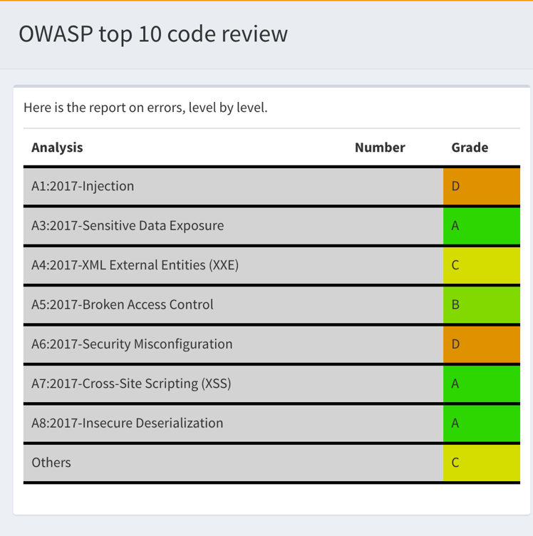

.. Reports:

Obtaining a report 
==================

There are several reports that may be extracted from Exakat : 

* Text
* Json
* XML
* CodeSniffer
* Codeflower
* Dependencywheel
* Owasp
* Ambassador
* Uml
* Plantuml
* Simpletable
* Marmelab
* Drillinstructor
* Clustergrammer
* Composer
* Inventories
* Stats
* PhpCompilation
* PhpConfiguration
* RadwellCode

   `php exakat.phar report -p <project> -format <format> -file <filename>`

Here is an explanation of all the different steps involved in running exakat on your code.

Common behavior
---------------

Default format is Text. Each report has a default filename, that may be configured with the -file option. Each report adds a file extension to the provided filename. 

A special value for -file is 'stdout'. Some formats may be output to stdout, such as Text or Json. Not all format are accepting that value : some format, like Ambassador or Sqlite, may only be written to directories. 

Each report is stored in its <project> folder, under the requested name.

Reports may be generated at any time, during execution of the analysis (partial results) or later, even if another audit is running. 

Text
----

Very simple text format, one result per line, including : 

   /path/from/project/root/to/file:line[space]name of analysis

Example : 

::

    /helpers/translation/class.TranslationFileReader.php:99 No Need For Else
    /helpers/translation/class.TranslationFileReader.php:99 Avoid Optional Properties
    /test/ClientLibRegistryTest.php:83 Confusing Names
    /helpers/form/elements/xhtml/class.Radiobox.php:53 Local Globals

It may be output to stdout.

Json
----

Simple Json format. It is a structured array with all results, described as object.::

    Filename => [
                    errors   => count,
                    warning  => count,
                    fixable  => count,
                    filename => string,
                    message  => [
                        line => [
                            type,
                            source,
                            severity,
                            fixable,
                            message
                        ]
                    ]
                ]

Example : 

::

    {  
       "\/src\/Path\/To\/File.php":{  
          "errors":0,
          "warnings":105,
          "fixable":0,
          "filename":"\/src\/Path\/To\/File.php",
          "messages":{  
             "55":[  
                [  
                   {  
                      "type":"warning",
                      "source":"Php/EllipsisUsage",
                      "severity":"Major",
                      "fixable":"fixable",
                      "message":"... Usage"
                   }
                ]
             ],
             }
        }
    }
   
It may be output to stdout.
   
XML
---

XML version of the reports. It uses the same format than PHP Code Sniffer to output the results. 

Here is an extract of the resulting XML 

::

   <?xml version="1.0" encoding="UTF-8"?>
   <phpcs version="0.8.6">
   <file name="/src/NlpTools/Stemmers/PorterStemmer.php" errors="0" warnings="105" fixable="0">
    <warning line="55" column="0" source="Php/EllipsisUsage" severity="Major" fixable="0">... Usage</warning>
   ....
   
This report may be output to stdout.

CodeSniffer
-----------

This format reports analysis using the Codesniffer's result format. 

Here is an example of the resulting format : 

::

    FILE : /Path/To/View/The/File.php
    --------------------------------------------------------------------------------
    FOUND 3 ISSUES AFFECTING 3 LINES
    --------------------------------------------------------------------------------
     32 | MINOR | Could Use Alias
     41 | MINOR | Could Make A Function
     43 | MINOR | Could Make A Function
    --------------------------------------------------------------------------------
   ....
   
See also [Code Sniffer Report](https://github.com/squizlabs/PHP_CodeSniffer/wiki/Reporting).

Codeflower
----------

Codeflower is a javascript visualization of the code. It is based on Francois Zaninotto's [CodeFlower Source code visualization](http://www.redotheweb.com/CodeFlower/).

Dependency Wheel
----------------

Dependency Wheel is a javascript visualization of the classes dependencies in the code. Every class, interface and trait are represented as a circle, and every relation between the classes are represented by a link between them, inside the circle. 

.. image:: images/report.dependencywheel.png
    :alt: dependency wheel report

It is based on Francois Zaninotto's [DependencyWheel](http://fzaninotto.github.com/DependencyWheel) and the [d3.js](https://github.com/mbostock/d3).

Owasp
-----

The OWASP report is a security report, that focuses on the [OWASP top 10](https://www.owasp.org/index.php/Category:OWASP_Top_Ten_Project). It reports all the security analysis, distributed across the 10 categories of vulnerabilities. 

Ambassador
----------

Ambassador is a standalone full HTML report, meant to be used from a browser. 

Ambassador includes : 

+ Full configuration for the audit
+ Full documentation of the analysis
+ All results, searchable and browsable by file and analysis
+ Extra reports for 
    + Minor versions compatibility
    + PHP Directive usage
    + PHP compilation recommendations
    + Error messages list
    + List of processed files

Uml
---

This report produces a dot file with a representation of the classes used in the repository. 

.. image:: images/report.uml.general.png
    :alt: General view of a UML report

.. image:: images/report.uml.detail.png
    :alt: Detail view of a UML report

.dot files are best seen with [graphviz](http://www.graphviz.org/) : they are easily convert into PNG or PDF.

PlanUml
-------

This report produces a .puml file, compatible with [PlantUML](http://plantuml.com/).

.. image:: images/report.plantuml.png
    :alt: General view of a UML report

PlantUML is an Open Source component that creates class diagrams. 

Simpletable
-----------

Simpletable is a simple table presentation, inspired from the Clang report. The result is a HTML file, with Javascript and CSS. 

This format doesn't support stdout output.

Marmelab
--------

Marmelab is a report format to build GraphQL server with exakat's results. Export the results of the audit in this JSON file, then use the [json-graphql-server](https://github.com/marmelab/json-graphql-server) to have a GraphQL server with all the results.
You may also learn more about GraphQL at [Introducing Json GraphQL Server](https://marmelab.com/blog/2017/07/12/json-graphql-server.html)

::
    php exakat.phar report -p -format Marmelab -file marmelab
    cp projects/myproject/marmelab.json path/to/marmelab
    json-graphql-server db.json

Clustergrammer
--------------

Clustergrammer is a visualisation tool that may be found online. After generation of this report, a TEXT file is available in the project directory. Upload it on [http://amp.pharm.mssm.edu/clustergrammer/](http://amp.pharm.mssm.edu/clustergrammer/) to visualize it. 

.. image:: images/report.plantuml.png
    :alt: General view of a UML report

See it live here : [Clustergrammer](http://amp.pharm.mssm.edu/clustergrammer/viz_sim_mats/5a8d41bf3a82d32a9dacddd9/clustergrammer.txt).

Composer
--------

Composer is a report that enhances your composer.json with all the extensions requirement that your code has. If you don't have a composer.json, exakat produces a simple composer.json with those contraints. 

::

    {
    "name": "pawka\/phrozn",
    "description": "Static Site Generator for PHP",
    "require": {
        "twig/twig": "1.12.*",
        "symfony/yaml": "2.0.*",
        "pear/Console_Color2": "*",
        "pear/Console_Table": "*",
        "pear/archive_tar": "*",
        "pear/console_commandline": "*",
        "leafo/lessphp": "0.4.*",
        "michelf/php-markdown": "1.3.*",
        "netcarver/textile": "3.5.*",
        "ext-ctype": "*",
        "ext-pear": "*"
    },
    .... 

The composer.json itself is not updated : review all suggestions before actually adopting them.

Inventories
------------

The inventories report collects literals values from the code. It provides the value, the file and line where it is present. 

The following values and names are inventoried : 

+ Constants
+ Functions
+ Classes
+ Interfaces
+ Traitnames
+ Namespaces
+ Exceptions
+ Variables
+ Incoming Variables
+ Session Variables
+ Global Variables
+ Date formats
+ Regex
+ Integer
+ Real
+ Literal Arrays
+ Strings

Literal values are hardcoded values : strings, integers, floats, heredoc; Structures names, : classes, interfaces, traits, variables, fonctions, constants, namespaces; and special values : etc) and special messages : error messages, compared literals. 

Inventories are great to review spelling, check unusual names and frequencies. 

:: 

    variable,type
    $path,var
    $loader,var
    $runner,var
    $runner,object
    $base,var
    $instance,var
    $dirs,var
    $dir,var
    $file,var
    $datadir,var

The result is a directory, containing CSV files. Empty results creates files containing only the headers.

Stats
--------------

This report collect various stats about the code. 

::

    {
    	"Summary": {
    		"Namespaces": 82,
    		"Classes": 59,
    		"Interfaces": 29,
    		"Trait": 0,
    		"Functions": 0,
    		"Variables": 4524,
    		"Constants": 0
    	},
    	"Classes": {
    		"Classes": 59,
    		"Class constants": 10,
    		"Properties": 140,
    		"Methods": 474
    	},
    	"Structures": {
    		"Ifthen": 568,
    		"Else": 76,
    		"Switch": 15,
    		"Case": 62,
    		"Default": 9,
    		"Fallthrough": 0,
    		"For": 5,
    		"Foreach": 102,
    		"While": 21,
    		"Do..while": 0,
    		"New": 106,
    		"Clone": 0,
    		"Class constant call": 34,
    		"Method call": 1071,
    		"Static method call": 52,
    		"Properties usage": 0,
    		"Static property": 65,
    		"Throw": 35,
    		"Try": 12,
    		"Catch": 12,
    		"Finally": 0,
    		"Yield": 0,
    		"Yield From": 0,
    		"?  :": 60,
    		"?: ": 2,
    		"Variables constants": 0,
    		"Variables variables": 7,
    		"Variables functions": 1,
    		"Variables classes": 5
    	}
    }

The result is in JSON format.

PhpCompilation
---------------

PhpCompilation produces a list of php.ini compilation directives to compile a PHP binary tailored for the code. 

::

    ;;;;;;;;;;;;;;;;;;;;;;;;
    ; PHP configure list   ;
    ;;;;;;;;;;;;;;;;;;;;;;;;
    
    ./configure
      --disable-dom
     --disable-fileinfo
     --disable-filter
     --disable-hash
     --disable-json
     --disable-libxml
     --disable-pdo
     --disable-posix
     --disable-session
     --without-sqlite3
     --disable-tokenizer
     --disable-xml
     --disable-xmlreader
     --with-xmlrpc[=DIR]
     --disable-xmlwriter
    
    ; For debug purposes
    ;--enable-dtrace
    ;--disable-phpdbg
    
    ;--enable-zend-signals
    ;--disable-opcacheReported 0 messages in PhpCompilation

The result itself is a Text file.

PhpConfiguration
----------------

PhpConfiguration suggest a list of directive to check when setting up the hosting server, tailored for the code.

::

    ;;;;;;;;;;;;;;;;;;;;;;;;;;
    ; Suggestion for php.ini ;
    ;;;;;;;;;;;;;;;;;;;;;;;;;;
    
    ; The directives below are selected based on the code provided. 
    ; They only cover the related directives that may have an impact on the code
    ;
    ; The list may not be exhaustive
    ; The suggested values are not recommendations, and should be reviewed and adapted
    ;
    
    
    [date]
    ; It is not safe to rely on the system's timezone settings. Make sure the
    ; directive date.timezone is set in php.ini.
    date.timezone = Europe/Amsterdam
    
    
    
    [pcre]
    ; More information about pcre : 
    ;http://php.net/manual/en/pcre.configuration.php
    
    
    
    [standard]
    ; This sets the maximum amount of memory in bytes that a script is allowed to
    ; allocate. This helps prevent poorly written scripts for eating up all available
    ; memory on a server. It is recommended to set this as low as possible and avoid
    ; removing the limit.
    memory_limit = 120
    
    ; This sets the maximum amount of time, in seconds, that a script is allowed to
    ; run. The lower the value, the better for the server, but also, the better has
    ; the script to be written. Avoid really large values that are only useful for
    ; admin, and set them per directory.
    max_execution_time = 90
    
    ; Exposes to the world that PHP is installed on the server. For security reasons,
    ; it is better to keep this hidden.
    expose_php = Off
    
    ; This determines whether errors should be printed to the screen as part of the
    ; output or if they should be hidden from the user.
    display_errors = Off
    
    ; Set the error reporting level. Always set this high, so as to have the errors
    ; reported, and logged.
    error_reporting = E_ALL
    
    ; Always log errors for future use
    log_errors = On
    
    ; Name of the file where script errors should be logged. 
    error_log = Name of a writable file, suitable for logging.
    
    ; More information about standard : 
    ;http://php.net/manual/en/info.configuration.php
    
    ; Name of the file where script errors should be logged. 
    disable_functions = curl_init,ftp_connect,ftp_ssl_connect,ldap_connect,mail,mysqli_connect,mysqli_pconnect,pg_connect,pg_pconnect,socket_create,socket_accept,socket_connect,socket_listen
    disable_classes = mysqli

The result is a Text file.

RadwellCode
-----------

RadwellCodes is a report based on Oliver Radwell's [PHP Do And Don't](https://blog.radwell.codes/2016/11/php-dos-donts-aka-programmers-dont-like/)

This is a Text report, with the file name and line of issue, and the report's error. 

::

    /Phrozn/Vendor/Extra/scss.inc.php:594 Slow PHP built-in functions
    /Phrozn/Vendor/Extra/scss.inc.php:2554 Too many nested if statements
    /Phrozn/Vendor/Extra/scss.inc.php:1208 Long if-else blocks
    /Phrozn/Vendor/Extra/scss.inc.php:1208 Too many nested if statements
    /Phrozn/Vendor/Extra/scss.inc.php:3935 Wrong function / class name casing
    /Phrozn/Vendor/Extra/scss.inc.php:3452 Too many nested if statements
    /Phrozn/Site/View/OutputPath/Entry/Parametrized.php:58 Slow PHP built-in functions
    /Phrozn/Runner/CommandLine/Callback/Init.php:82 Extra brackets and braces and quotes

Note that all rules are not implemented, especially the 'coding conventions' ones, as this is beyond the scope of this tool.

