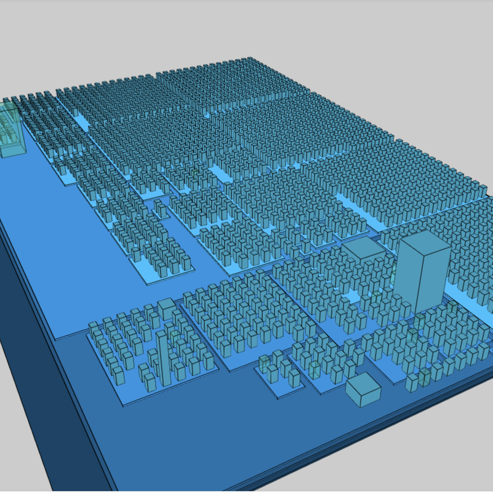

.. Reports:

Reports
=======

There are several reports that may be extracted from Exakat : 

* `Ambassador`_
* `Clustergrammer`_
* `Code Flower`_
* `Code Sniffer`_
* `Composer`_
* `Dependency Wheel`_
* `Inventories`_
* `Json`_
* `Marmelab`_
* `Owasp`_
* `PhpCompilation`_
* `PhpConfiguration`_
* `Phpcity`_
* `PlantUml`_
* `RadwellCode`_
* `SimpleTable`_
* `Stats`_
* `Text`_
* `Uml`_
* `Xml`_

Configuring a report before the audit
-------------------------------------

By default, Exakat builds the 'Ambassador' report for any project. If you want another report, or want to ignore the build of Ambassador, configure it before running the audit. 

To do so, open the `projects/<project>/config.ini` file, and mention the list of report like that : 

    project_reports[] = 'Owasp';
    project_reports[] = 'Weekly';

By configuring the reports before the audit, Exakat processes only the needed analysis, and produces all the reports for each audit. 

Generating a report after the audit
-----------------------------------

If you have run an audit, but wants to extract another report for a piece of code, you can use the following command : 

   `php exakat.phar report -p <project> -format <format> -file <filename>`
   
Where <format> is one of the format listed in the following section, and <filename> is the target file. 

Note that some format requires some specific audits to be run : they will fail if those results are not available. Then, run the audit again, and mention the desired audit in the configuration. 

Common behavior
---------------

Default format is Text. Each report has a default filename, that may be configured with the -file option. Each report adds a file extension to the provided filename. 

A special value for -file is 'stdout'. Some formats may be output to stdout, such as Text or Json. Not all format are accepting that value : some format, like Ambassador or Sqlite, may only be written to directories. 

Each report is stored in its <project> folder, under the requested name.

Reports may be generated at any time, during execution of the analysis (partial results) or later, even if another audit is running. 

Ambassador
----------

Ambassador is the most complete Exakat report.

Ambassador includes : 

+ Full configuration for the audit
+ Full documentation of the analysis
+ All results, searchable and browsable by file and analysis
+ Extra reports for 
    + Minor versions compatibility
    + PHP Directive usage
    + PHP compilation recommendations
    + Error messages list
    + List of processed files

.. image:: images/report.ambassador.png
    :alt: Example of a Ambassador report (0)

Ambassador includes the report from 3 other reports : PhpCompilation, PhpConfiguration, Stats.

Ambassador is a HTML report format.

Ambassador depends on the following  themes : CompatibilityPHP53, CompatibilityPHP54, CompatibilityPHP55, CompatibilityPHP56, CompatibilityPHP70, CompatibilityPHP71, CompatibilityPHP72, CompatibilityPHP73, Analyze, Preferences, Inventory, Performances, Appinfo, Appcontent, Dead code, Security, Suggestions, Custom.

Clustergrammer
--------------

The Clustergrammar report format data for a clustergrammer diagramm.

Clustergrammer is a visualisation tool that may be found online. After generation of this report, a TEXT file is available in the project directory. Upload it on [http://amp.pharm.mssm.edu/clustergrammer/](http://amp.pharm.mssm.edu/clustergrammer/) to visualize it. 

See a live report here : [Clustergrammer](http://amp.pharm.mssm.edu/clustergrammer/viz_sim_mats/5a8d41bf3a82d32a9dacddd9/clustergrammer.txt).

.. image:: images/report.clustergrammer.png
    :alt: Example of a Clustergrammer report (0)

Clustergrammer is a TEXT report format.

Clustergrammer doesn't depend on themes.

Code Flower
-----------

The Code Flower represents hierarchies in a code source.

Codeflower is a javascript visualization of the code. It is based on Francois Zaninotto's [CodeFlower Source code visualization](http://www.redotheweb.com/CodeFlower/).

It represents : 
+ Class hierarchy
+ Namespace hierarchy
+ Inclusion

.. image:: images/report.codeflower.png
    :alt: Example of a Code Flower report (0)

Code Flower is a HTML report format.

Code Flower doesn't depend on themes.

Code Sniffer
------------

The CodeSniffer report exports in the CodeSniffer format.

This format reports analysis using the Codesniffer's result format. 

See also [Code Sniffer Report](https://github.com/squizlabs/PHP_CodeSniffer/wiki/Reporting).

::

    FILE : /Path/To/View/The/File.php
    --------------------------------------------------------------------------------
    FOUND 3 ISSUES AFFECTING 3 LINES
    --------------------------------------------------------------------------------
     32 | MINOR | Could Use Alias
     41 | MINOR | Could Make A Function
     43 | MINOR | Could Make A Function
    --------------------------------------------------------------------------------
    

Code Sniffer is a TEXT report format.

Code Sniffer accepts any arbitrary list of results.

Composer
--------

The Composer report provide elements for the require attribute in the composer.json.

It helps documenting the composer.json, by providing more informations, extracted from the code.

This report makes a copy then updates the composer.json, if available. It creates a totally new composer.json if the latter is not available. 

It is recommended to review manually the results of the suggested composer.json before using it.

::

    Name,File,Line
    0,/features/bootstrap/FeatureContext.php,61
    10000,/features/bootstrap/FeatureContext.php,61
    777,/features/bootstrap/FeatureContext.php,63
    20,/features/bootstrap/FeatureContext.php,73
    0,/features/bootstrap/FeatureContext.php,334
    0,/features/bootstrap/FeatureContext.php,339
    0,/features/bootstrap/FeatureContext.php,344
    0,/features/bootstrap/FeatureContext.php,362
    0,/features/bootstrap/FeatureContext.php,366
    0,/features/bootstrap/FeatureContext.php,368
    0,/features/bootstrap/FeatureContext.php,372
    777,/features/bootstrap/FeatureContext.php,423
    777,/features/bootstrap/FeatureContext.php,431
    0,/src/Behat/Behat/Context/ContextClass/SimpleClassGenerator.php,68
    1,/src/Behat/Behat/Context/ContextClass/SimpleClassGenerator.php,69
    0,/src/Behat/Behat/Context/Environment/InitializedContextEnvironment.php,84
    0,/src/Behat/Behat/Context/Environment/InitializedContextEnvironment.php,150
    

Composer is a JSON report format.

Composer depends on the following theme : Appinfo.

Dependency Wheel
----------------

The DependencyWheel represents dependencies in a code source.

Dependency Wheel is a javascript visualization of the classes dependencies in the code. Every class, interface and trait are represented as a circle, and every relation between the classes are represented by a link between them, inside the circle. 

It is based on Francois Zaninotto's [DependencyWheel](http://fzaninotto.github.com/DependencyWheel) and the [d3.js](https://github.com/mbostock/d3).

.. image:: images/report.dependencywheel.png
    :alt: Example of a Dependency Wheel report (0)

Dependency Wheel is a HTML report format.

Dependency Wheel doesn't depend on themes.

Inventories
-----------

The Inventories report collects literals and names from the code.

This report provides the value, the file and line where a type of value is present. 

The following values and names are inventoried : 

+ Variables
+ Incoming Variables
+ Session Variables
+ Global Variables
+ Date formats
+ Constants
+ Functions
+ Classes
+ Interfaces
+ Traitnames
+ Namespaces
+ Exceptions
+ Regex
+ SQL
+ URL
+ Unicode blocks
+ Integer
+ Real
+ Literal Arrays
+ Strings

Every type of values is exported to a file. If no value of such type was found during the audit, the file only contains the headers. It is always produced.

::

    Name,File,Line
    0,/features/bootstrap/FeatureContext.php,61
    10000,/features/bootstrap/FeatureContext.php,61
    777,/features/bootstrap/FeatureContext.php,63
    20,/features/bootstrap/FeatureContext.php,73
    0,/features/bootstrap/FeatureContext.php,334
    0,/features/bootstrap/FeatureContext.php,339
    0,/features/bootstrap/FeatureContext.php,344
    0,/features/bootstrap/FeatureContext.php,362
    0,/features/bootstrap/FeatureContext.php,366
    0,/features/bootstrap/FeatureContext.php,368
    0,/features/bootstrap/FeatureContext.php,372
    777,/features/bootstrap/FeatureContext.php,423
    777,/features/bootstrap/FeatureContext.php,431
    0,/src/Behat/Behat/Context/ContextClass/SimpleClassGenerator.php,68
    1,/src/Behat/Behat/Context/ContextClass/SimpleClassGenerator.php,69
    0,/src/Behat/Behat/Context/Environment/InitializedContextEnvironment.php,84
    0,/src/Behat/Behat/Context/Environment/InitializedContextEnvironment.php,150
    

Inventories is a CSV report format.

Inventories depends on the following theme : Inventories.

Json
----

The JSON report exports in JSON format.

Simple Json format. It is a structured array with all results, described as object.

::

    Filename => [
                    errors   => count,
                    warning  => count,
                    fixable  => count,
                    filename => string,
                    message  => [
                        line => [
                            type,
                            source,
                            severity,
                            fixable,
                            message
                        ]
                    ]
                ]

::

    {  
       "\/src\/Path\/To\/File.php":{  
          "errors":0,
          "warnings":105,
          "fixable":0,
          "filename":"\/src\/Path\/To\/File.php",
          "messages":{  
             "55":[  
                [  
                   {  
                      "type":"warning",
                      "source":"Php/EllipsisUsage",
                      "severity":"Major",
                      "fixable":"fixable",
                      "message":"... Usage"
                   }
                ]
             ],
             }
        }
    }

Json is a XML report format.

Json accepts any arbitrary list of results.

Marmelab
--------

The Marmelab report format data to use with a graphQL server.

Marmelab is a report format to build GraphQL server with exakat's results. Export the results of the audit in this JSON file, then use the [json-graphql-server](https://github.com/marmelab/json-graphql-server) to have a GraphQL server with all the results.

You may also learn more about GraphQL at [Introducing Json GraphQL Server](https://marmelab.com/blog/2017/07/12/json-graphql-server.html).

::

    php exakat.phar report -p -format Marmelab -file marmelab
    cp projects/myproject/marmelab.json path/to/marmelab
    json-graphql-server db.json
    

Marmelab is a JSON report format.

Marmelab depends on the following theme : Analyze.

Owasp
-----

The OWASP report is a security report.

The OWASP report focuses on the [OWASP top 10](https://www.owasp.org/index.php/Category:OWASP_Top_Ten_Project). It reports all the security analysis, distributed across the 10 categories of vulnerabilities.

.. image:: images/report.owasp.png
    :alt: Example of a Owasp report (0)

Owasp is a HTML report format.

Owasp depends on the following theme : Security.

PhpCompilation
--------------

The PhpCompilation suggests a list of compilation directives when compiling the PHP binary, tailored for the code

PhpCompilation bases its selection on the code and its usage of features. PhpCompilation also recommends disabling unused standard extensions : this helps reducing the footprint of the binary, and prevents unused features to be available for intrusion. PhpCompilation is able to detects over 150 PHP extensions.

::

    ;;;;;;;;;;;;;;;;;;;;;;;;;;
    ; Suggestion for php.ini ;
    ;;;;;;;;;;;;;;;;;;;;;;;;;;
    
    ; The directives below are selected based on the code provided. 
    ; They only cover the related directives that may have an impact on the code
    ;
    ; The list may not be exhaustive
    ; The suggested values are not recommendations, and should be reviewed and adapted
    ;
    
    
    [date]
    ; It is not safe to rely on the system's timezone settings. Make sure the
    ; directive date.timezone is set in php.ini.
    date.timezone = Europe/Amsterdam
    
    
    
    [pcre]
    ; More information about pcre : 
    ;http://php.net/manual/en/pcre.configuration.php
    
    
    
    [standard]
    ; This sets the maximum amount of memory in bytes that a script is allowed to
    ; allocate. This helps prevent poorly written scripts for eating up all available
    ; memory on a server. It is recommended to set this as low as possible and avoid
    ; removing the limit.
    memory_limit = 120
    
    ; This sets the maximum amount of time, in seconds, that a script is allowed to
    ; run. The lower the value, the better for the server, but also, the better has
    ; the script to be written. Avoid really large values that are only useful for
    ; admin, and set them per directory.
    max_execution_time = 90
    
    ; Exposes to the world that PHP is installed on the server. For security reasons,
    ; it is better to keep this hidden.
    expose_php = Off
    
    ; This determines whether errors should be printed to the screen as part of the
    ; output or if they should be hidden from the user.
    display_errors = Off
    
    ; Set the error reporting level. Always set this high, so as to have the errors
    ; reported, and logged.
    error_reporting = E_ALL
    
    ; Always log errors for future use
    log_errors = On
    
    ; Name of the file where script errors should be logged. 
    error_log = Name of a writable file, suitable for logging.
    
    ; More information about standard : 
    ;http://php.net/manual/en/info.configuration.php
    
    ; Name of the file where script errors should be logged. 
    disable_functions = curl_init,ftp_connect,ftp_ssl_connect,ldap_connect,mail,mysqli_connect,mysqli_pconnect,pg_connect,pg_pconnect,socket_create,socket_accept,socket_connect,socket_listen
    disable_classes = mysqli
    

PhpCompilation is a Text report format.

PhpCompilation depends on the following theme : Appinfo.

PhpConfiguration
----------------

The PhpConfiguration suggests a list of directives to check when setting up the hosting server, tailored for the code

PhpConfiguration bases its selection on the code, and classic recommendations. For example, memory_limit or expose_php are always reported, though they have little impact in the code. Extensions also get a short list of important directive, and offer a link to the documentation for more documentation.

::

    ;;;;;;;;;;;;;;;;;;;;;;;;;;
    ; Suggestion for php.ini ;
    ;;;;;;;;;;;;;;;;;;;;;;;;;;
    
    ; The directives below are selected based on the code provided. 
    ; They only cover the related directives that may have an impact on the code
    ;
    ; The list may not be exhaustive
    ; The suggested values are not recommendations, and should be reviewed and adapted
    ;
    
    
    [date]
    ; It is not safe to rely on the system's timezone settings. Make sure the
    ; directive date.timezone is set in php.ini.
    date.timezone = Europe/Amsterdam
    
    
    
    [pcre]
    ; More information about pcre : 
    ;http://php.net/manual/en/pcre.configuration.php
    
    
    
    [standard]
    ; This sets the maximum amount of memory in bytes that a script is allowed to
    ; allocate. This helps prevent poorly written scripts for eating up all available
    ; memory on a server. It is recommended to set this as low as possible and avoid
    ; removing the limit.
    memory_limit = 120
    
    ; This sets the maximum amount of time, in seconds, that a script is allowed to
    ; run. The lower the value, the better for the server, but also, the better has
    ; the script to be written. Avoid really large values that are only useful for
    ; admin, and set them per directory.
    max_execution_time = 90
    
    ; Exposes to the world that PHP is installed on the server. For security reasons,
    ; it is better to keep this hidden.
    expose_php = Off
    
    ; This determines whether errors should be printed to the screen as part of the
    ; output or if they should be hidden from the user.
    display_errors = Off
    
    ; Set the error reporting level. Always set this high, so as to have the errors
    ; reported, and logged.
    error_reporting = E_ALL
    
    ; Always log errors for future use
    log_errors = On
    
    ; Name of the file where script errors should be logged. 
    error_log = Name of a writable file, suitable for logging.
    
    ; More information about standard : 
    ;http://php.net/manual/en/info.configuration.php
    
    ; Name of the file where script errors should be logged. 
    disable_functions = curl_init,ftp_connect,ftp_ssl_connect,ldap_connect,mail,mysqli_connect,mysqli_pconnect,pg_connect,pg_pconnect,socket_create,socket_accept,socket_connect,socket_listen
    disable_classes = mysqli
    

PhpConfiguration is a Text report format.

PhpConfiguration depends on the following theme : Appinfo.

Phpcity
-------

The Phpcity report represents your code as a city. 

Phpcity is a code visualisation tool : it displays the source code as a city, with districts and buildings. Ther will be high sky crappers, signaling large classes, entire districts of small blocks, large venues and isolated parks. Some imagination is welcome too. 

The original idea is Richard Wettel's [Code city](https://wettel.github.io/codecity.html), which has been adapted to many languages, including PHP. The PHP version is based on the open source [PHPcity project](https://github.com/adrianhuna/PHPCity), which is itself build with [JScity](https://github.com/ASERG-UFMG/JSCity/wiki/JSCITY). 

To use this tool, run an exakat audit, then generate the 'PHPcity' report : `php exakat.phar report -p mycode -format PHPcity -v`

This generates the `exakat.phpcity.json` file, in the `projects/mycode/` folder. 

You may test your own report online, at [Adrian Huna](https://github.com/adrianhuna)'s website, by [uploading the results](https://adrianhuna.github.io/PHPCity/) and seeing it live immediately. 

Or, you can install the [PHPcity](https://github.com/adrianhuna/PHPCity) application, and load it locally. 

Phpcity is a JSON report format.

Phpcity doesn't depend on themes.

PlantUml
--------

The PlantUml export data structure to PlantUml format.

This report produces a .puml file, compatible with [PlantUML](http://plantuml.com/).

PlantUML is an Open Source component that dislays class diagrams. 

.. image:: images/report.plantuml.png
    :alt: Example of a PlantUml report (0)

PlantUml is a puml report format.

PlantUml doesn't depend on themes.

RadwellCode
-----------

The RadwellCode is a report based on Oliver Radwell's [PHP Do And Don't](https://blog.radwell.codes/2016/11/php-dos-donts-aka-programmers-dont-like/).

Note that all rules are not implemented, especially the 'coding conventions' ones, as this is beyond the scope of this tool.

::

        /Phrozn/Vendor/Extra/scss.inc.php:594 Slow PHP built-in functions
        /Phrozn/Vendor/Extra/scss.inc.php:2554 Too many nested if statements
        /Phrozn/Vendor/Extra/scss.inc.php:1208 Long if-else blocks
        /Phrozn/Vendor/Extra/scss.inc.php:1208 Too many nested if statements
        /Phrozn/Vendor/Extra/scss.inc.php:3935 Wrong function / class name casing
        /Phrozn/Vendor/Extra/scss.inc.php:3452 Too many nested if statements
        /Phrozn/Site/View/OutputPath/Entry/Parametrized.php:58 Slow PHP built-in functions
        /Phrozn/Runner/CommandLine/Callback/Init.php:82 Extra brackets and braces and quotes
    

RadwellCode is a Text report format.

RadwellCode depends on the following theme : RadwellCodes.

SimpleTable
-----------

The Simpletable is a simple table presentation.

Simpletable is suitable for any list of results provided by exakat. It is inspired from the Clang report. The result is a HTML file, with Javascript and CSS. 

.. image:: images/report.simpletable.png
    :alt: Example of a SimpleTable report (0)

SimpleTable is a HTML report format.

SimpleTable doesn't depend on themes.

Stats
-----

The Stats report collects various stats about the code.

Stats reports PHP structures definition, like class, interfaces, variables, and also features, like operator, control flow instructions, etc.

::

    {
        "Summary": {
            "Namespaces": 82,
            "Classes": 59,
            "Interfaces": 29,
            "Trait": 0,
            "Functions": 0,
            "Variables": 4524,
            "Constants": 0
        },
        "Classes": {
            "Classes": 59,
            "Class constants": 10,
            "Properties": 140,
            "Methods": 474
        },
        "Structures": {
            "Ifthen": 568,
            "Else": 76,
            "Switch": 15,
            "Case": 62,
            "Default": 9,
            "Fallthrough": 0,
            "For": 5,
            "Foreach": 102,
            "While": 21,
            "Do..while": 0,
            "New": 106,
            "Clone": 0,
            "Class constant call": 34,
            "Method call": 1071,
            "Static method call": 52,
            "Properties usage": 0,
            "Static property": 65,
            "Throw": 35,
            "Try": 12,
            "Catch": 12,
            "Finally": 0,
            "Yield": 0,
            "Yield From": 0,
            "?  :": 60,
            "?: ": 2,
            "Variables constants": 0,
            "Variables variables": 7,
            "Variables functions": 1,
            "Variables classes": 5
        }
    }

Stats is a JSON report format.

Stats depends on the following theme : Stats.

Text
----

The Text report is a very simple text format.

The Text report displays one result per line, with the following format  : 

::
    
   /path/from/project/root/to/file:line[space]name of analysis
   
   
This format is fast, and fitted for machine communications.

::

        /helpers/translation/class.TranslationFileReader.php:99 No Need For Else
        /helpers/translation/class.TranslationFileReader.php:99 Avoid Optional Properties
        /test/ClientLibRegistryTest.php:83 Confusing Names
        /helpers/form/elements/xhtml/class.Radiobox.php:53 Local Globals
    
    

Text is a Text report format.

Text accepts any arbitrary list of results.

Uml
---

The Uml exports data structure to UML format.

This report produces a dot file with a representation of the classes used in the repository. 

Classes, interfaces and traits are represented, along with their constants, methods and properties. 

.dot files are best seen with [graphviz](http://www.graphviz.org/) : they are easily convert into PNG or PDF.

.. image:: images/report.uml.general.png
    :alt: Example of a Uml report (0)

.. image:: images/report.uml.detail.png
    :alt: Example of a Uml report (1)

Uml is a dot report format.

Uml doesn't depend on themes.

Xml
---

The Xml report exports in XML format.

XML version of the reports. It uses the same format than PHP Code Sniffer to output the results. 

::

    <?xml version="1.0" encoding="UTF-8"?>
    <phpcs version="0.8.6">
    <file name="/src/NlpTools/Stemmers/PorterStemmer.php" errors="0" warnings="105" fixable="0">
     <warning line="55" column="0" source="Php/EllipsisUsage" severity="Major" fixable="0">... Usage</warning>
    

Xml is a XML report format.

Xml accepts any arbitrary list of results.

