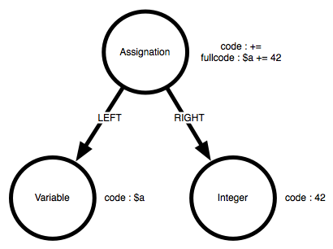

.. _Development:

Custom analysis
===============

Summary:
--------

* `How Exakat runs an analysis`_
* `Quick startup`_
* `Analysis structure`_
* `Internal database`_
    * `Atoms`_
    * `Atom properties`_
    * `Links`_
    * `Navigating`_
    * `Dictionaries`_
* `Testing your analysis`_
* `Tooling`_
* `Publishing your analysis`_

How Exakat runs an analysis
---------------------------

An analysis is the smallest unit of work on the Exakat engine. 

An analysis is constituted of several elements : 

* A name, including a prefix called 'folder'. 
* A class, that extends `Exakat\Analyzer\Analyzer`. 
* A documentation
* Unit tests

The exakat command `analyze` runs an analysis, either alone, or as a member of one category. An analysis may be part of multiple categories. Categories gathers several analysis together, to be used by a report. 

::

    # run one analysis alone
    php exakat analyze -p test -P Structures/AddZero 

    # run an analysis as apart of of a category : Structures/AddZero belongs to Analyze
    php exakat analyze -p test -T Analyze

An analysis can only be run after loading the code in the central database, with the 'load' command. It is then 'dump'-ed before being reported as an audit. 

The prefix is used for internal identification and storage. It is unique. 

Quick startup
-------------

To create a new analysis, you must work with the Exakat source code. Start by cloning the repository : 

``git clone exakat https://github.com/exakat/exakat.git``

Then move to the cloned directory. Here, call the following script to create an analysis : 

``php scripts/createAnalyzer Custom/FirstTest``

This script creates the following files : 

* library/Exakat/Analyze/Custom/FirstTest.php
* human/en/Custom/FirstTest.ini
* tests/analyzer/Test/Custom/FirstTest.php
* tests/analyzer/source/Custom/FirstTest.01.php
* tests/analyzer/exp/Custom/FirstTest.01.php
* It also updates a file called `data/analyzers.sqlite`

Open `library/Exakat/Analyze/Custom/FirstTest.php` in your favorite IDE. The code looks like the following : 

::

    <?php
    /*
     * Copyright 2012-2018 Damien Seguy – Exakat Ltd <contact(at)exakat.io>
     * This file is part of Exakat.
     *
     * Exakat is free software: you can redistribute it and/or modify
     * it under the terms of the GNU Affero General Public License as published by
     * the Free Software Foundation, either version 3 of the License, or
     * (at your option) any later version.
     *
     * Exakat is distributed in the hope that it will be useful,
     * but WITHOUT ANY WARRANTY; without even the implied warranty of
     * MERCHANTABILITY or FITNESS FOR A PARTICULAR PURPOSE.  See the
     * GNU Affero General Public License for more details.
     *
     * You should have received a copy of the GNU Affero General Public License
     * along with Exakat.  If not, see <http://www.gnu.org/licenses/>.
     *
     * The latest code can be found at <http://exakat.io/>.
     *
    */
    
    namespace Exakat\Analyzer\Custom;
    
    use Exakat\Analyzer\Analyzer;
    
    class FirstTest extends Analyzer {
        /* Remove this if useless
        public function dependsOn() {
            return array('MethodDefinition');
        }
        */
        
        public function analyze() {
            $this->atomIs('Identifier')
                 ->back('first');
            $this->printQuery();
            $this->prepareQuery();
        }
    }
    
    ?>

The main part of the analysis is the `analyze` method, so we'll focus on it. It has a very simple example code, and runs a debugging tool. Let start by removing the line `$this->printQuery();`.

For this example, we're going to look for useless additions : something like `$a + 0`. For that, we need to detect additions, check that the operator is `+` and find if one of the operand is 0. For that, we're going to replace the first call to `$this` by the following code : 

::

    $this->atomIs('Addition')
         ->codeIs('+')
         ->outIs('RIGHT')
         ->atomIs('Integer')
         ->codeIs('0');
    $this->prepareQuery();

The query may be read as the following : find all atoms that are 'Addition', check if the code is '+', then go to the 'RIGHT' expression, check if the atom is an 'Integer', then check if the value is '0'. If all of those steps are valid, the resulting element is now a result for our analysis.

The next call to 'prepareQuery' means that this query is complete. 

At that point, our analysis is build with one query. It is executed by the exakat engine.

Now, we need to start testing our analysis and check if all works as expected. The simplest is to rely on the unit tests to validate the analysis. 

Open the file `tests/analyzer/source/Custom/MyFirst.01.php`. Inside, you'll find an empty PHP script. 

:: 

    <?php
    
    ?>

Let's complete this script with code that we intend to analyse. For that, we simply PHP code that hold the pattern we are looking for. For example : 

::

    <?php
    
    $a + 0;
    0 + $a;
    
    1 + $a;
    $a + 1;
    ?>

As you can see, we added patterns of code that we would like to find, like `$a + 0` and `0 + $a`. We also added patterns of code we don't want to find, like `$a + 1` and `1 + $a`. It is important to tell the tests what we expect, and what we want to avoid.

Save that file, and open the next one : `tests/analyzer/exp/Custom/MyFirst.01.php`.

::

    <?php
    
    $expected     = array('',
                          '',
                         );
    
    $expected_not = array('',
                          '',
                         );
    
    ?>

This file holds the expected values and the values we want to avoid. The expected values are `$a + 0` and `0 + $a`, so added them in the `$expected` array. The unwanted values are `$a + 1` and `1 + $a`, so added them in the `$expected_not` array. 

::

    <?php
    
    $expected     = array('$a + 0',
                          '0 + $a',
                         );
    
    $expected_not = array('$a + 1',
                          '1 + $a',
                         );
    
    ?>

Save the file too. We are now ready to run this test with PHPunit. Check that PHPunit is installed, then run the test.

::

    cd tests/analyzer/
    phpunit Test/Custom/MyFirst.php

You should have a result like this : 

::

    PHPUnit 7.3.5 by Sebastian Bergmann and contributors.
    
    .                                                                   1 / 1 (100%)
    
    Time: 2.01 seconds, Memory: 10.00MB
    
    There was 1 failure:
    
    1) Test\Custom_MyFirst::testCustom_MyFirst01
    1 values were found and are unprocessed : 0 + $a
    
    source/Custom/MyFirst.02.php
    exp/Custom/MyFirst.02.php
    phpunit --filter=01 Test/Custom/MyFirst.php
    
    
    Failed asserting that 1 matches expected 0.
    
    FAILURES!
    Tests: 2, Assertions: 5, Failures: 1.

In the first analysis, we have build a query to look for `$a + 0` but not for `0 + $a`. It is a good thing that we added tests for them, so we need to add more query to the analysis.

Open again the 'library/Exakat/Analyze/Custom/MyFirst.php', and, inside the `analyze()` method, below the first `prepareQuery()`, add the following code to search for `0 + $a` : 

::

    $this->atomIs('Addition')
         ->codeIs('+')
         ->outIs('LEFT')
         ->atomIs('Integer')
         ->codeIs('0');
    $this->prepareQuery();

An analysis may run several queries. In this case, we have searched for '$a + 0', but we should also check for '0 + $a'. Addition is associative, so 0 may be useless on the right or on the left. 

::

    PHPUnit 7.3.5 by Sebastian Bergmann and contributors.
    
    .                                                                   1 / 1 (100%)
    
    Time: 2.82 seconds, Memory: 10.00MB

This means that the Unit Test found the values we expected, and it also didn't find the values we didn't want. 

Congratulations! This is your first analysis, and it is time to celebrate! Welcome to the great family of static analyzers.

Analysis structure
------------------

An analysis class is build with 4 elements. 

* analyze() method
* dependsOn() method
* $phpVersion property
* Analyzer extends

The analyze() method
####################

The analyze method is the most important. It is the method that does the actual analysis. 

The method doesn't return anything. 

The dependsOn() method
######################

This method returns the list of other analysis on which the current analysis depends on. For example, an analysis may target PHP functions : it relies on another analysis that detects the PHP functions, then, add it own layer of review. The other analysis must be processed first, and the Exakat engine run the dependencies before it runs the current analysis.

The list of dependency is a array of strings, with the usual analysis format : for example, `array('Functions/IsExtFunction')`. Multiple analysis may be returned by that method. If the current analysis is autonomous, the method may be omitted, or it may return an empty array. 

$phpVersion property
####################

The protected `$phpVersion` property configure the analysis to run with specific versions of PHP. For example, `Structures/Break0` is an analysis that can only run until PHP 5.4 : after that version, PHP doesn't compile code that uses `break 0;`. Thus, there is no need to run the current analysis on newer PHP versions.

If the analysis works on every PHP version, this can be omitted.

Patch level version are never taken into consideration : PHP 7.0.0 or PHP 7.0.30 are all covered by '7.0'.

`$phpVersion` accepts several values : 

* '7.0' : the analysis only runs for PHP 7.0 version.
* '7.1-' : the analysis only runs until PHP 7.1 version. PHP 7.1 is excluded.
* '7.2+' : the analysis only runs after PHP 7.2 version. PHP 7.2 is included.

Generally speaking, PHP version are the official middle versions : 5.2, 5.3, 5.4, 5.5, 5.6, 7.0, 7.1, 7.2, 7.3, 7.4, 8.0. This changes with the publication of PHP versions.

Analyzer extends
################

By default, an analysis extends the Exakat\Analyzer\Analyzer class. Some frequent analysis that can be configurer, are available in the `Common/*` folder. More on that later.

Internal database
-----------------

Presentation
############

Every important structure of PHP code is stored in the database as a node, called atom. Nodes are connected to each other with links. Each atom has a list of defining properties, that are not represented in the code. For example, where is a simple assignation : 

The 'Assignation' atom is holding the '+=' code, which is its characteristics. Then, it has two members : 'LEFT' and 'RIGHT'. Each of the target atoms are different : one is a variable, and the other is a integer. Altogether, they build the assignation, which is summed up in the 'fullcode' property of the assignation.

To define a pattern in the code, we use a combinaison of filters on atom, links or their property. Any succession of steps that yield a result means that an issue has been found in the code.  

Atoms
#####

{{LIST_ATOMS}}

{{DETAILS_ATOMS}}

Atom properties
###############

Each atom in the database has a list of properties. They hold information about the current atom, that are not available through the network.

To check those properties, there are some specific method calls.

* label : this is the type of atom.
* code : the value of the PHP token. For a variable, it is `$name`, while for a function, it is the function name `foo` instead of `foo(1,2,3)`
* token : the name of the current PHP token. They use the same names as inside PHP, plus a couple of special values. They are strings, and not integers
* fullcode : this is a normalized representation of the code. It include the current atom, and its important dependencies
* rank : the position of the current atom in a list of similar element, like arguments in a functioncall. rank starts at 0. 
* reference : is this atom is a reference, marked with '&'
* variadic : is this atom is a variadic, marked with '...'
* noscream : is this atom is a variadic, marked with '@'
* block : is this atom enclosed in curly braces (only available for Sequence)
* heredoc : is this a Heredoc (true), or a Nowdoc (false) (only available for Heredoc)
* delimiter : delimiter used for string : ', " or nothing
* noDelimiter : the actual value of the string, without the delimiters
* count : count of elements. For example, count in a functioncall represents the number of arguments.
* fullnspath : the Full Qualified Name, as it was resolved at compile time.
* absolute : is this name absolute or not (only available for Nsname)
* alias : the alias name (only available for Usenamespace)
* origin : the origin for the use expression (only available for Usenamespace)
* encoding : Unicode block for the current string
* intval : the value of the atom, when cast as integer
* strval :  the value of the atom, when cast as string
* boolean :  the value of the atom, when cast as boolean
* args_max : maximum number of arguments (only available for Function, Method, Closure, Magicmethod)
* args_min : minimum number of arguments (only available for Function, Method, Closure, Magicmethod)
* enclosing : is the atom inside curly braces (only available for Variable inside a string)
* bracket : is the current array a short syntax or a traditional syntax (only available for Arrayliteral)
* flexible : is the Heredoc using the flexible syntax
* close_tag : has the Php atom the closing tag or not
* aliased : is the current tag aliased with a use expression, or not
* constant : is the current atom a constant value. atom are constant if they are build with constant values, like other constants or literals.
* root : is this the root node
* globalvar : the simple name of the variable, in the global syntax. For example, $GLOBALS['x'] is actually $x in the global space
* binaryString : the equivalent of strval, but after replacing the PHP escape sequence with their actual value. For example, "\064" is turned into "4". This is valid for PHP sequences, unicode codepoint, etc.
* visibility : the visibility for the property, constant or method. (only available for Const, Method, Magicmethod, Propertydefinition)
* final : is the current class or method final (only available for Class, Method and Magicmethod) 
* abstract : is the current class or method abstract (only available for Class, Method and Magicmethod) 
* static : is the current class, property or method static (only available for Class, Method, Property and Magicmethod) 

Links
#####

Links are the relation established between the atoms. You can move from one to the other by using links. 

Links are defined only with their label. A link between a 'Not' atom, and its operand is called 'NOT'. 

There may be several links from an atom : for example, Addition has two outgoing links : 'LEFT' and 'RIGHT'. 

Some links are always available, like 'CONDITION' and 'THEN' for Ifthen. 'ELSE' is not always available, depending on the code. 

Some links may be repeated as often as necessary. For example, 'CONCAT' is the building block for 'Concatenation' : there may be from 2 'CONCAT' link to a lot more. 

Links are oriented : they always start from the mentioned atom, and go to the next. Leaving the current atom is the 'OUT' direction, while going back to the originating atom is 'IN'. 

The destination atom type is rarely defined. PHP always provides a lot of freedom, and various expressions may be used at the same place. Consider calling a function : `foo()`, `\foo()`, '$foo()`, `foo()()`, `$foo[1]()`. So, the target for 'NAME' from a 'Functioncall' atom, may be a 'Name', 'Nsname', 'Variable', 'Functioncall', 'Array'. Usually, it is important to always check the landing atom, before accessing properties.

Navigating 
##########

The script is turned into a structure network of atoms, connected by links. To create an analysis, exakat will navigate those atoms and links. The navigation is based on a specific API. 

It starts with a call to atomIs() or analyzerIs() from $this, inside the analysis. Then, different steps are taken, and, in the end, if a final token is found, the query has found a result. 

Initial steps
_____________

There are three special steps that must be used as first call : atomIs(), atomFunctionIs() or analyzerIs(). Those two steps are optimized as first step, to take advantage of indexes in the databases. They also represents the classic starting point of any static analysis. 

Those two steps may also be used anywhere else in the query. 

* atomIs($atomType) : checks that the current atom is of the type $atomType
* analyzerIs($analyzerName) : checks that the current atom is also the result of the analysis called $analyzerName.
* atomFunctionIs($functionName) : checks that the current atom is a 'Functioncall', with the name $functionName. This step can't be used anywhere in the query but as the first step

Here is an example of two queries with the initial step. The first one searches for an Exit command, described above as a call to `exit` or `die`. Then, it checks that the call has no argument, which only allows 'exit' to be selected.

:: 

    $this->atomIs('Exit')
         ->hasNoOut('ARGUMENT');
    $this->prepareQuery();

    $this->analyzerIs('Functions/IsExtFunction')
         ->outIs('ARGUMENT')
         ->atomIs('Void');
    $this->prepareQuery();

The second is based on the 'Functions/IsExtFunction', which mark functioncalls made to PHP extensions : as such, the function won't have a definition in the PHP code, but in the binary. Then, the query follows the available 'ARGUMENT' links, and check if the argument is 'Void' or not. Here, the second call to atomIs() is not an initial step. 

All steps
_________

{{LIST_STEPS}}

Special values
______________

There are a few special values to be used when calling a method's query.

* Most of the arguments are expected as string. They often may also be replaced with an array of strings, and they will be used as a list of values for the same purpose. For example, `atomIs("String")` filters a "String", while `atomIs(array("String", "Integer"))` filters a "String" or an "Integer".
* With analyzerIs() and analyzerIsNot(), the special 'self' may be used to represents the current analysis.

Dictionaries
############

There are a collection of dictionaries available. Dictionaries hold list of definition, like PHP's constant and functions, extension's classes, or classes from unit test frameworks. 

Documentation
-------------

Documentation is used to build automatic documentation for audit report : every time an analysis is run, its documentation is provided in the audits. 

Every Exakat analysis <Folder/Name> has a documentation, stored in the 'human/en' folder, as a .ini file. 

Keep the .ini files compiled, as PHP will refuse to load them otherwise. Then, Exakat will stop the processing : no documentation, no analysis.

The documentation is in international English.Localisation will be handled in the future, as other folders inside 'human'.

Each analysis has a standard structure, with the following elements : 

* name : the title used for the analysis. Keep it as short as possible, as it is used for short references in reports.
* description: A complete description of the analysis. The description should include a short introduction, a detailled explanation of the targe situations, a piece of code with good recommended code as a first illustration, and various bad situations as second example. The description should also include limitations from the analysis, if any. It should also include external links, including PHP.net documentation and tutorials, to help the reader learn more about the problem. 
* exakatSince: This is the version where the analysis was created. For example : "1.4.0"
* modifications: This is an array of strings : each string is a short suggestions on what kind of refactoring may be done once the analysis has spotted the issue. Suggestions should be as precise as possible. Provide as many suggestions as possible, as the problem may often be solved from different angles.

Testing your analysis
---------------------

Every analysis has its own set of unit test. They check that the analysis finds every pattern it intend to find, and it doesn't find the other patterns. As such, it is important to test for expected and unwanted results.

Expected results are patterns that you expect to find. But sometimes, analysis are too broad, and collect a number extra situations that are false positives. To avoid collecting them, and to document that they should not be found, unit tests have to be written.

Analysis tests are located in the `tests/analyzer/` folder. In that folder, there is : 

* Test folder : it contains the PHPUnit classes, and is automatically generated. Don't open it.
* source : this  folder contains the PHP code source for the tests. 
* exp : this folder contains the expected results of an analysis on the corresponding `source` code.
* random.php : this is a PHPUnit test suite that runs a random selection of unit tests
* alltests.php : this is a PHPUnit test suite that runs all the unit tests. It also checks some of the test Structures
* create_test.php : use this tool to create and add a new test to Exakat unit test list. It will create all the necessary files

Unit are run with `PHPUnit <https://www.phpunit.de/>`_ version 7.0+. They were tested with PHPUnit 7.3.5 and are supposed to work with other minor versions. 

Writing test
------------

Tests must be written to match patterns and to not-match anti-patterns. 

For example, imagine that we are analyzing code to find useless additions. We want to match `$a + 0`, `$a - 0`, `0 + $a` but not `0 - $a`. The last one doesn't have the same effect than the others : here the `-` sign has an important value. As such,  `$a + 0`, `$a - 0`, `0 + $a`  must go in the `$expected` array, and `0 - $a` must go in the `$expected_not` array. 

The unit test framework also supports code source as folders. There are situations where PHP refuses to compile a piece of code if all the code is in a single script, but accepts the same code when split over two or several files. For that, use the `create_test.php` with `-d` option, so as to create the folder with the test. `source/Custom/MyFirst.0x.php` will be created as a folder (including with the '.php' extension). Otherwise, simply remove the `source/Custom/MyFirst.0x.php` file, and create a folder of the same name instead.

PHP source for tests only have to compile without warning. There is no need for the PHP test script to run, nor to make any sense : this code will be audited, but not run. 

Pieces of advice
################

* In the PHP source for the test, always try to give names that help understand where is the error being hunter, and what are clean situations. This may be done by giving explicit names to functions and variables. 
* Try to keep the PHP source in a single file. When it is not possible, rely on a directory, with little files.
* When building a test, remove any name that link it to an existing code. Often, simply changing the name '$EXPLICIT_GLOBAL' to '$X' is enough.

Tooling
-------

There are three scripts to simplify manipulations when managing an analyzer. 

They are located in the `scripts` folder. They must be called from Exakat's code root, and not from within the script folder. 

* createAnalyzer <Folder/Name>: this tool creates a new analyzer in the 'Folder' folder, with the name 'Name'. At the time of creation, it creates also the documentation in 'human/en/Folder/Name.ini' file, and a first set of tests in the 'tests/analyzer/'. Finally, it sets up the analyzer in the data/analyzers.sqlite folder. 
* renameAnalyzer <Folder1/Name1> <Folder2/Name2>: this tool moves the analyzer called <Folder1/Name1> to <Folder2/Name2>. It moves the code in 'library/Exakat/Analyzer/', in the tests, and in the 'human/en' folder. 
* removeAnalyzer <Folder/Name>: this tool removes the analyzer called <Folder/Name>. It removes the code in 'library/Exakat/Analyzer/', in the tests, and in the 'human/en' folder. 

The scripts are only available with the open source version. Exakat.phar doesn't have support for those scripts.

Publishing your analysis
------------------------

To be written.